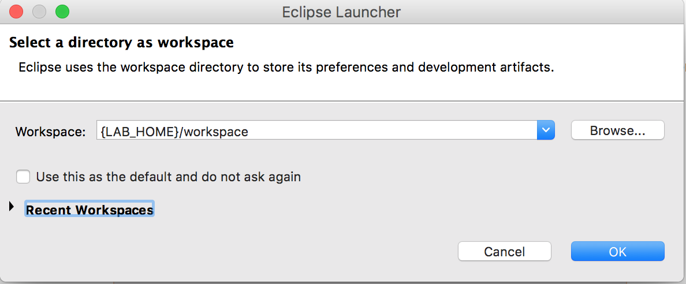
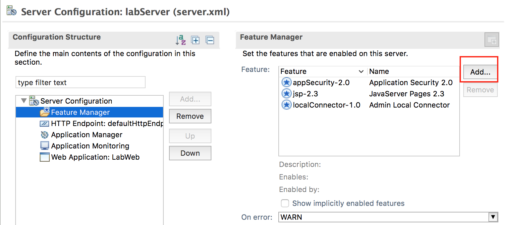

**Liberty JSP and application security**

Contents

[Lab 0 Liberty JSP and application security 3](#liberty-jsp-and-application-security)

[0.1 Prerequisites 3](#prerequisites)

[0.2 Create a Web Project 3](#create-a-web-project)

[0.3 Clean up after lab 42](#clean-up-after-lab)

[Appendix A. Notices 43](#notices)

[Appendix B. Trademarks and copyrights 45](#trademarks-and-copyrights)

## Liberty JSP and application security

This lab will show you how to create a simple and secure application to run on the Liberty profile. You will use a simple user registry to test secure access.

Please refer to the following table for file and resource location references on different operating systems.

Location Ref. |   OS    |     Absolute Path
 --------------| ------- | --------------------------
 *{LAB_HOME}*  | Windows |  `C:\\WLP_<VERSION>` or your choice
 *{LAB_HOME}*  | Linux   |  `~/WLP_<VERSION>` or your choice
 *{LAB_HOME}*  | Mac OSX |  `~/WLP_<VERSION>` or your choice  

# Prerequisites

The following preparation must be completed prior to beginning this lab:

Complete the Getting Started lab to set up the lab environment, including JRE, and Liberty runtime, and eclipse with WDT. You should have already created a default Liberty server (i.e. labServer) as part of the Getting Started lab.

Create a Web Project
--------------------

1.  Start Eclipse:
*For Windows run `{LAB_HOME}\wdt\eclipse\eclipse.exe` and select the workspace at `{LAB_HOME}\workspace`*
*For Linux: run `{LAB_HOME}/wdt/eclipse/eclipse` and select the workspace at `{LAB_HOME}/workspace`*
*For Mac: run `{LAB_HOME}/wdt/Eclipse.app/Contents/MacOS/eclipse` and select the workspace at `{LAB_HOME}/workspace`*
    

1.  Create a Web Project called LabWeb.

    1.  Click **File > New > Dynamic Web Project**  
    

    1.  Enter **LabWeb** as the name. Select “**Liberty Runtime”** as the Target runtime. Select “**3.1”** as the Dynamic web module version. Unselect **"Add project to an EAR”**. Click **Finish**.
      
    1.  Click **Yes** to switch to the Web perspective if prompted.

1.  Create a simple JSP

    1.  Right Click **LabWeb** and navigate to **New > JSP File**

        

    1.  Enter **index.jsp** as the file name. Click **Finish.**

        

4.  Writing the “Who Am I” JSP.

    a.  Replace the text:

        <title>Insert title here</title>

        with:

        <title>Who Am I?</title>

    b.  Enter the following code into the <body> section:

        You are <%=request.getUserPrincipal().getName() %>

    c.  Save the file.

        

        If something is wrong, you can import the index.jsp file for this lab found in the `{LAB_HOME}\labs\development\0_SimpleDevelopment` directory.

1.  Configure the security roles for the application.

    1.  Right click on the project LabWeb.

    1.  Click **Java EE Tools** > **Generate Deployment Descriptor Stub**.

        

    1.  Double click `LabWeb\WebContent\WEB-INF\web.xml` to open it in the Web Application 3.1 Deployment Descriptor Editor.

        

    1.  In the **Design** view, select **Web Application (LabWeb)** from the **Overview** list again and click **Add**.

        

    1.  In the Add Item window, select **Security Constraint** from the list and click **OK**.

        

    1.  For the new **Security Constraint** added, add a new **Role Name** in the Security Constraint section by clicking **Add,** type **\*\***, then press the **Enter** key. The role name **\*\*** is new in Servlet 3.1, and means all authenticated users. Also select **CONFIDENTIAL** in the **Transport Guarantee** list in the User Data Constraint section. Ignore the error message for now.

        

    1.  Complete the security constraint configuration by selecting **Web Resource Collection** from the **Overview** view; and enter index in the **Web Resource Name** field in the **Details** section; then click the **Add** button next to the **URL Pattern** list, enter /\*, and press the Enter key. Finally, save the web.xml by clicking **File > Save**. The error message should be cleared.

        

    1.  Review the changes in the Source tab, and the web.xml should look like:

 `<?xml version="1.0" encoding="UTF-8"?>
 
 <web-app xmlns="http://xmlns.jcp.org/xml/ns/javaee" xmlns:xsi="http://www.w3.org/2001/XMLSchema-instance" xsi:schemaLocation="http://xmlns.jcp.org/xml/ns/javaee http://xmlns.jcp.org/xml/ns/javaee/web-app_3_1.xsd" version="3.1">
 
    <display-name>LabWeb</display-name>
 
    <welcome-file-list>
 
       <welcome-file>index.html</welcome-file>
 
       <welcome-file>index.htm</welcome-file>
 
       <welcome-file>index.jsp</welcome-file>
 
       <welcome-file>default.html</welcome-file>
 
       <welcome-file>default.htm</welcome-file>
 
       <welcome-file>default.jsp</welcome-file>
 
    </welcome-file-list>
    
    <security-constraint>
    
       <web-resource-collection>
       
          <web-resource-name>index.jsp</web-resource-name>
          
          <url-pattern>/*</url-pattern>
          
       </web-resource-collection>
       
       <auth-constraint>
       
          <role-name>**</role-name>
          
       </auth-constraint>
       
       <user-data-constraint>
       
          <transport-guarantee>CONFIDENTIAL</transport-guarantee>
          
       </user-data-constraint>
       
    </security-constraint>
    
 </web-app>`

1.  Enable security on the server

    1.  Click **Servers** tab then expand **Liberty Server**.

        

    1.  Double click **Server Configuration** to open the **Server Configuration** pane.

        

    1.  Select **Feature Manager** from the **Configuration Structure** view and click the **Add** button in the **Feature Manager** view.

        

    1.  Select **appSecurity-2.0** from the list in the Add Feature window and click OK. Note that that no users can access the application until authorization bindings have been configured.

        

    1.  Click the **Source** tab to view the modified server.xml. You may also edit the server configuration directly.

        

1.  Deploy the application

    1.  Right click **LabWeb** from the Enterprise Explorer view and select **Run As > Run on Server**.

        

    1.  If prompted, save any resources you have not yet saved.

        

    1.  Select **WebSphere Application Server Liberty** on the Run On Server window and click **Finish**.

        

    1.  The server will be started if it’s not already running. The application will be deployed and run. A web browser will be opened and an error will appear with error code 403. This is because the server hasn’t been set up to use SSL, or with security role bindings.

        

1.  Enable SSL.

    1.  Select **Feature Manager** from the Configuration Structure view and click the **Add** button in the Feature Manager view.

        

    1.  Type **tran** in the **type filter text** field in the Add Feature window to refine the feature list, then select **transportSecurity-1.0** and click **OK**. This will enable ssl-1.0 by default.

        

    1.  Select **Server Configuration** from the Configuration Structure view and click **Add**.

        

    1.  Type key in the **type filter text** field in the Add Element window to refine the configuration element list, then select **Keystore** and click **OK**.

        

    1.  With **Keystore** in the Configuration Structure view selected, click the **Set** button next to the **Password** field in the Keystore view to set an encoded password for the keystore.

        

    1.  Enter mysecret for the **Password** in the Set Password window, then click **OK**.

        

    1.  The XOR encoded password is entered into the **Password** field in the Keystore view. Save the server configuration.

        

1.  Create a basic user registry for testing the application.

    1.  Select **Server Configuration** in the Configuration Structure view and click **Add**.

        

    1.  Type basic in the **type filter text** field of the Add Element window to refine the configuration element list, then select **Basic User Registry** and click **OK**.

        

    1.  Select **Basic User Registry** from the Configuration Structure view and click **Add**.

        

    1.  Select **User** in the Add Element view then click **OK**.

        

    1.  With **User** selected in the Configuration Structure view, enter userX for **User name** in the User view. Then click the Set button after the **Password** field in the User view.

        

    1.  Enter passwordX for the **Password** field in the Set Password window, then click **OK** and the encoded password will be entered in the **Password** field of the User view.

        

    1.  Save your changes

##Running the application

    1.  If the server status shows Republish, right click and select **Publish**.

        

    1.  If the server is stopped, start the server by right clicking the **WebSphere Application Server Liberty Profile** in the Server view and select **Start**.

        

    1.  Go to the Console view and click the web application hyperlink <http://localhost:9080/LabWeb>.

 >**Note: "The server might run on port 9580 instead of 9080."**

       

    1.  When prompted accept the untrusted certificate.

    1.  Enter the user name and password combination userX and passwordX.

        

    1.  The output should look like:

      

<!-- -->

1.  What if you want to restrict access not to all authenticated users, but to just a few users? You can do this by declaring security roles in web.xml, and defining role to user or group mappings in server.xml. First, let’s configure web.xml:

    1.  Double click **LabWeb > WebContent > WEB-INF > web.xml**

    1.  In the **Design** view, click **Web Application (LabWeb)** then click **Add**

        

    1.  Select **Security role** then click **OK**

        

    1.  For Role Name, enter **labWebUsers**

        

    1.  Left click **Security Constraint**, and change **Role Name** to **labWebUsers**. This means only users with **labWebUsers** role may access this web resource collection.

        

    1.  Save your changes

1.  Configure the security bindings in the server to map the role **labWebUsers** to specific users.

    1.  Go back to the server configuration by clicking the **server.xml** tab then the **Design** tab.

        

    1.  Select **Web Application: LabWeb** and click **Add** from the Configuration Structure view.

        

    1.  Select **Application Bindings** from the Add Element window and click **OK**.

        

    1.  Select **Application Bindings,** then click **Add**

        

    1.  Select **Security Role** then click **OK.**

        

    1.  With **Security Role** in the Configuration Structure view selected, enter **labWebUsers** in the **Security role name** field in the Security Role view. Then click **Add** to add child element.

        

    1.  Select **User** in the Add Element window then click **OK**.

        

    1.  Enter **userX** for User name.

        

    1.  Let’s add one more user for testing purpose. Select Basic User Registry, then click **Add**

        

    1.  Select **User**, then click **OK**

        

    1.  Make the user name **userY**, and the password **passwordY**        
        

        

    1.  Save your changes

1.  Retest the application ***\*Note: "The server might run on port 9580 instead of 9080."***

    1.  Start a new browser outside of eclipse

    1.  Point your browser to: `<http://localhost:9080/LabWeb/>``

    1.  Accept the certificate

    1.  Login with user **userY** and password **passwordY.** It should fail

    1.  Login with user **userX** and password **passwordX**. It should succeed.

1.  Optional: Define variables for host name and ports. Using variables makes the server definition more portable.

    1.  Select **HTTP Endpoint: defaultHttpEndpoint** in the Configuration Structure view and change the values for the following fields as show below:

        `Host = \${MY.HOST}

        Port = \${MY.HTTP.PORT}

        Secure port = \${MY.HTTPS.PORT}`

        

    1.  Right click **WebSphere Application Server Liberty** in the Server view and select **New > Server Environment file > bootstrap.properties**.

        

    1.  Enter the variables and values in the bootstrap.properties file as shown below. If the file is not automatically opened, you can find it in **WebSphere Application Server Liberty Profile > servers > labServer** folder in the Enterprise Explorer view.

        `MY.HOST=localhost

        MY.HTTP.PORT=9080

        MY.HTTPS.PORT=9443`

        

    1.  Save the bootstrap.properties file.

1.  Review your changes:

    Your changes should look similar to the server.xml included with this lab.

1.  Retest the application

    1.  Restart the server so that the bootstrap.properties is read.

    1.  Start a new browser outside of eclipse

    1.  Point your browser to: <http://localhost:9080/LabWeb/>

    1.  Accept the certificate

    1.  Login with user **userX** and password **passwordX**. It should succeed.

1.  If you are having problems, paste the contents of server.xml and bootstrap.properties in the `{LAB_HOME}\labs\development\0_SimpleDevelopmen`* directory and try to run the application again.

#Clean up after lab

1.  Remove the LabWeb application from the server by right clicking on the **LabWeb** application in the Server view and select **Remove**.

    

2.  Stop the labServer by right clicking on the **labServer** in the Server view and select **Stop**.

    

#Notices

This information was developed for products and services offered in the U.S.A.

IBM may not offer the products, services, or features discussed in this document in other countries. Consult your local IBM representative for information on the products and services currently available in your area. Any reference to an IBM product, program, or service is not intended to state or imply that only that IBM product, program, or service may be used. Any functionally equivalent product, program, or service that does not infringe any IBM intellectual property right may be used instead. However, it is the user's responsibility to evaluate and verify the operation of any non-IBM product, program, or service.

IBM may have patents or pending patent applications covering subject matter described in this document. The furnishing of this document does not grant you any license to these patents. You can send license inquiries, in writing, to:

IBM Director of Licensing
IBM Corporation
North Castle Drive
Armonk, NY 10504-1785
U.S.A.

For license inquiries regarding double-byte (DBCS) information, contact the IBM Intellectual Property Department in your country or send inquiries, in writing, to:

IBM World Trade Asia Corporation
Licensing
2-31 Roppongi 3-chome, Minato-ku
Tokyo 106-0032, Japan

**The following paragraph does not apply to the United Kingdom or any other country where such provisions are inconsistent with local law:** INTERNATIONAL BUSINESS MACHINES CORPORATION PROVIDES THIS PUBLICATION "AS IS" WITHOUT WARRANTY OF ANY KIND, EITHER EXPRESS OR IMPLIED, INCLUDING, BUT NOT LIMITED TO, THE IMPLIED WARRANTIES OF NON-INFRINGEMENT, MERCHANTABILITY OR FITNESS FOR A PARTICULAR PURPOSE. Some states do not allow disclaimer of express or implied warranties in certain transactions, therefore, this statement may not apply to you.

This information could include technical inaccuracies or typographical errors. Changes are periodically made to the information herein; these changes will be incorporated in new editions of the publication. IBM may make improvements and/or changes in the product(s) and/or the program(s) described in this publication at any time without notice.

Any references in this information to non-IBM Web sites are provided for convenience only and do not in any manner serve as an endorsement of those Web sites. The materials at those Web sites are not part of the materials for this IBM product and use of those Web sites is at your own risk.

IBM may use or distribute any of the information you supply in any way it believes appropriate without incurring any obligation to you.

Any performance data contained herein was determined in a controlled environment. Therefore, the results obtained in other operating environments may vary significantly. Some measurements may have been made on development-level systems and there is no guarantee that these measurements will be the same on generally available systems. Furthermore, some measurements may have been estimated through extrapolation. Actual results may vary. Users of this document should verify the applicable data for their specific environment.

Information concerning non-IBM products was obtained from the suppliers of those products, their published announcements or other publicly available sources. IBM has not tested those products and cannot confirm the accuracy of performance, compatibility or any other claims related to non-IBM products. Questions on the capabilities of non-IBM products should be addressed to the suppliers of those products.

All statements regarding IBM's future direction and intent are subject to change or withdrawal without notice, and represent goals and objectives only.

This information contains examples of data and reports used in daily business operations. To illustrate them as completely as possible, the examples include the names of individuals, companies, brands, and products. All of these names are fictitious and any similarity to the names and addresses used by an actual business enterprise is entirely coincidental. All references to fictitious companies or individuals are used for illustration purposes only.

COPYRIGHT LICENSE:

This information contains sample application programs in source language, which illustrate programming techniques on various operating platforms. You may copy, modify, and distribute these sample programs in any form without payment to IBM, for the purposes of developing, using, marketing or distributing application programs conforming to the application programming interface for the operating platform for which the sample programs are written. These examples have not been thoroughly tested under all conditions. IBM, therefore, cannot guarantee or imply reliability, serviceability, or function of these programs.

Trademarks and copyrights {#trademarks-and-copyrights .HeadingAppendix}
=========================

The following terms are trademarks of International Business Machines Corporation in the United States, other countries, or both:

  IBM          AIX        CICS             ClearCase      ClearQuest   Cloudscape   
  ------------ ---------- ---------------- -------------- ------------ ------------ --
  Cube Views   DB2        developerWorks   DRDA           IMS          IMS/ESA      
  Informix     Lotus      Lotus Workflow   MQSeries       OmniFind                  
  Rational     Redbooks   Red Brick        RequisitePro   System i                  
  *System z*   *Tivoli*   *WebSphere*      *Workplace*    *System p*                

Adobe, the Adobe logo, PostScript, and the PostScript logo are either registered trademarks or trademarks of Adobe Systems Incorporated in the United States, and/or other countries.

IT Infrastructure Library is a registered trademark of the Central Computer and Telecommunications Agency which is now part of the Office of Government Commerce.

Intel, Intel logo, Intel Inside, Intel Inside logo, Intel Centrino, Intel Centrino logo, Celeron, Intel Xeon, Intel SpeedStep, Itanium, and Pentium are trademarks or registered trademarks of Intel Corporation or its subsidiaries in the United States and other countries.

Linux is a registered trademark of Linus Torvalds in the United States, other countries, or both.

Microsoft, Windows, Windows NT, and the Windows logo are trademarks of Microsoft Corporation in the United States, other countries, or both.

ITIL is a registered trademark, and a registered community trademark of The Minister for the Cabinet Office, and is registered in the U.S. Patent and Trademark Office.

UNIX is a registered trademark of The Open Group in the United States and other countries.

Java and all Java-based trademarks and logos are trademarks or registered trademarks of Oracle and/or its affiliates.

Cell Broadband Engine is a trademark of Sony Computer Entertainment, Inc. in the United States, other countries, or both and is used under license therefrom.

Linear Tape-Open, LTO, the LTO Logo, Ultrium, and the Ultrium logo are trademarks of HP, IBM Corp. and Quantum in the U.S. and other countries.

© Copyright IBM Corporation 2017.

The information contained in these materials is provided for informational purposes only, and is provided AS IS without warranty of any kind, express or implied. IBM shall not be responsible for any damages arising out of the use of, or otherwise related to, these materials. Nothing contained in these materials is intended to, nor shall have the effect of, creating any warranties or representations from IBM or its suppliers or licensors, or altering the terms and conditions of the applicable license agreement governing the use of IBM software. References in these materials to IBM products, programs, or services do not imply that they will be available in all countries in which IBM operates. This information is based on current IBM product plans and strategy, which are subject to change by IBM without notice. Product release dates and/or capabilities referenced in these materials may change at any time at IBM’s sole discretion based on market opportunities or other factors, and are not intended to be a commitment to future product or feature availability in any way.

IBM, the IBM logo and ibm.com are trademarks of International Business Machines Corp., registered in many jurisdictions worldwide. Other product and service names might be trademarks of IBM or other companies. A current list of IBM trademarks is available on the Web at “Copyright and trademark information” at www.ibm.com/legal/copytrade.shtml.

