# Setup Liberty

In this lab we will perform the initial set up required for all the labs and explore Liberty. The instructions assume a Windows environment, but Linux and Mac differences are presented. Where applicable, substitute with Linux or Mac equivalent, such as path names.

Please refer to the following table for file and resource location references on different operating systems.

 Location Ref. |   OS    |     Absolute Path
  --------------| ------- | --------------------------
  *{LAB_HOME}*  | Windows |  `C:\\WLP_<VERSION>` or your choice
  *{LAB_HOME}*  | Linux   |  `~/WLP_<VERSION>` or your choice
  *{LAB_HOME}*  | Mac OSX |  `~/WLP_<VERSION>` or your choice                  
  

## Unzip the Contents to your computer 

Unzip the .zip file appropriate from your platform from USB drive to your computer.

* For Windows, unzip LibertyPoT_`<`VERSION`>`_WIN.zip to c: drive. The final directory is C:\\WLP_`<`VERSION`>`
* For Linux unzip LibertyPoT_`<`VERSION`>`_LINUX.zip to a directory of {LAB_HOME}, e.g, your home directory. The final directory is {LAB_HOME}/WLP_`<`VERSION`>`
* For Mac, unzip LibertyPoT_`<`VERSION`>`_MAC.zip to a directory of {LAB_HOME}, e.g., your home directory. The final directory is {LAB_HOME}/WLP_`<`VERSION`>`.

## Install Mac prerequisites

1.  Mac: Download and install the JRE from Oracle's website:
    <http://www.oracle.com/technetwork/java/javase/downloads/jdk8-downloads-2133151.html>

## Install Linux prerequisites

You may be missing prerequisite packages required to run the supplied Java SDK and Eclipse. If you are running on 64-bit Linux, you need to install 32-bit packages as the supplied Java SDK and Eclipse are both 32 bits. For Ubuntu or Debian variants of Linux, use the following commands to install the missing packages. For other Linux variants, search online for equivalent packages.

***To run the supplied Java SDK, use these commands to install the prerequisite packages:***

1.  *sudo apt-get install build-essential*
2.  *sudo apt-get install g++-4.8-multilib*

***To run the supplied Eclipse with WDT, use these commands to install the prerequisite packages:***

1.  *sudo apt-get install libswt-gtk-3-java*
2.  *sudo apt-get install libgtk2.0-0:i386*
3.  *sudo apt-get install libgtk-3-0:i386*
4.  *sudo apt-get install libxtst6:i386*
5.  *sudo apt-get install gtk2-engines-murrine:i386*
6.  *sudo apt-get install unity-gtk2-module:i386*
7.  *sudo apt-get install libcanberra-gtk-module:i386*
8.  *sudo apt-get install gtk3-engines-unico:i386*
9.  *sudo apt-get install overlay-scrollbar-gtk2:i386 (Note: this
    package may not install successfully on latest versions of Ubuntu,
    but WDT can function without it.)*

## Installing Liberty and the Java Runtime

1.  To install for windows or linux,
    1.  Liberty is already installed for you `{LAB_HOME}/wlp`
    1.  The IBM JRE is already installed for you `{LAB_HOME}/wlp/java`
    1.  The IBM JRE is preset in the `{LAB_HOME}/wlp/etc/server.env`
* *If you want to override this for a specific server create a **server.env**  file in the `usr/servers/<server name>` directory.*
     > **Note:** *If JAVA_HOME is already set in your shell, then you will need to clear the JAVA_HOME variable.*
     To check:
     * **Linux**: execute `“env| grep –i java_home”`. If it returns with a value, then execute `“unset JAVA_HOME”`
     * **Windows:** execute `“set JAVA_HOME”`. If it returns with a value, then execute `“set JAVA_HOME=”`
     * **MAC:** The Java cannot be overriden.

## Create test server

1.  From the `{LAB_HOME}/wlp/bin directory` in your Liberty runtime
    installation, run the following command to create a new server. For
    Linux and Mac, use `./server` to pick up the local “server”
    
    `server create myServer`
    
1.  The new server is created in `{LAB_HOME}/wlp/usr/servers/myServer`.
    The server.xml file is the complete server configuration. Open up an
    editor to view `{LAB_HOME}/wlp/usr/servers/myServer/server.xml`.
1.  Start the server instance with this command:

    `server start myServer`
    
    This runs the server in the background and the output is written to files in the `{LAB_HOME}/wlp/usr/servers/myServer/logs` directory.  Alternatively, to start the server in the foreground (so the console  messages are seen in the command window) you can use the command:  “server run myServer”.
    
1.  Stop the server with the command:

     `server stop myServer`
     
1.  Having verified the install, clean up. Delete the server by deleting the `{LAB_HOME}/wlp/usr/servers/myServer` directory.

You now have a Liberty runtime environment that is ready to be  configured to run applications.

## Test the WebSphere Developer Tools (WDT)

You can manage Liberty from the command line, and edit the server
configuration files in any editor, but the WebSphere Developer Tools
(WDT) provide a great configuration editor, server controls and
application publishing, as well as many other time-saving utilities. We
will use WDT in many more labs.

Normally you would first download and install Eclipse, followed by the
installation of WDT. For this lab, we have bundled everything into a
single zip file. The directory `{LAB_HOME}/wdt` contains a prebuilt and
expanded WDT. Note: Upon first startup, it may take Eclipse up to a
minute to start as it initializes.

1.  Start WDT by executing the following executable
    1.  For Windows, `{LAB_HOME}\wdt\eclipse\eclipse.exe`
    1.  For Linux, `{LAB_HOME}/wdt/eclipse/eclipse`
    1.  For Mac, `{LAB_HOME}/wdt/eclipse/Eclipse.app/Contents/MacOs/eclipse`
1.  When the Eclipse launcher prompts you to Select a workspace:
    1.  Enter `{LAB_HOME}\workspace`
    1.  Click **OK**, substituting *{LAB_HOME}* with the correct value
        for your platform. This should create workspace directory for
        you.
        
        **Note:** Accepting the default workspace location, may cause
        problems with a preexisting workspace. Please use a clean
        workspace location.
        
         > 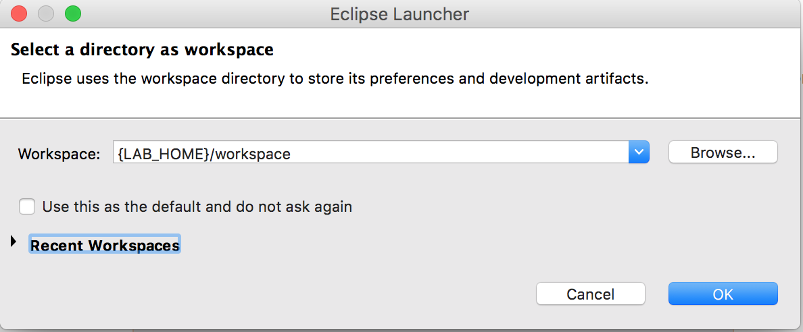   
         
1.  Remove the welcome page by clicking on the ‘X’ icon
   > 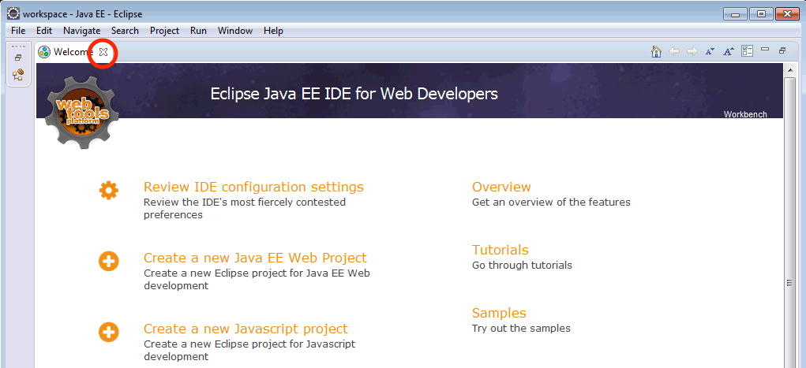

# Create Liberty Server in WDT

1.  At the bottom of the workbench, open the Servers view by clicking the Servers tab. Right-click within the windows of the Servers view and select **New > Server**
   > 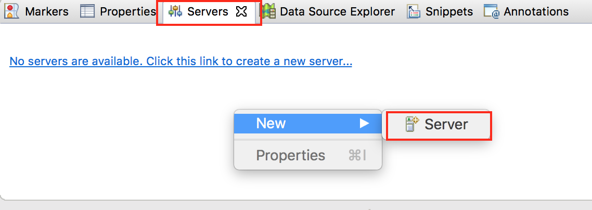
   
1.  Under the server type list, expand IBM and select the **Liberty Server** server type. Use the default eclipse server name as supplied (localhost). Click **Next**. This creates the liberty server object in eclipse.
  > 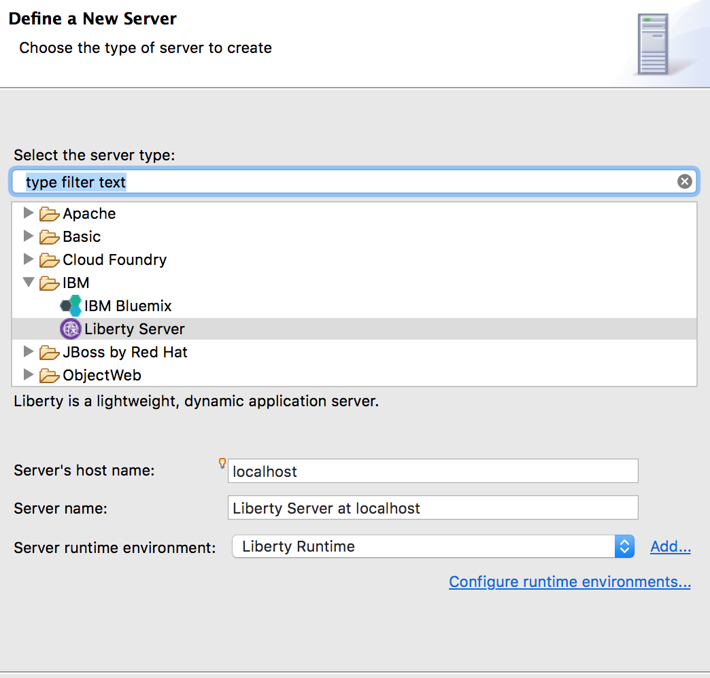
  
1.  Now eclipse needs to associate the ‘localhost’ server with a server
    configuration in a Liberty runtime (the runtime that you installed
    in section 3 above). The Liberty Runtime Environment page is
    displayed.
    1.  In the **Path** field under the **Installation folder** section,
        type or browse for the directory where you installed the Liberty
        runtime environment (The value of `{LAB_HOME}/wlp`)
    1. You may also select which JRE to use if you have multiple JRE in
        your environment.
    1. Click **Next.**
        > 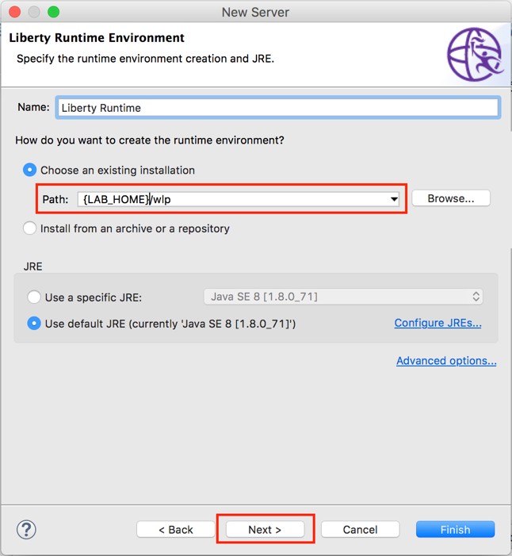
        
1.  To create the server configuration in the runtime, either use the current populated server ‘myServer’ or click the **New** button.  **Note:** If directions were followed and myServer was deleted, your screen print will differ and there will be no new button and defaultServer will be prepopulated
   > 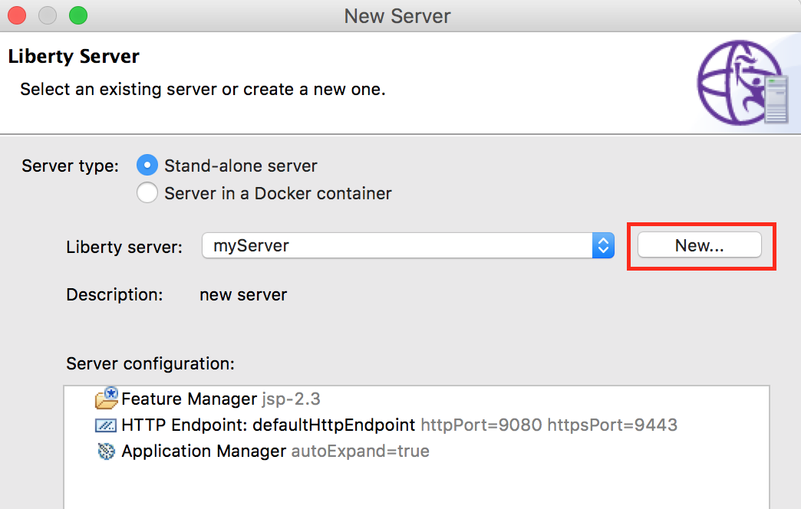
    
1.  Enter in **labServer** to the Liberty Server box then click **Finish** and then **Finish** again.
   > 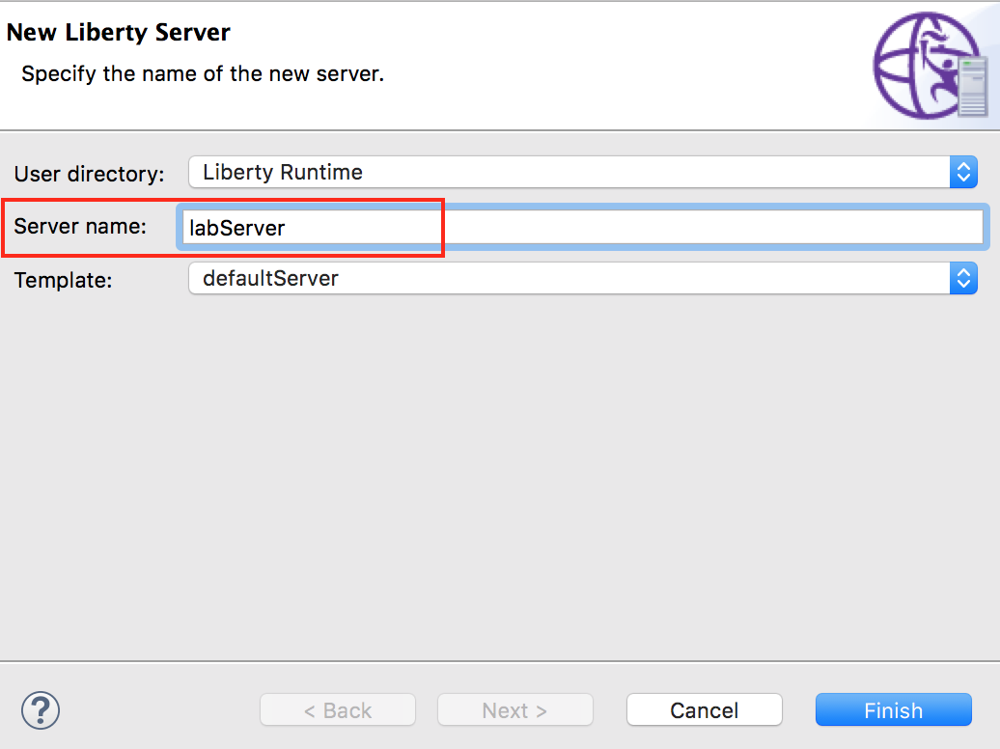
   
1.  The new server will appear in the Servers view. You can expand the server to show a quick view of the configuration. You can open the  server configuration editor by double-clicking on **Server Configuration:**
    > 
    

## Labs Accessing IBM Cloud: Create a IBM Cloud User ID

For the cloud labs, IBM Cloud is used for the hosting environment. If you already have an IBM Cloud account, you may skip this part. Your  30-day Cloud trial is free, with no credit card required. You get  access to 2 GB of runtime and container memory to run apps, unlimited IBM services and APIs.

1.  To begin, visit https://bluemix.net/ (redirects to
    console.bluemix.net) and select the **Create a free account** link.
    If you don't see a sign-up link, you should already be logged in,
    though you will need to know your login and password for later
    steps.
    > 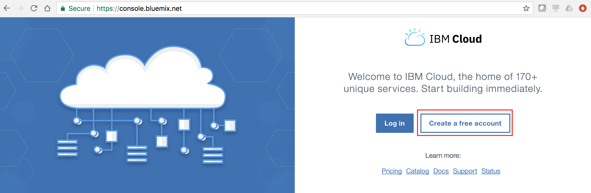

1.  On the sign-up page, enter your email address and the other required
    information. Your IBM ID and IBM Cloud information should be sent to
    your email account shortly.
    > 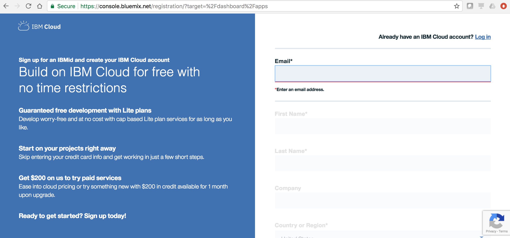

1.  Once you receive the email message in your account, follow the steps
    to verify your address. Once verified, you will be able to log in
    the IBM Cloud with the password you specified in the previous steps.
1.  Once created, open your account in the IBM Cloud console. Visit
    <https://console.ng.bluemix.net> and click **LOG IN**. Enter your
    email id and then your password as requested.
1.  Once logged in, you may need to create a new space and organization.
    If you are required to create these, you will be immediately asked
    to do so by the IBM Cloud console (otherwise, proceed to the next
    part).

## Labs Accessing IBM Cloud: Create a IBM Cloud API Key to use for authentication

As a IBM Cloud user, you might want to use an API key when you enable a program or script without distributing your password to the script or worry about dealing with password management. A benefit of using an API key can be that a user or organization can create several API Keys for different programs and the API keys can be deleted independently if compromised without interfering with other API keys or even the user.

1.  Create a Platform API Key to use to authenticate with IBM Cloud.
    1.  Click **Manage > Security > Platform API Keys**
    > 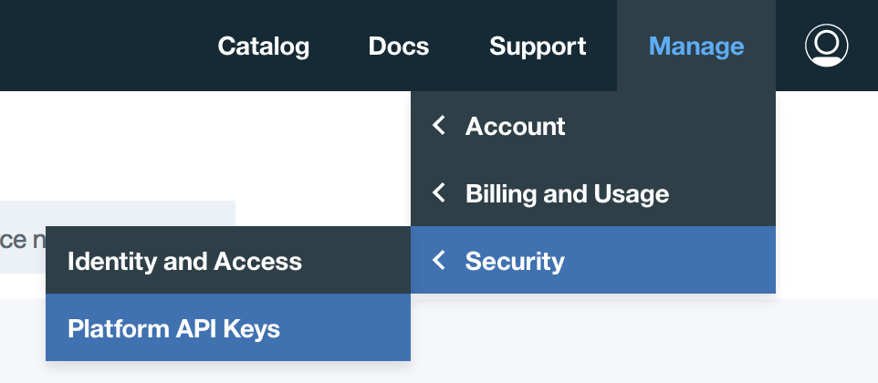

    1.  Click **Create**
       > 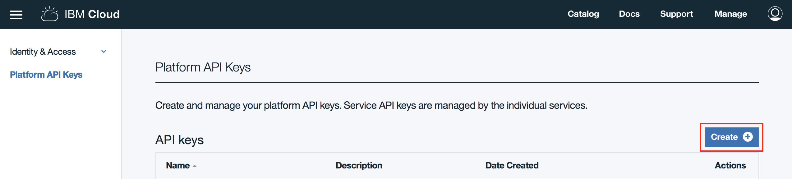

    1.  Enter the Name and a description; then click **Create **
        1.  Name: **Liberty-APIKey**
        1. Description: **This API Key for use with Liberty POTs**
         > 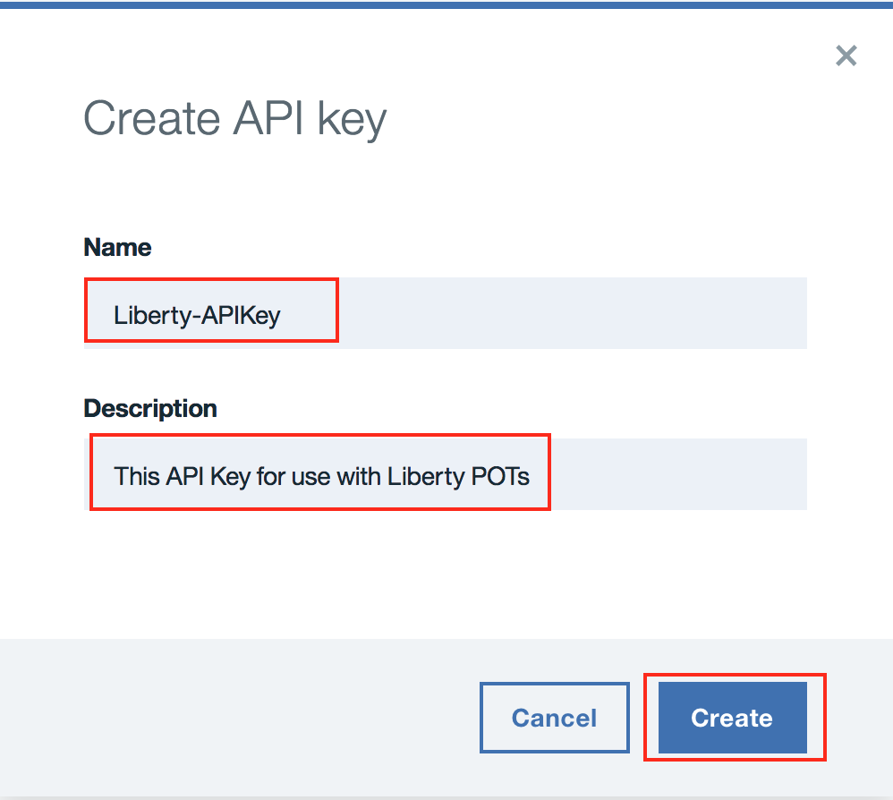

    1.  Click **Download**
      > 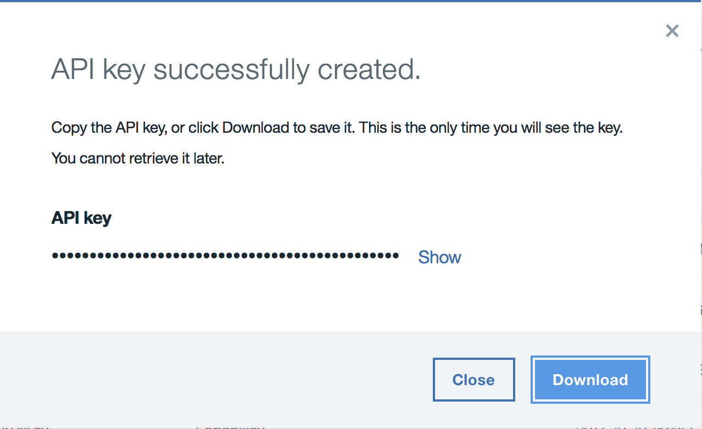
       
    1.  Find the downloaded file named **apiKey.json**. (This should be
        in your browsers Download folder) Now rename the file to
        **Liberty-APIKey.json.** There is a string in the file that will
        be used in lieu of a username/password.
    1.  Copy the **Liberty-APIKey.json** to {LAB_HOME} just so it is
        not lost. Unfortunately, this key is only downloadable in a file
        once. If lost, another key will need to be generated.
    1.  The file contents will look accordingly. The string in bold is
        your “password” that maps to the “user” or “email address” of
        **apikey**

` > {

> "name": "Liberty-APIKey",

> "description": "",

> "createdAt": "2017-06-26T16:16+0000",

> "apiKey": "**gI2-RsH8DHWGhCwWA-K61PSdWbLawRlgpAiGixmq7ZmD**"

> }`

## Labs Accessing IBM Cloud: Install the Command Line Interface (CLI) tools

You can use the command line interface to deploy and modify applications and service instances.

https://console.bluemix.net/docs/cli/index.html#cli

For these labs, Download the IBM Cloud CLI interface (bx.

https://console.bluemix.net/docs/cli/reference/bluemix_cli/get_started.html#getting-started

Once installed, executing **bx** should result in:
`
> $ bx
>
> NAME:
>
> bx - A command line tool to interact with Cloud
>
> USAGE:
>
> \[environment variables\] bx \[global options\] command
> \[arguments...\] \[command options\]
>
> VERSION:
>
> … `

This completes the lab exercise.

# Notices 

This information was developed for products and services offered in the
U.S.A.

IBM may not offer the products, services, or features discussed in this
document in other countries. Consult your local IBM representative for
information on the products and services currently available in your
area. Any reference to an IBM product, program, or service is not
intended to state or imply that only that IBM product, program, or
service may be used. Any functionally equivalent product, program, or
service that does not infringe any IBM intellectual property right may
be used instead. However, it is the user's responsibility to evaluate
and verify the operation of any non-IBM product, program, or service.

IBM may have patents or pending patent applications covering subject
matter described in this document. The furnishing of this document does
not grant you any license to these patents. You can send license
inquiries, in writing, to:

IBM Director of Licensing
IBM Corporation
North Castle Drive
Armonk, NY 10504-1785
U.S.A.

For license inquiries regarding double-byte (DBCS) information, contact
the IBM Intellectual Property Department in your country or send
inquiries, in writing, to:

IBM World Trade Asia Corporation Licensing
2-31 Roppongi 3-chome, Minato-ku
Tokyo 106-0032, Japan

**The following paragraph does not apply to the United Kingdom or any
other country where such provisions are inconsistent with local law:**
INTERNATIONAL BUSINESS MACHINES CORPORATION PROVIDES THIS PUBLICATION
"AS IS" WITHOUT WARRANTY OF ANY KIND, EITHER EXPRESS OR IMPLIED,
INCLUDING, BUT NOT LIMITED TO, THE IMPLIED WARRANTIES OF
NON-INFRINGEMENT, MERCHANTABILITY OR FITNESS FOR A PARTICULAR PURPOSE.
Some states do not allow disclaimer of express or implied warranties in
certain transactions, therefore, this statement may not apply to you.

This information could include technical inaccuracies or typographical
errors. Changes are periodically made to the information herein; these
changes will be incorporated in new editions of the publication. IBM may
make improvements and/or changes in the product(s) and/or the program(s)
described in this publication at any time without notice.

Any references in this information to non-IBM Web sites are provided for
convenience only and do not in any manner serve as an endorsement of
those Web sites. The materials at those Web sites are not part of the
materials for this IBM product and use of those Web sites is at your own
risk.

IBM may use or distribute any of the information you supply in any way
it believes appropriate without incurring any obligation to you.

Any performance data contained herein was determined in a controlled
environment. Therefore, the results obtained in other operating
environments may vary significantly. Some measurements may have been
made on development-level systems and there is no guarantee that these
measurements will be the same on generally available systems.
Furthermore, some measurements may have been estimated through
extrapolation. Actual results may vary. Users of this document should
verify the applicable data for their specific environment.

Information concerning non-IBM products was obtained from the suppliers
of those products, their published announcements or other publicly
available sources. IBM has not tested those products and cannot confirm
the accuracy of performance, compatibility or any other claims related
to non-IBM products. Questions on the capabilities of non-IBM products
should be addressed to the suppliers of those products.

All statements regarding IBM's future direction and intent are subject
to change or withdrawal without notice, and represent goals and
objectives only.

This information contains examples of data and reports used in daily
business operations. To illustrate them as completely as possible, the
examples include the names of individuals, companies, brands, and
products. All of these names are fictitious and any similarity to the
names and addresses used by an actual business enterprise is entirely
coincidental. All references to fictitious companies or individuals are
used for illustration purposes only.

COPYRIGHT LICENSE:

This information contains sample application programs in source
language, which illustrate programming techniques on various operating
platforms. You may copy, modify, and distribute these sample programs in
any form without payment to IBM, for the purposes of developing, using,
marketing or distributing application programs conforming to the
application programming interface for the operating platform for which
the sample programs are written. These examples have not been thoroughly
tested under all conditions. IBM, therefore, cannot guarantee or imply
reliability, serviceability, or function of these programs.

Trademarks and copyrights {#trademarks-and-copyrights .HeadingAppendix}
=========================

The following terms are trademarks of International Business Machines
Corporation in the United States, other countries, or both:

  IBM          AIX        CICS             ClearCase      ClearQuest   Cloudscape   
  ------------ ---------- ---------------- -------------- ------------ ------------ --
  Cube Views   DB2        developerWorks   DRDA           IMS          IMS/ESA      
  Informix     Lotus      Lotus Workflow   MQSeries       OmniFind                  
  Rational     Redbooks   Red Brick        RequisitePro   System i                  
  *System z*   *Tivoli*   *WebSphere*      *Workplace*    *System p*                

Adobe, the Adobe logo, PostScript, and the PostScript logo are either
registered trademarks or trademarks of Adobe Systems Incorporated in the
United States, and/or other countries.

IT Infrastructure Library is a registered trademark of the Central
Computer and Telecommunications Agency which is now part of the Office
of Government Commerce.

Intel, Intel logo, Intel Inside, Intel Inside logo, Intel Centrino,
Intel Centrino logo, Celeron, Intel Xeon, Intel SpeedStep, Itanium, and
Pentium are trademarks or registered trademarks of Intel Corporation or
its subsidiaries in the United States and other countries.

Linux is a registered trademark of Linus Torvalds in the United States,
other countries, or both.

Microsoft, Windows, Windows NT, and the Windows logo are trademarks of
Microsoft Corporation in the United States, other countries, or both.

ITIL is a registered trademark, and a registered community trademark of
The Minister for the Cabinet Office, and is registered in the U.S.
Patent and Trademark Office.

UNIX is a registered trademark of The Open Group in the United States
and other countries.

Java and all Java-based trademarks and logos are trademarks or
registered trademarks of Oracle and/or its affiliates.

Cell Broadband Engine is a trademark of Sony Computer Entertainment,
Inc. in the United States, other countries, or both and is used under
license therefrom.

Linear Tape-Open, LTO, the LTO Logo, Ultrium, and the Ultrium logo are
trademarks of HP, IBM Corp. and Quantum in the U.S. and other countries.

© Copyright IBM Corporation 2018.

The information contained in these materials is provided for
informational purposes only, and is provided AS IS without warranty of
any kind, express or implied. IBM shall not be responsible for any
damages arising out of the use of, or otherwise related to, these
materials. Nothing contained in these materials is intended to, nor
shall have the effect of, creating any warranties or representations
from IBM or its suppliers or licensors, or altering the terms and
conditions of the applicable license agreement governing the use of IBM
software. References in these materials to IBM products, programs, or
services do not imply that they will be available in all countries in
which IBM operates. This information is based on current IBM product
plans and strategy, which are subject to change by IBM without notice.
Product release dates and/or capabilities referenced in these materials
may change at any time at IBM’s sole discretion based on market
opportunities or other factors, and are not intended to be a commitment
to future product or feature availability in any way.

IBM, the IBM logo and ibm.com are trademarks of International Business
Machines Corp., registered in many jurisdictions worldwide. Other
product and service names might be trademarks of IBM or other companies.
A current list of IBM trademarks is available on the Web at “Copyright
and trademark information” at www.ibm.com/legal/copytrade.shtml.

