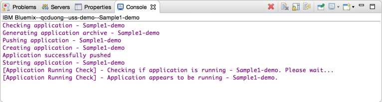

# Discover Liberty on IBM Cloud

In this lab, you will learn how to run, modify and deploy a simple web app to the cloud using the Java language and the IBM Cloud® Tools for Eclipse. Once you deploy the app to IBM Cloud, IBM's cloud development platform, anyone on the Internet can access it.

Please refer to the following table for file and resource location references on different operating systems.

Location Ref. |   OS    |     Absolute Path
 --------------| ------- | --------------------------
 *{LAB_HOME}*  | Windows |  `C:\\WLP_<VERSION>` or your choice
 *{LAB_HOME}*  | Linux   |  `~/WLP_<VERSION>` or your choice
 *{LAB_HOME}*  | Mac OSX |  `~/WLP_<VERSION>` or your choice  

## Introduction to IBM Cloud

IBM Cloud allows developers to deploy applications directly to the cloud without needing to configure the underlying system or service dependencies. This allows developers to stay focused on the fun stuff, without the hassle of backend and system configuration. IBM Cloud supports both web and mobile workloads, and provides boilerplates and runtimes for many common scenarios, which allows developers to get up-and-running quickly.

IBM Eclipse Tools for IBM Cloud grants you the ability to develop and deploy applications to your local workspace to IBM Cloud, directly from inside the Eclipse IDE. During this lab, we demonstrate how to install the tools and to quickly bootstrap your Eclipse environment to deploy to IBM Cloud using an existing IBM Cloud account. The tools integrate directly into your existing Eclipse environment (as a set of installed plug-ins). IBM Eclipse Tools for IBM Cloud is available from the Eclipse Marketplace, from WASdev and from ibmcloud.net, and is based on the open source Cloud Foundry Eclipse Integration project, while including additional support for IBM Cloud-specific functionality.

IBM Eclipse Tools for IBM Cloud provides a fully integrated IBM Cloud development environment for developing and deploying both Java and JavaScript applications. Developers may use IBM Cloud Eclipse Tools tooling to easily create new applications, or migrate/deploy existing applications.

## What is Liberty, and what is Liberty on IBM Cloud

WebSphere Liberty is a highly composable, fast-to-start, dynamic application server runtime environment. It is available as part of IBM WebSphere Application Server v8.5.5, and it supports popular frameworks like Spring and includes the IBM JRE. WebSphere Liberty enables rapid application development that is well suited to the cloud.

Liberty for Java applications on IBM® Cloud are powered by the IBM WebSphere® Liberty Buildpack. Buildpacks are the underlying infrastructure that your applications run on. Different buildpacks power different types of applications, for example, Java EE applications are powered by the Liberty buildpack, while Javascript applications are powered by Node.js buildpack. The Liberty buildpack provides a complete runtime environment for running Java EE 7 and OSGi applications on top of Liberty profile.

In addition to the above, IBM Cloud offers a wide variety of buildpacks, such as buildpacks for Ruby, GO, Python, PHP, ASP.NET and more. To see the full list of all available buildpacks, you can use the cf buildpacks once you have are logged in:

(What is CLI?: <https://www.ng.bluemix.net/docs/starters/install_cli.html>)

## Prerequisites

The following preparation must be completed prior to beginning this lab:

### Setup up Access to IBM Cloud

1.  Complete the sections marked “Labs Accessing IBM Cloud” in `${LAB_HOME}/labs/getttingStarted/0_setup/setup.pdf`

### Optional – Create the IBM Cloud Server configuration in WDT

> **Note:** If you already have a IBM Cloud Server defined in WDT, you can skip this step.

1.  At the bottom of the workbench, open the Servers view by clicking the Servers tab. Right-click within the windows of the Servers view and select **New > Server**:

 

1.  Under the **server type** list, expand IBM and select **IBM Cloud**. Use the default eclipse server name (IBM Cloud) supplied. Click **Next**.

 

1.  On the **IBM Cloud Account** page,

    1.  Enter your IBM Cloud login credentials. (These were created in the `labs/gettingStarted/0_setup/setup.pdf` section 0.5)

        1.  email address: **apikey**

        1. password: (Value in `{LAB_HOME}/Liberty-APIKey.json` file **apiKey**)

    1.  Select the URL from the drop-down list for the IBM Cloud Region you belong.

    1.  Click the **Validate Account** button. An error will be displayed if there are validation errors with the credentials entered.

    1.  If you have multiple ORGs or Spaces defined in your IBM Cloud account, select the desired ORG and Space where you will deploy your application. Click **Finish**.

        

    1.  A prompt may appear for a new master password. Use what you remember, but l**abPassword** is as good as any.

        

    1.  The IBM Cloud server will appear in the Servers view. You can expand the server and view any applications that are already deployed to your IBM Cloud server.

        

## Working with your application

### Deploy the WAR file to IBM Cloud

You can deploy the Simple1.war file directly to Java EE-compatible servers such as a Liberty profile server running either on your own computer or in the IBM Cloud cloud. You'll deploy it now to IBM Cloud:

1.  To get started, first make sure that your command window is in the working directory where the application war file is located at: `{LAB_HOME}\labs\cloud\1_LibertyOnIBMCloud\Sample1.war`

1.  If not already logged in to IBM Cloud, run these Cloud Foundry commands from your OS command prompt to log in:
    ~~~~
    bx api https://api.ng.bluemix.net/
    ~~~~
    For other regions of the world:
    ~~~~
     bx api https://api.eu-gb.bluemix.net/
     bx api https://api.eu-de.bluemix.net/
     bx api https://api.au-syd.bluemix.net/
     bx api https://api.us-east.bluemix.net

     bx login -u <Your IBM Cloud username> --apikey @{LAB_HOME}/Liberty-APIKey.json

     API endpoint: https://api.ng.bluemix.net
     Authenticating...
     OK

     Targeted account <your account> Account (eeee7d19b6701916e21bf02f116813a9)

     Targeted org <Your org (email if non subscribed account)>

     Targeted space LAB_SPACE

     API endpoint:   https://api.ng.bluemix.net (API version: 2.75.0)   
     Region:         us-south   
     User:           <your user email>
     Account:        <your account> Account (eeee7d19b6701916e21bf02f116813a9)   
     Org:            <Your org (email if non subscribed account)>
     Space:          LAB_SPACE   
                ~~~~

1.  Deploy <war name> to IBM Cloud by running this command:

    `bx cf push <your app name> -p <war name>`

    The name you choose for your application must be unique on IBM Cloud — not used by any other IBM Cloud user. You'll get an error if the name (called a *route*) is taken.

   The command that you just ran:

   1. Uploads the WAR file to IBM Cloud

   1. Runs the Liberty profile buildpack in IBM Cloud

   1. Starts your Liberty profile server instance in IBM Cloud

   1. Deploys the app in your Liberty Profile server instance

   1. Maps a route to your running app, enabling the app to be accessed over the Internet at the URL `https://<your app name>.mybluemix.net/`

1.  Open `https://<your app name>.mybluemix.net/SimpleServlet` in your browser to try out the app the simple web application call Sample1. The image below is an example of what the result looks like. The **sub-domain** url will be the value of <your app name>.mybluemix.net.

  For other regions in IBM Cloud:

  1. Open `https://<your app name>.<your-region>.myblulemix.net/SimpleServlet`

  For example:

  

1.  Stop and reflect. You just finished deploying a working web application to the cloud! The bx command-line tool and a IBM Cloud account were all you needed.

### Import the app into your Eclipse workspace

1.  Start your Eclipse IDE by running `{LAB_HOME}\wdt\eclipse.exe` and select the workspace at **{LAB_HOME}\workspace** . Select **File > Import**. The select **Web > WAR file**

    

1.  Browse your file system to locate the war file. Make sure to uncheck the **Add project to an EAR** box, then click the **Finish** button.

    

1.  Examine the simple code structure in the Enterprise Explorer pane on the left.

    

### Deploy application using IBM Cloud Tools for Eclipse

There are several ways to deploy this application to IBM Cloud. The earlier deployment was done using the Command Line Interface (CLI), in this part of the exercise you will use the IBM Cloud Tools for Eclipse to update and deploy the application to IBM Cloud.

1.  In the Enterprise Explorer, expand the **Java Resources > src > wasdev.sample**. Right click on the **SimpleServlet.java** file and choose **Run As > Run On Server**.

1.  In the menu that opens, select **IBM Cloud** under the Cloud folder then click on the **Finish** button.

    

1.  In the application details dialog window, enter a unique name for the application that will be deployed to IBM Cloud. The wizard will attempt to provide a unique name based on the Project. You can use provided name or enter a unique value of your liking. Suggest using `<your name>-Sample1-demo` Click the **Next** button.

    **Note:** A non-unique name can cause and error when deploying to IBM Cloud. Namespace is based on unique names.

    

1.  The Launch deployment dialogue allows for modifying the deployment details for the application. You can customize the Subdomain and Domain value, then validate if that route is available. You can also update the amount of memory allocated to the deployed instance.

    1.  Set the Memory Limit (MB) to **256**

    1.  Click the **Next** button to continue.

        

1.  The Services selection window allows you to optionally select and bind services that you have already provisioned, if any, in the IBM Cloud organization and space that you are you targeting. The service shown here is an example. Click on the **Finish** button.

    

1.  Follow the status of the deploying process using the **Console** view window.

    

1.  After a period of time, a web browser should open to the SimpleServlet as shown below. If this does not happen, open a browser and enter address as shown in the Deployed URL.

    

### Update the application on IBM Cloud

1.  Open the SimpleServlet.java file to reveal the implementation class in the editor.

    

1.  Change the print method to `` then **Save** the file.

1.  Select the SimpleServlet.java file and **Run As > On Server**. Choose the **IBM Cloud** server then click the **Finish** button.

3.  Look for updating application messages in the **Console** view.

    

4.  After a short time, you can see that the application is updated and results in the new font color.

    

5.  Congratulations! You deployed a web application on IBM Cloud.

Clean up
--------

In the interest of not running up subscription costs on IBM Cloud, please stop all instances that you created from the dashboard. This will let you stay in the free tier while you are learning the product.

Dashboard URLS are:

<https://console.ng.bluemix.net/dashboard/>

<https://console.us-east.bluemix.net/dashboard/>

<https://console.eu-gb.bluemix.net/dashboard>

<https://console.eu-de.bluemix.net/dashboard>

<https://console.au-syd.bluemix.net/dashboard>

## Glossary

> Familiarize yourself with the following important terms, which you'll often see in documentation and status messages when you work with IBM Cloud.
>
> **Droplet**— A bundle ready to run in the cloud, including everything needed (for instance, a bundle with JVM, Liberty profile server, and your app) except an operating system.
>
> **Buildpack**— An executable that takes the code or packaged server that you push, and bundles it up into a droplet.
>
> **Manifest**— An optional file, named ***manifest.yml***, that you can add to your project. The manifest file configures various parameters that affect the deployed server — including memory size, buildpack to use during deployment, services that are required, the disk space consumed, and so on. For simple Java web apps, you don't need a manifest; the system automatically detects and uses the Liberty profile buildpack and applies a default configuration.
>
> **Staging**— The process handled by the buildpack, bundling what you uploaded with system components and dependencies into a valid droplet
>
> **Droplet Execution Agent (DEA)**— The system piece that's responsible for reconstituting the droplet and running your app in the cloud
>
> **Warden**— A mechanism to ensure that your app is isolated and secured from other running apps

## Summary

> In this exercise, you have experience various ways to deploy and run your application to WebSphere Liberty on IBM Cloud. Using the command line interface as well as Eclipse based tooling.

#Notices 

This information was developed for products and services offered in the U.S.A.

IBM may not offer the products, services, or features discussed in this document in other countries. Consult your local IBM representative for information on the products and services currently available in your area. Any reference to an IBM product, program, or service is not intended to state or imply that only that IBM product, program, or service may be used. Any functionally equivalent product, program, or service that does not infringe any IBM intellectual property right may be used instead. However, it is the user's responsibility to evaluate and verify the operation of any non-IBM product, program, or service.

IBM may have patents or pending patent applications covering subject matter described in this document. The furnishing of this document does not grant you any license to these patents. You can send license inquiries, in writing, to:

IBM Director of Licensing\
IBM Corporation\
North Castle Drive\
Armonk, NY 10504-1785\
U.S.A.

For license inquiries regarding double-byte (DBCS) information, contact the IBM Intellectual Property Department in your country or send inquiries, in writing, to:

IBM World Trade Asia Corporation\
Licensing\
2-31 Roppongi 3-chome, Minato-ku\
Tokyo 106-0032, Japan

**The following paragraph does not apply to the United Kingdom or any other country where such provisions are inconsistent with local law:** INTERNATIONAL BUSINESS MACHINES CORPORATION PROVIDES THIS PUBLICATION "AS IS" WITHOUT WARRANTY OF ANY KIND, EITHER EXPRESS OR IMPLIED, INCLUDING, BUT NOT LIMITED TO, THE IMPLIED WARRANTIES OF NON-INFRINGEMENT, MERCHANTABILITY OR FITNESS FOR A PARTICULAR PURPOSE. Some states do not allow disclaimer of express or implied warranties in certain transactions, therefore, this statement may not apply to you.

This information could include technical inaccuracies or typographical errors. Changes are periodically made to the information herein; these changes will be incorporated in new editions of the publication. IBM may make improvements and/or changes in the product(s) and/or the program(s) described in this publication at any time without notice.

Any references in this information to non-IBM Web sites are provided for convenience only and do not in any manner serve as an endorsement of those Web sites. The materials at those Web sites are not part of the materials for this IBM product and use of those Web sites is at your own risk.

IBM may use or distribute any of the information you supply in any way it believes appropriate without incurring any obligation to you.

Any performance data contained herein was determined in a controlled environment. Therefore, the results obtained in other operating environments may vary significantly. Some measurements may have been made on development-level systems and there is no guarantee that these measurements will be the same on generally available systems. Furthermore, some measurements may have been estimated through extrapolation. Actual results may vary. Users of this document should verify the applicable data for their specific environment.

Information concerning non-IBM products was obtained from the suppliers of those products, their published announcements or other publicly available sources. IBM has not tested those products and cannot confirm the accuracy of performance, compatibility or any other claims related to non-IBM products. Questions on the capabilities of non-IBM products should be addressed to the suppliers of those products.

All statements regarding IBM's future direction and intent are subject to change or withdrawal without notice, and represent goals and objectives only.

This information contains examples of data and reports used in daily business operations. To illustrate them as completely as possible, the examples include the names of individuals, companies, brands, and products. All of these names are fictitious and any similarity to the names and addresses used by an actual business enterprise is entirely coincidental. All references to fictitious companies or individuals are used for illustration purposes only.

COPYRIGHT LICENSE:

This information contains sample application programs in source language, which illustrate programming techniques on various operating platforms. You may copy, modify, and distribute these sample programs in any form without payment to IBM, for the purposes of developing, using, marketing or distributing application programs conforming to the application programming interface for the operating platform for which the sample programs are written. These examples have not been thoroughly tested under all conditions. IBM, therefore, cannot guarantee or imply reliability, serviceability, or function of these programs.

Trademarks and copyrights {#trademarks-and-copyrights .HeadingAppendix}
=========================

The following terms are trademarks of International Business Machines Corporation in the United States, other countries, or both:

  IBM          AIX        CICS             ClearCase      ClearQuest   Cloudscape   
  ------------ ---------- ---------------- -------------- ------------ ------------ --
  Cube Views   DB2        developerWorks   DRDA           IMS          IMS/ESA      
  Informix     Lotus      Lotus Workflow   MQSeries       OmniFind                  
  Rational     Redbooks   Red Brick        RequisitePro   System i                  
  *System z*   *Tivoli*   *WebSphere*      *Workplace*    *System p*                

Adobe, the Adobe logo, PostScript, and the PostScript logo are either registered trademarks or trademarks of Adobe Systems Incorporated in the United States, and/or other countries.

IT Infrastructure Library is a registered trademark of the Central Computer and Telecommunications Agency which is now part of the Office of Government Commerce.

Intel, Intel logo, Intel Inside, Intel Inside logo, Intel Centrino, Intel Centrino logo, Celeron, Intel Xeon, Intel SpeedStep, Itanium, and Pentium are trademarks or registered trademarks of Intel Corporation or its subsidiaries in the United States and other countries.

Linux is a registered trademark of Linus Torvalds in the United States, other countries, or both.

Microsoft, Windows, Windows NT, and the Windows logo are trademarks of Microsoft Corporation in the United States, other countries, or both.

ITIL is a registered trademark, and a registered community trademark of The Minister for the Cabinet Office, and is registered in the U.S. Patent and Trademark Office.

UNIX is a registered trademark of The Open Group in the United States and other countries.

Java and all Java-based trademarks and logos are trademarks or registered trademarks of Oracle and/or its affiliates.

Cell Broadband Engine is a trademark of Sony Computer Entertainment, Inc. in the United States, other countries, or both and is used under license therefrom.

Linear Tape-Open, LTO, the LTO Logo, Ultrium, and the Ultrium logo are trademarks of HP, IBM Corp. and Quantum in the U.S. and other countries.

© Copyright IBM Corporation 2018.

The information contained in these materials is provided for informational purposes only, and is provided AS IS without warranty of any kind, express or implied. IBM shall not be responsible for any damages arising out of the use of, or otherwise related to, these materials. Nothing contained in these materials is intended to, nor shall have the effect of, creating any warranties or representations from IBM or its suppliers or licensors, or altering the terms and conditions of the applicable license agreement governing the use of IBM software. References in these materials to IBM products, programs, or services do not imply that they will be available in all countries in which IBM operates. This information is based on current IBM product plans and strategy, which are subject to change by IBM without notice. Product release dates and/or capabilities referenced in these materials may change at any time at IBM’s sole discretion based on market opportunities or other factors, and are not intended to be a commitment to future product or feature availability in any way.

IBM, the IBM logo and ibm.com are trademarks of International Business Machines Corp., registered in many jurisdictions worldwide. Other product and service names might be trademarks of IBM or other companies. A current list of IBM trademarks is available on the Web at “Copyright and trademark information” at www.ibm.com/legal/copytrade.shtml.

