# Liberty API Discovery

This lab will show you how to expose and explore REST APIs provided by a JAX-RS application. This lab will use airlines.war, a sample application, which exposes REST APIs. With minimal Liberty server configuration, those APIs will be documented via the REST API Explorer.

This lab covers the most common path for API discovery. More information and scenarios can be found on the [Exposing WebSphere Liberty REST APIs with Swagger](https://developer.ibm.com/wasdev/blog/2016/02/17/exposing-liberty-rest-apis-swagger/) article on wasdev.net and in the Knowledge Center.

*The API Economy is the economy where companies expose their (internal) business assets or services in the form of (Web) APIs to third parties with the goal of unlocking additional business value through the creation of new asset classes.*

And now with WebSphere Connect, and API discovery features in WAS Liberty, Java applications running in WebSphere fully participate in the API Economy.

The dominant architectural style for creating web APIs is through RESTful Web Services, and the JAX-RS specification has provided a way to create Java applications as REST APIs for quite some time. Now it is very easy to document and discover these APIs with Was Liberty.

WebSphere Liberty now provides the way to:

1. **Document Java APIs** using Swagger and the OpenAPI initiative,

2. **discover Java APIs** on a Liberty server,

3. **publish Java APIs to an API catalog**, such as provided with IBM API Connect

Please refer to the following table for file and resource location references on different operating systems.

Location Ref. |   OS    |     Absolute Path
 --------------| ------- | --------------------------
 *{LAB_HOME}*  | Windows |  `C:\\WLP_<VERSION>` or your choice
 *{LAB_HOME}*  | Linux   |  `~/WLP_<VERSION>` or your choice
 *{LAB_HOME}*  | Mac OSX |  `~/WLP_<VERSION>` or your choice  

## Prerequisites

The following preparation must be completed prior to beginning this lab:

1.  Complete the Getting Started lab to set up the lab environment, including JRE, and Liberty runtime, and Eclipse with WDT.

## Deploy a JAX-RS Application and Explore APIs

1.  Start Eclipse by running and select the workspace at `{LAB_HOME}\workspace`.

- (WIN) `{LAB_HOME}\wdt\eclipse\eclipse.exe`
- (MAC) `{LAB_HOME}/wdt/eclipse/Eclipse.app/Contents/MacOS/eclipse`
- (LINUX) `{LAB_HOME}/wdt/eclipse/eclipse`

    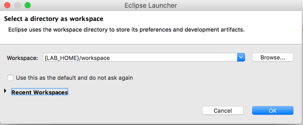

1.  Create a new Liberty server called apiDiscovery.

    1.  Open the Servers view, and create a new server.

        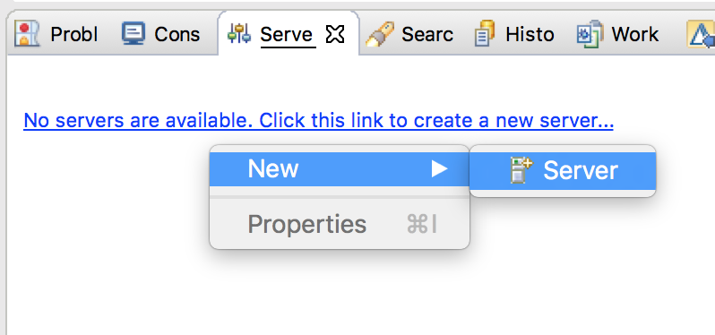

    1.  Create a new “**Liberty Server”** server representation. Click **Next**.

        

    1.  Click **New…** to create a new Liberty server instance.

        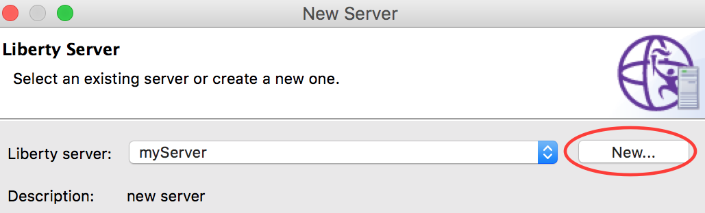

    1.  Specify the server name apiDiscovery and click **Finish**. And click **Finish** again.

        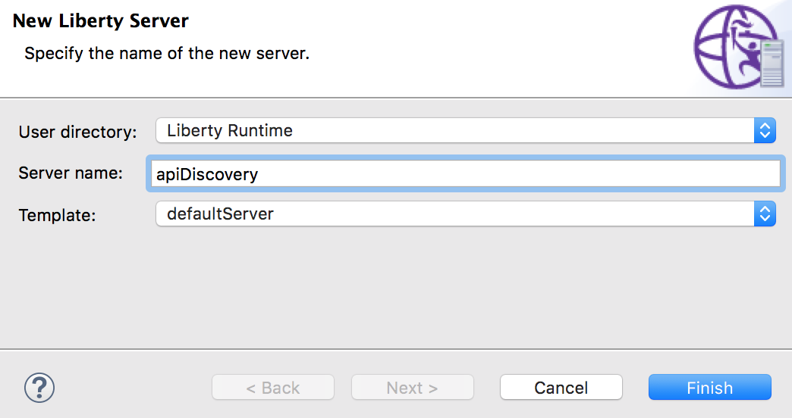

1.  Copy lab artifacts to the apiDiscovery server configuration. This lab relies on a pre-existing application and its associated configuration.

    1.  Copy the airlines.war from the lab directory to the `{WLP_USER_DIR}/servers/apiDiscovery/apps` directory.

    1.  Copy the server.xml from the lab directory to the `{WLP_USER_DIR}/servers/apiDiscovery` directory and replace the existing server.xml

1.  Start the apiDiscovery server and access the API Explorer. The API Explorer is protected and requires the Administrator role. The `server.xml` copied in the previous step defines the necessary security configuration to access the protected endpoint, specifically it defines a minimal SSL configuration and defines the user ‘admin’ as an Administrator.

    1.  From the **Servers** view, select your **apiDiscovery** server instance and click the **Start the server** button (). Alternatively, you can also right-click the server name and choose the **Start** option from the context menu.

    1.  To access the API Explorer, click on the link in the Console view.
        ***[AUDIT] CWWKT0016I: Web application available (default_host): <http://localhost:9080/ibm/api/explorer/>***

        Note: Make sure you pick the “ibm” url not the 9080/api/explorer

    1.  The web browser in Eclipse will open. Accept the Security Certificate (click Continue)

        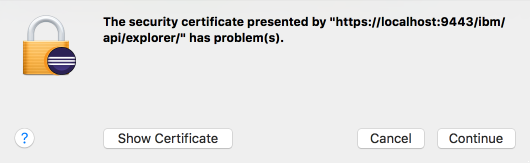

    1.  Log in with **username** ***‘admin’*** and **password** ***‘admin’***.

        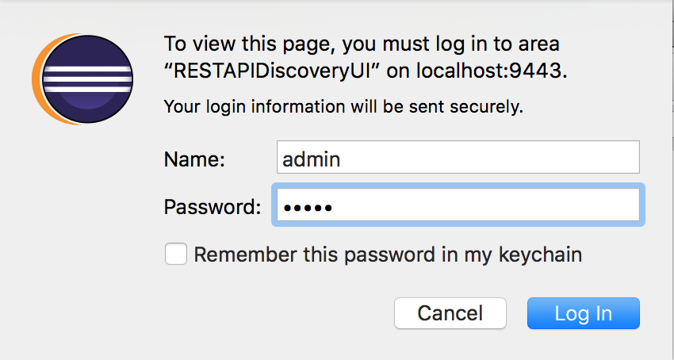

    1.  Click on the ***Airline Booking API*** heading to expand the section. The REST API Explorer allows you to see each available REST API, and to get detailed documentation for the API as well as to invoke it from within the Explorer.

        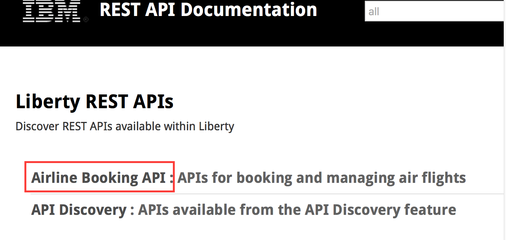

    1.  Listed is all of the REST APIs provided by the airlines.war application.  Click on **GET /airlines/** to expand the details of that API.

        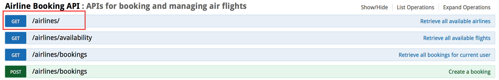

    1.  Within the expanded section, you can see sample JSON which the API returns. To drive a real invocation of the API, click the **Try it out!** button.

        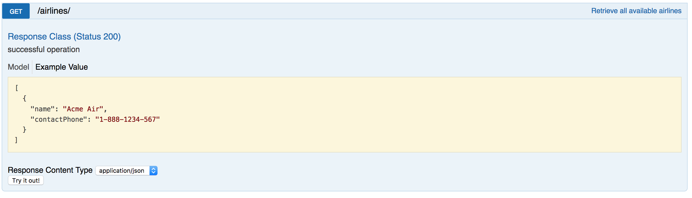

    1.  The **Try it out!** button drives the REST API and returns the details of the invocation.

        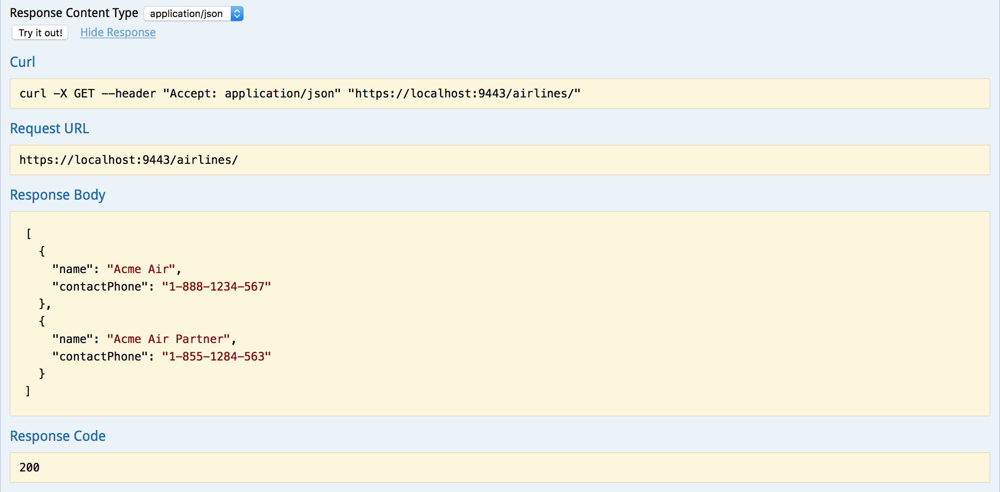

    1.  Take some time to play with the available REST APIs and the REST API Explorer. Next, we will look at the source code for the airlines.war app and see how the swagger documentation can be provided and defined within the application source code.

     You have just experienced how easy it is to use the API discovery feature and the API Explorer in Liberty to discover and work with APIs running on a Liberty server. This capability extends to the discovery of APIs on collectives of Liberty servers.  

     In the next section of the lab, you will explore the configuration and Swagger annotations that made that possible.

## Examine JAX-RS Application source and Swagger annotations

1.  The **airlines.war** includes the application source. You can explore the source by importing the WAR into Eclipse.

    1.  Click **File -> Import** and filter for ***war***. Click **Next**.

        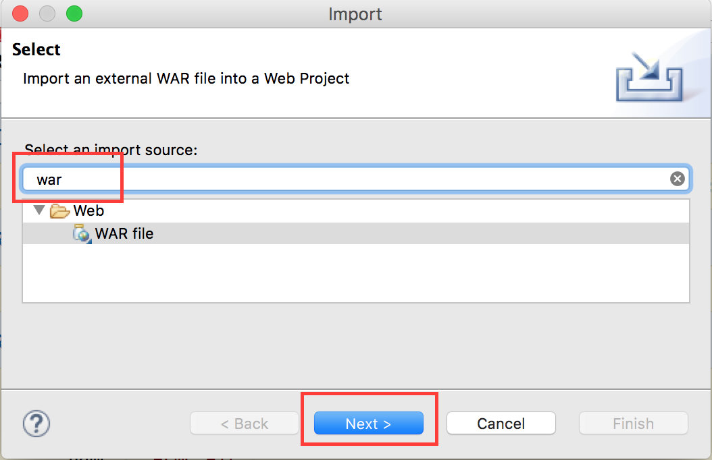

    1.  **Browse** to the airlines.war file (either in the lab material or in the server’s app directory). **Uncheck “Add project to EAR”.** Click **Finish**.

        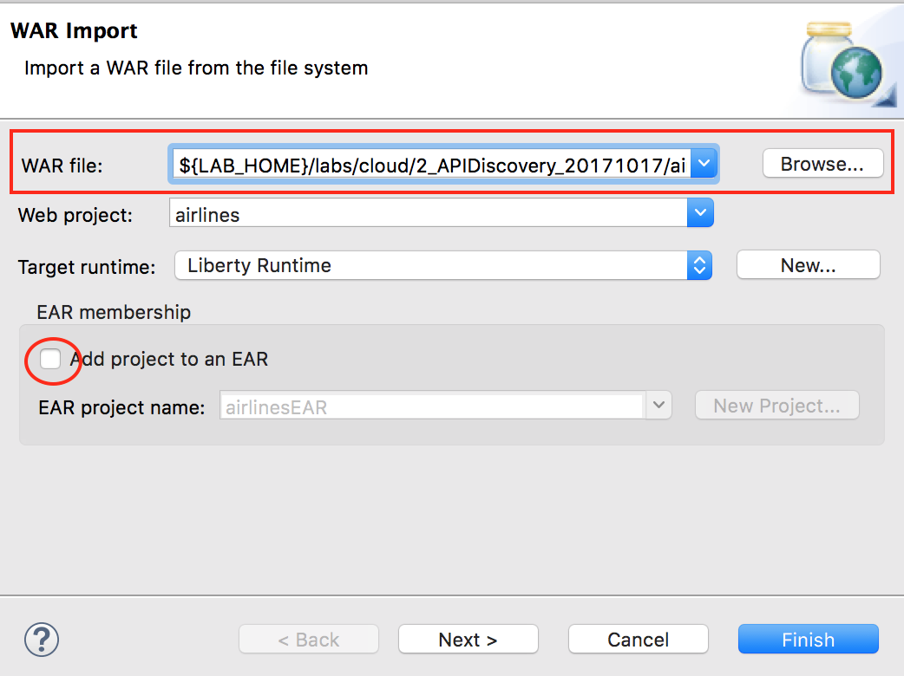

1.  Next we will browse the source code and explore the various Swagger annotations used to document the REST APIs.

    1.  Open the **JAXRSApp.java**

        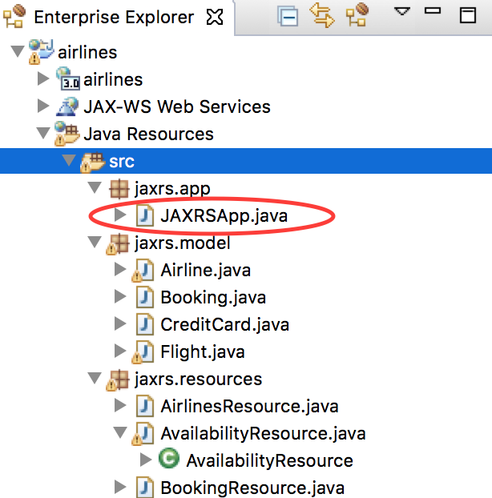

    1.  Review the code. The top-level entry point for the REST API and uses the `@SwaggerDefinition` annotation to name and describe the API.

      ~~~~
      @ApplicationPath("/")
      @SwaggerDefinition(tags={@Tag(name="Airline Booking API", description="APIs for booking and managing air flights")})
      public class JAXRSApp extends Application {
      ~~~~

    The `@SwaggerDefinition` annotation defines the top-level entry in the REST API Explorer.

        

    1.  Open **AvailabilityResource.java**

        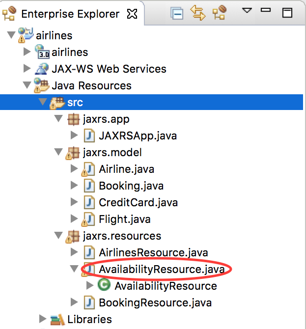

    1.  This class defines the /airlines/availability API. The method getFlights is annotated with `@ApiOperation`, which defines the operation’s description and the object model (Flight.class), which it will return.

        ~~~~
        @GET
        @ApiOperation(value="Retrieve all available flights", responseContainer="array", response=Flight.class)
        @Produces("application/json")
        public Response getFlights(@QueryParam("departureDate") String departureDate,
        ~~~~

        

    1.  The query parameter list defined by the getFlights operation is exposed via the REST API Explorer without the need for additional annotations.

        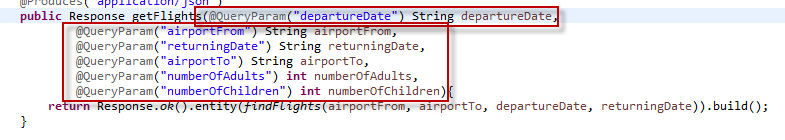

        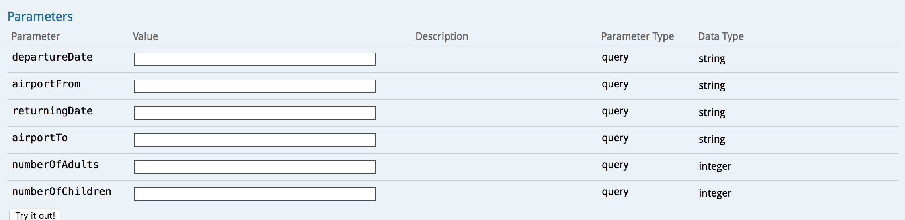

    1.  The Flight.class referenced in the `@ApiOperation` annotation is also exposed through the REST API Explorer when the operation’s model or model schema is viewed.

        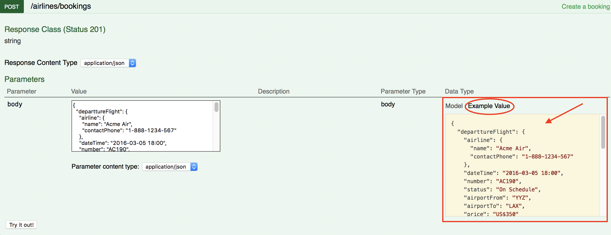

    1.  Next, open **Flight.java**.

        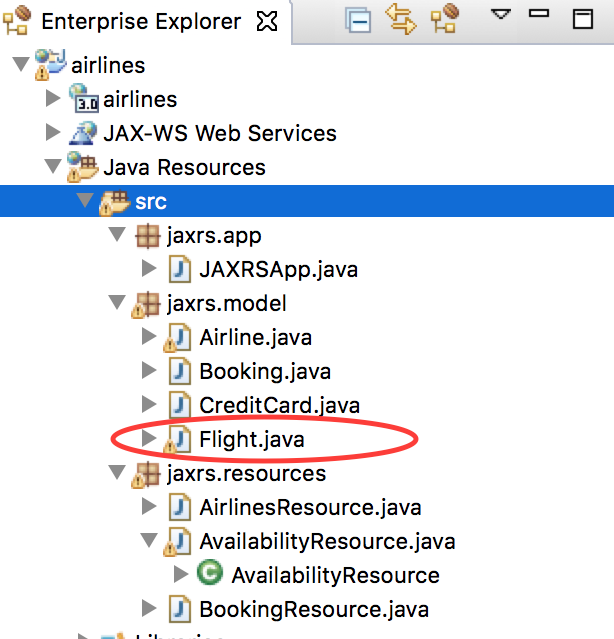

    1.  This class defines the Flight object used by the /airlines/availability API. The fields of the class are annotated with the `@ApiModelProperty` annotation, which Swagger will use to document necessary field values but also to provide the model schema in the screenshot above.

      ~~~~    
      @ApiModelProperty(required=true)
      private Airline airline;

      @ApiModelProperty(required=true, dataType="dateTime", example="2016-03-05 18:00")
      private String dateTime;

      @ApiModelProperty(required=true, example="AC190")
      private String number;
      ~~~~

1.  In the REST API Explorer, click on the **Model Example Value** for the "**POST airlines/booking**" API definition

    1.  Clicking on the **Model Example Value** automatically copy the contents into the body's text value. This demonstrates that by providing examples in your Swagger annotations you are improving the user experience of testing those APIs via the Explorer. It pre-populates the request body so when the “Try it out!” button is pressed it sends some data.

    1.  Click the **“Try it out!”** button

        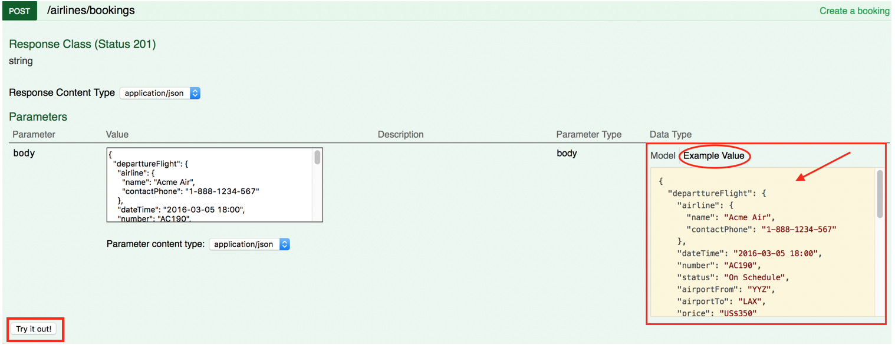

1.  A **Response Code** of 201 indicates that a new airline booking was created. The **Response Body** returns the ID of the new airline booking.

    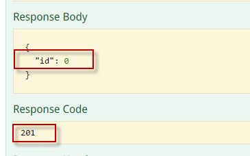

1.  Execute the  API

    1.  In the **id** filed, enter the ID from the Response Body of the POST API call

    1.  Click **Try it Out?**

        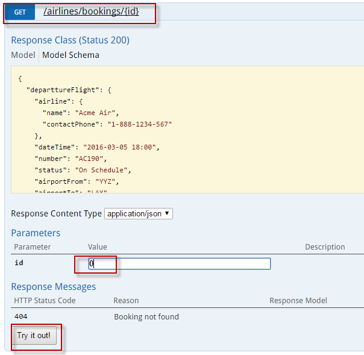

    1.  You should get a Response Code of 200, and the Response Body will contain the details of the booing you requested.

        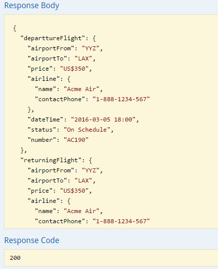

## Integration with API Connect

1.  The API Discovery capability of Liberty allows for easy integration with API Connect, which is an API management solution capable of providing metering, security and other gateway capabilities. This lab does not depend on API Connect, but you can [learn more about API Connect](http://www-03.ibm.com/software/products/en/api-management) and try it at ibm.com

1.  API Discovery supports pushing the API definitions into API Connect in order for the APIs to be managed through a central gateway.

    1.  In order to push the API definitions to API Connect, expand the **API Discovery** section in the REST API Explorer

    1.  Then expand **POST** **/ibm/api/docs/apiconnect**

        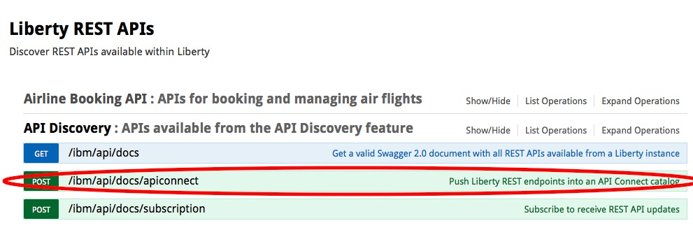

1.  Once expanded, you will see the various parameters, such as organization, catalog, server and X-APIM-Authorization which can be specified when pushing the API definition to API Connect.

    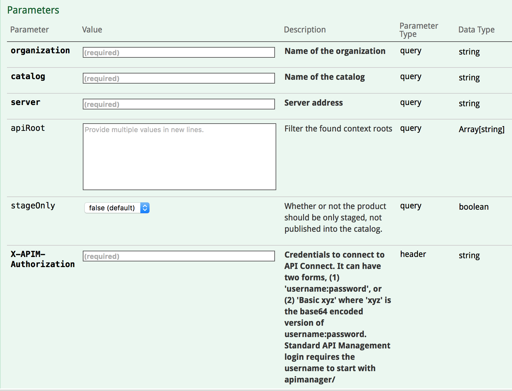

1.  The most important part of the form to submit is the **body**, which controls how API Connect will expose and configure access to the pushed APIs. The sample Model Schema can be modified to fully customize how the APIs are exposed via API Connect.

1.  For a demo of the end-to-end integration with API Connect, see the demo video **WebSphere Liberty API Connect Integration.mp4** in the lab folder.

## Clean up after lab

1.  Stop the apiDiscovery server by right clicking on the **apiDiscovery** in the Server view and select **Stop**.

    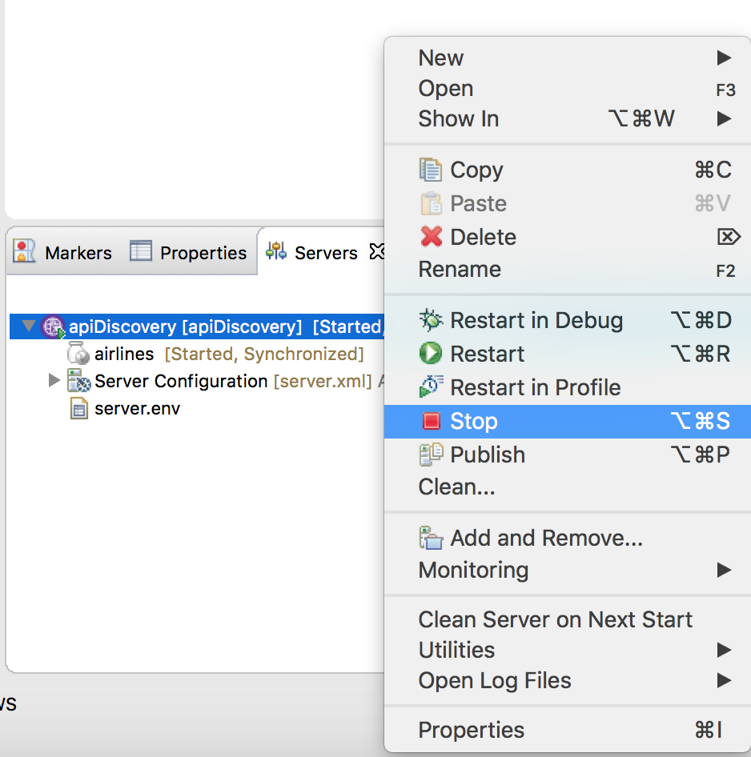

# Notices

This information was developed for products and services offered in the U.S.A.

IBM may not offer the products, services, or features discussed in this document in other countries. Consult your local IBM representative for information on the products and services currently available in your area. Any reference to an IBM product, program, or service is not intended to state or imply that only that IBM product, program, or service may be used. Any functionally equivalent product, program, or service that does not infringe any IBM intellectual property right may be used instead. However, it is the user's responsibility to evaluate and verify the operation of any non-IBM product, program, or service.

IBM may have patents or pending patent applications covering subject matter described in this document. The furnishing of this document does not grant you any license to these patents. You can send license inquiries, in writing, to:

IBM Director of Licensing\
IBM Corporation\
North Castle Drive\
Armonk, NY 10504-1785\
U.S.A.

For license inquiries regarding double-byte (DBCS) information, contact the IBM Intellectual Property Department in your country or send inquiries, in writing, to:

IBM World Trade Asia Corporation\
Licensing\
2-31 Roppongi 3-chome, Minato-ku\
Tokyo 106-0032, Japan

**The following paragraph does not apply to the United Kingdom or any other country where such provisions are inconsistent with local law:** INTERNATIONAL BUSINESS MACHINES CORPORATION PROVIDES THIS PUBLICATION "AS IS" WITHOUT WARRANTY OF ANY KIND, EITHER EXPRESS OR IMPLIED, INCLUDING, BUT NOT LIMITED TO, THE IMPLIED WARRANTIES OF NON-INFRINGEMENT, MERCHANTABILITY OR FITNESS FOR A PARTICULAR PURPOSE. Some states do not allow disclaimer of express or implied warranties in certain transactions, therefore, this statement may not apply to you.

This information could include technical inaccuracies or typographical errors. Changes are periodically made to the information herein; these changes will be incorporated in new editions of the publication. IBM may make improvements and/or changes in the product(s) and/or the program(s) described in this publication at any time without notice.

Any references in this information to non-IBM Web sites are provided for convenience only and do not in any manner serve as an endorsement of those Web sites. The materials at those Web sites are not part of the materials for this IBM product and use of those Web sites is at your own risk.

IBM may use or distribute any of the information you supply in any way it believes appropriate without incurring any obligation to you.

Any performance data contained herein was determined in a controlled environment. Therefore, the results obtained in other operating environments may vary significantly. Some measurements may have been made on development-level systems and there is no guarantee that these measurements will be the same on generally available systems. Furthermore, some measurements may have been estimated through extrapolation. Actual results may vary. Users of this document should verify the applicable data for their specific environment.

Information concerning non-IBM products was obtained from the suppliers of those products, their published announcements or other publicly available sources. IBM has not tested those products and cannot confirm the accuracy of performance, compatibility or any other claims related to non-IBM products. Questions on the capabilities of non-IBM products should be addressed to the suppliers of those products.

All statements regarding IBM's future direction and intent are subject to change or withdrawal without notice, and represent goals and objectives only.

This information contains examples of data and reports used in daily business operations. To illustrate them as completely as possible, the examples include the names of individuals, companies, brands, and products. All of these names are fictitious and any similarity to the names and addresses used by an actual business enterprise is entirely coincidental. All references to fictitious companies or individuals are used for illustration purposes only.

COPYRIGHT LICENSE:

This information contains sample application programs in source language, which illustrate programming techniques on various operating platforms. You may copy, modify, and distribute these sample programs in any form without payment to IBM, for the purposes of developing, using, marketing or distributing application programs conforming to the application programming interface for the operating platform for which the sample programs are written. These examples have not been thoroughly tested under all conditions. IBM, therefore, cannot guarantee or imply reliability, serviceability, or function of these programs.

Trademarks and copyrights {#trademarks-and-copyrights .HeadingAppendix}
=========================

The following terms are trademarks of International Business Machines Corporation in the United States, other countries, or both:

  IBM          AIX        CICS             ClearCase      ClearQuest   Cloudscape   
  ------------ ---------- ---------------- -------------- ------------ ------------ --
  Cube Views   DB2        developerWorks   DRDA           IMS          IMS/ESA      
  Informix     Lotus      Lotus Workflow   MQSeries       OmniFind                  
  Rational     Redbooks   Red Brick        RequisitePro   System i                  
  *System z*   *Tivoli*   *WebSphere*      *Workplace*    *System p*                

Adobe, the Adobe logo, PostScript, and the PostScript logo are either registered trademarks or trademarks of Adobe Systems Incorporated in the United States, and/or other countries.

IT Infrastructure Library is a registered trademark of the Central Computer and Telecommunications Agency which is now part of the Office of Government Commerce.

Intel, Intel logo, Intel Inside, Intel Inside logo, Intel Centrino, Intel Centrino logo, Celeron, Intel Xeon, Intel SpeedStep, Itanium, and Pentium are trademarks or registered trademarks of Intel Corporation or its subsidiaries in the United States and other countries.

Linux is a registered trademark of Linus Torvalds in the United States, other countries, or both.

Microsoft, Windows, Windows NT, and the Windows logo are trademarks of Microsoft Corporation in the United States, other countries, or both.

ITIL is a registered trademark, and a registered community trademark of The Minister for the Cabinet Office, and is registered in the U.S. Patent and Trademark Office.

UNIX is a registered trademark of The Open Group in the United States and other countries.

Java and all Java-based trademarks and logos are trademarks or registered trademarks of Oracle and/or its affiliates.

Cell Broadband Engine is a trademark of Sony Computer Entertainment, Inc. in the United States, other countries, or both and is used under license therefrom.

Linear Tape-Open, LTO, the LTO Logo, Ultrium, and the Ultrium logo are trademarks of HP, IBM Corp. and Quantum in the U.S. and other countries.

© Copyright IBM Corporation 2018.

The information contained in these materials is provided for informational purposes only, and is provided AS IS without warranty of any kind, express or implied. IBM shall not be responsible for any damages arising out of the use of, or otherwise related to, these materials. Nothing contained in these materials is intended to, nor shall have the effect of, creating any warranties or representations from IBM or its suppliers or licensors, or altering the terms and conditions of the applicable license agreement governing the use of IBM software. References in these materials to IBM products, programs, or services do not imply that they will be available in all countries in which IBM operates. This information is based on current IBM product plans and strategy, which are subject to change by IBM without notice. Product release dates and/or capabilities referenced in these materials may change at any time at IBM’s sole discretion based on market opportunities or other factors, and are not intended to be a commitment to future product or feature availability in any way.

IBM, the IBM logo and ibm.com are trademarks of International Business Machines Corp., registered in many jurisdictions worldwide. Other product and service names might be trademarks of IBM or other companies. A current list of IBM trademarks is available on the Web at “Copyright and trademark information” at www.ibm.com/legal/copytrade.shtml.

