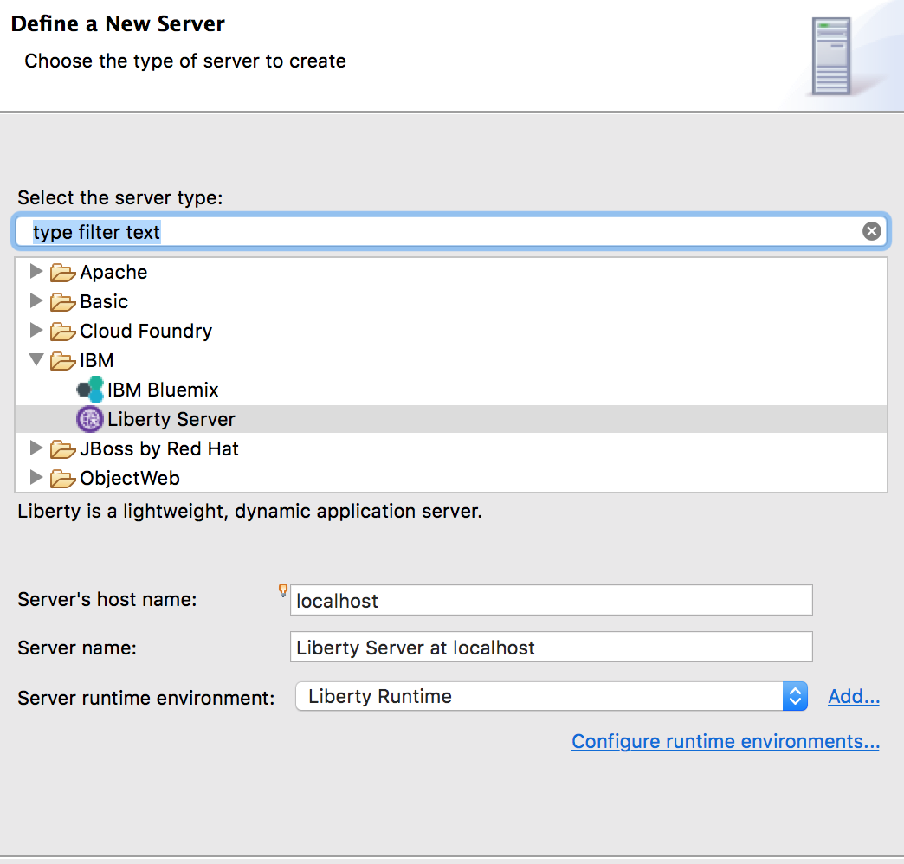
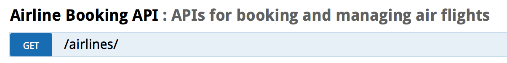

# Liberty API Discovery

This lab will show you how to expose and explore REST APIs provided by a JAX-RS application. This lab will use airlines.war, a sample application, which exposes REST APIs. With minimal Liberty server configuration, those APIs will be documented via the REST API Explorer.

This lab covers the most common path for API discovery. More information and scenarios can be found on the [Exposing WebSphere Liberty REST APIs with Swagger](https://developer.ibm.com/wasdev/blog/2016/02/17/exposing-liberty-rest-apis-swagger/) article on wasdev.net and in the Knowledge Center.

*The API Economy is the economy where companies expose their (internal) business assets or services in the form of (Web) APIs to third parties with the goal of unlocking additional business value through the creation of new asset classes.*

And now with WebSphere Connect, and API discovery features in WAS Liberty, Java applications running in WebSphere fully participate in the API Economy.

The dominant architectural style for creating web APIs is through RESTful Web Services, and the JAX-RS specification has provided a way to create Java applications as REST APIs for quite some time. Now it is very easy to document and discover these APIs with Was Liberty.

WebSphere Liberty now provides the way to:

1. **Document Java APIs** using Swagger and the OpenAPI initiative,

2. **discover Java APIs** on a Liberty server,

3. **publish Java APIs to an API catalog**, such as provided with IBM API Connect

Please refer to the following table for file and resource location references on different operating systems.

Location Ref. |   OS    |     Absolute Path
 --------------| ------- | --------------------------
 *{LAB_HOME}*  | Windows |  `C:\\WLP_<VERSION>` or your choice
 *{LAB_HOME}*  | Linux   |  `~/WLP_<VERSION>` or your choice
 *{LAB_HOME}*  | Mac OSX |  `~/WLP_<VERSION>` or your choice  

## Prerequisites

The following preparation must be completed prior to beginning this lab:

1.  Complete the Getting Started lab to set up the lab environment, including JRE, and Liberty runtime, and Eclipse with WDT.

## Deploy a JAX-RS Application and Explore APIs

1.  Start Eclipse by running and select the workspace at `{LAB_HOME}\workspace`.

- (WIN) `{LAB_HOME}\wdt\eclipse\eclipse.exe`
- (MAC) `{LAB_HOME}/wdt/eclipse/Eclipse.app/Contents/MacOS/eclipse`
- (LINUX) `{LAB_HOME}/wdt/eclipse/eclipse`

    

1.  Create a new Liberty server called apiDiscovery.

    1.  Open the Servers view, and create a new server.

        

    1.  Create a new “**Liberty Server”** server representation. Click **Next**.

        

    1.  Click **New…** to create a new Liberty server instance.

        

    1.  Specify the server name apiDiscovery and click **Finish**. And click **Finish** again.

        

1.  Copy lab artifacts to the apiDiscovery server configuration. This lab relies on a pre-existing application and its associated configuration.

    1.  Copy the airlines.war from the lab directory to the `{WLP_USER_DIR}/servers/apiDiscovery/apps` directory.

    1.  Copy the server.xml from the lab directory to the `{WLP_USER_DIR}/servers/apiDiscovery` directory and replace the existing server.xml

1.  Start the apiDiscovery server and access the API Explorer. The API Explorer is protected and requires the Administrator role. The `server.xml` copied in the previous step defines the necessary security configuration to access the protected endpoint, specifically it defines a minimal SSL configuration and defines the user ‘admin’ as an Administrator.

    1.  From the **Servers** view, select your **apiDiscovery** server instance and click the **Start the server** button (). Alternatively, you can also right-click the server name and choose the **Start** option from the context menu.

    1.  To access the API Explorer, click on the link in the Console view.
        ***[AUDIT] CWWKT0016I: Web application available (default_host): <http://localhost:9080/ibm/api/explorer/>***

        Note: Make sure you pick the “ibm” url not the 9080/api/explorer

    1.  The web browser in Eclipse will open. Accept the Security Certificate (click Continue)

        

    1.  Log in with **username** ***‘admin’*** and **password** ***‘admin’***.

        

    1.  Click on the ***Airline Booking API*** heading to expand the section. The REST API Explorer allows you to see each available REST API, and to get detailed documentation for the API as well as to invoke it from within the Explorer.

        

    1.  Listed is all of the REST APIs provided by the airlines.war application.  Click on **GET /airlines/** to expand the details of that API.

        

    1.  Within the expanded section, you can see sample JSON which the API returns. To drive a real invocation of the API, click the **Try it out!** button.

        

    1.  The **Try it out!** button drives the REST API and returns the details of the invocation.

        

    1.  Take some time to play with the available REST APIs and the REST API Explorer. Next, we will look at the source code for the airlines.war app and see how the swagger documentation can be provided and defined within the application source code.

     You have just experienced how easy it is to use the API discovery feature and the API Explorer in Liberty to discover and work with APIs running on a Liberty server. This capability extends to the discovery of APIs on collectives of Liberty servers.  

     In the next section of the lab, you will explore the configuration and Swagger annotations that made that possible.

## Examine JAX-RS Application source and Swagger annotations

1.  The **airlines.war** includes the application source. You can explore the source by importing the WAR into Eclipse.

    1.  Click **File -> Import** and filter for ***war***. Click **Next**.

        

    1.  **Browse** to the airlines.war file (either in the lab material or in the server’s app directory). **Uncheck “Add project to EAR”.** Click **Finish**.

        

1.  Next we will browse the source code and explore the various Swagger annotations used to document the REST APIs.

    1.  Open the **JAXRSApp.java**

        

    1.  Review the code. The top-level entry point for the REST API and uses the `@SwaggerDefinition` annotation to name and describe the API.

      ~~~~
      @ApplicationPath("/")
      @SwaggerDefinition(tags={@Tag(name="Airline Booking API", description="APIs for booking and managing air flights")})
      public class JAXRSApp extends Application {
      ~~~~

    The `@SwaggerDefinition` annotation defines the top-level entry in the REST API Explorer.

       

    1.  Open **AvailabilityResource.java**

        

    1.  This class defines the /airlines/availability API. The method getFlights is annotated with `@ApiOperation`, which defines the operation’s description and the object model (Flight.class), which it will return.

        ~~~~
        @GET
        @ApiOperation(value="Retrieve all available flights", responseContainer="array", response=Flight.class)
        @Produces("application/json")
        public Response getFlights(@QueryParam("departureDate") String departureDate,
        ~~~~

        

    1.  The query parameter list defined by the getFlights operation is exposed via the REST API Explorer without the need for additional annotations.

        

        

    1.  The Flight.class referenced in the `@ApiOperation` annotation is also exposed through the REST API Explorer when the operation’s model or model schema is viewed.

        

    1.  Next, open **Flight.java**.

        

    1.  This class defines the Flight object used by the /airlines/availability API. The fields of the class are annotated with the `@ApiModelProperty` annotation, which Swagger will use to document necessary field values but also to provide the model schema in the screenshot above.

      ~~~~    
      @ApiModelProperty(required=true)
      private Airline airline;

      @ApiModelProperty(required=true, dataType="dateTime", example="2016-03-05 18:00")
      private String dateTime;

      @ApiModelProperty(required=true, example="AC190")
      private String number;
      ~~~~

1.  In the REST API Explorer, click on the **Model Example Value** for the "**POST airlines/booking**" API definition

    1.  Clicking on the **Model Example Value** automatically copy the contents into the body's text value. This demonstrates that by providing examples in your Swagger annotations you are improving the user experience of testing those APIs via the Explorer. It pre-populates the request body so when the “Try it out!” button is pressed it sends some data.

    1.  Click the **“Try it out!”** button

        

1.  A **Response Code** of 201 indicates that a new airline booking was created. The **Response Body** returns the ID of the new airline booking.

    

1.  Execute the  API

    1.  In the **id** filed, enter the ID from the Response Body of the POST API call

    1.  Click **Try it Out?**

        

    1.  You should get a Response Code of 200, and the Response Body will contain the details of the booing you requested.

        

## Integration with API Connect

1.  The API Discovery capability of Liberty allows for easy integration with API Connect, which is an API management solution capable of providing metering, security and other gateway capabilities. This lab does not depend on API Connect, but you can [learn more about API Connect](http://www-03.ibm.com/software/products/en/api-management) and try it at ibm.com

1.  API Discovery supports pushing the API definitions into API Connect in order for the APIs to be managed through a central gateway.

    1.  In order to push the API definitions to API Connect, expand the **API Discovery** section in the REST API Explorer

    1.  Then expand **POST** **/ibm/api/docs/apiconnect**

        

1.  Once expanded, you will see the various parameters, such as organization, catalog, server and X-APIM-Authorization which can be specified when pushing the API definition to API Connect.

    

1.  The most important part of the form to submit is the **body**, which controls how API Connect will expose and configure access to the pushed APIs. The sample Model Schema can be modified to fully customize how the APIs are exposed via API Connect.

1.  For a demo of the end-to-end integration with API Connect, see the demo video **WebSphere Liberty API Connect Integration.mp4** in the lab folder.

## Clean up after lab

1.  Stop the apiDiscovery server by right clicking on the **apiDiscovery** in the Server view and select **Stop**.

    
