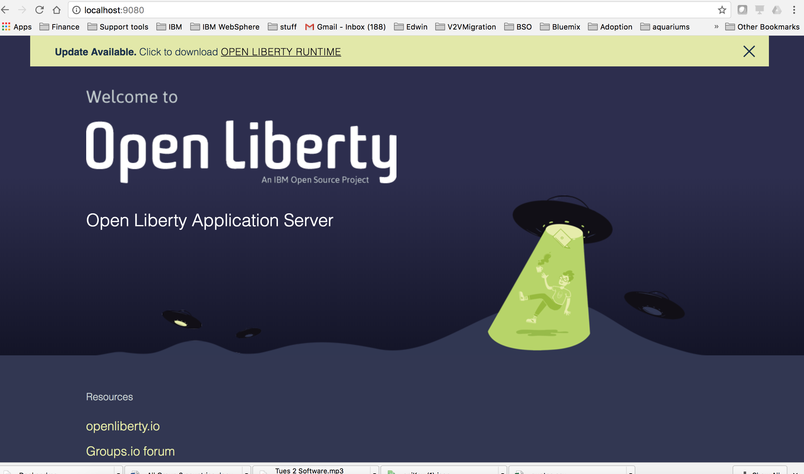
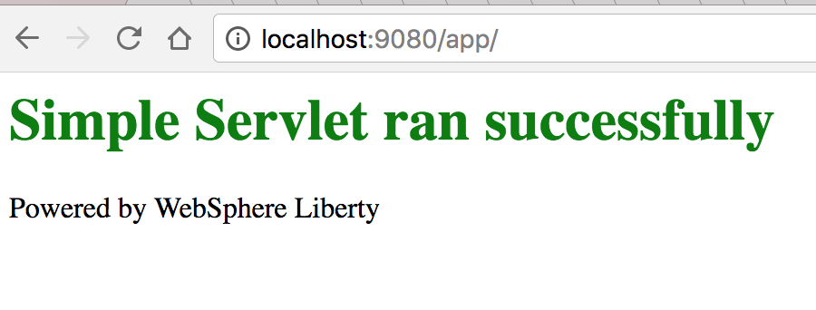
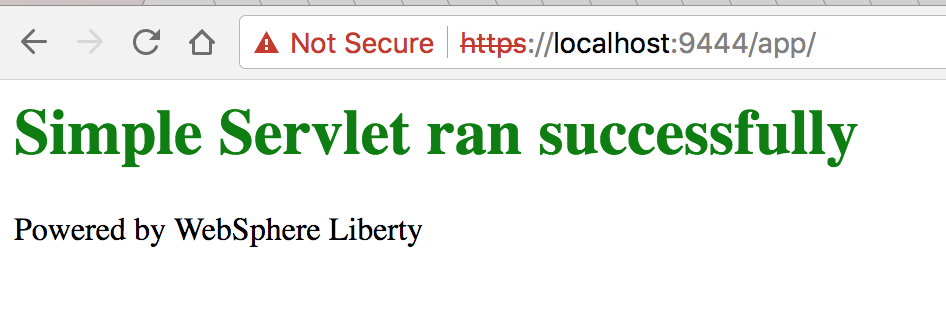

# Hello Docker!!

This lab is a primer on how to use, build, deploy and run Liberty in a Docker container. In this lab you will pull Liberty from Docker hub, install it, review information about the container, access resources inside the container, add an application then test it.

Please refer to the following table for file and resource location references on different operating systems.

Location Ref. |   OS    |     Absolute Path
 --------------| ------- | --------------------------
 *{LAB_HOME}*  | Windows |  `C:\\WLP_<VERSION>` or your choice
 *{LAB_HOME}*  | Linux   |  `~/WLP_<VERSION>` or your choice
 *{LAB_HOME}*  | Mac OSX |  `~/WLP_<VERSION>` or your choice

## Prerequisites

The following preparation must be completed prior to beginning this lab:

1.  Access to the internet and more specifically Docker Hub.

1.  Download and install Docker to your machine. Go to <https://www.docker.com/> to get the version for the OS being used.

    1.  If you are on Windows, Docker requires you to have Windows 10 installed

## Setting up your Docker environment

Docker has a set of infrastructure that is used to run and manage the Docker containers. When you install the Docker software it creates a daemon, command line tools and a quick start terminal.

1.  Open a terminal window and verify that Docker is installed by running:

    1.  `docker --version`
        `Docker version 1.12.1, build 6f9534c`

    1.  `docker run hello-world`

        1.  If it succeeds it will pull down the hello-world:latest confirming that Docker is working properly
        1. If it fails to start, start the Docker daemon

            `docker: Cannot connect to the Docker daemon. Is the docker daemon running on this host?.`

## Investigate the Docker Command

1.  Use the images option to find out which Docker images are in the local docker repository

    1.  `docker images`
        ~~~~
        REPOSITORY TAG IMAGE ID CREATED SIZE

        hello-world latest c54a2cc56cbb 11 weeks ago 1.848 kB
        ~~~~

1.  Investigate the history or layers that make up the container

    1.  `docker history hello-world`
        ~~~
        IMAGE CREATED CREATED BY SIZE COMMENT

        c54a2cc56cbb 11 weeks ago /bin/sh -c \#(nop) CMD \["/hello"\] 0 B

        <missing> 11 weeks ago /bin/sh -c \#(nop) COPY file:21fb0ede514e588c7 1.848 kB
        ~~~~
1.  Let’s run a Liberty image Docker container. Docker will check if there is an image in the repository. If not it will download the latest image, then run it.

    1.  `docker run -d -p 9080:9080 --name wlp websphere-liberty`
        ~~~~
        Unable to find image 'websphere-liberty:latest' locally

        latest: Pulling from library/websphere-liberty

        952132ac251a: Pull complete

        cf88eb2790ed: Pull complete

        b79bc15ccdb3: Pull complete

        26eea697f093: Pull complete

        f0772594b736: Pull complete

        6d864bbed0dc: Pull complete

        7c38edab1e5c: Pull complete

        e58a7f9f5b7a: Pull complete

        c0b1caf382fe: Pull complete

        d43e1f127400: Pull complete

        fa192947348f: Pull complete

        2830387e6f06: Pull complete

        969c2a1fc525: Pull complete

        b2de9651a96a: Pull complete

        d4d79c7cc2b4: Pull complete

        f68a11cc2013: Pull complete

        Digest: sha256:ac770677ec1f46f5ebd173d7abfc2b7dd6f431cd4f64d715cce3b328ee6dfdce

        Status: Downloaded newer image for websphere-liberty:latest

        5e8cf88eb88b747ea69323f0e0197950028f4a74a62e96633e4538cb7c7e2c4d
        ~~~~
    1.  Review the Container’s process information:

        1.  `docker ps`
            ~~~~
            CONTAINER ID IMAGE COMMAND CREATED STATUS

            3f5066240ef7 websphere-liberty "/opt/ibm/docker/dock" 9 seconds ago Up 8 seconds

            PORTS NAMES

            0.0.0.0:9080-<;9080/tcp, 9443/tcp wlp
            ~~~~

        1. `docker stats`
            ~~~~
            CONTAINER CPU % MEM USAGE / LIMIT MEM %

            3f5066240ef7 1.57% 159 MiB / 1.952 GiB 7.95%

            NET I/O BLOCK I/O PIDS

            648 B / 648 B 0 B / 20.61 MB 111
            ~~~~

        1. `Ctrl + C` to stop stats

    1.  Open a browser and access <http://localhost:9080>
      

    1.  Look at the logs for the Liberty server running inside the Docker container.

    1.  `docker logs --tail=all -f wlp`
         ~~~~
         Launching defaultServer (WebSphere Application Server 17.0.0.4/wlp-1.0.19.201712061531) on IBM J9 VM, version 8.0.5.7 - pxa6480sr5fp7-20171216_01(SR5 FP7) (en_US)
         [AUDIT] CWWKE0001I: The server defaultServer has been launched.

         [AUDIT] CWWKE0100I: This product is licensed for development, and limited production use. The full license terms can be viewed here: https://public.dhe.ibm.com/ibmdl/export/pub/software/websphere/wasdev/license/base_ilan/ilan/17.0.0.4/lafiles/en.html

         [AUDIT] CWWKG0093A: Processing configuration drop-ins resource: /opt/ibm/wlp/usr/servers/defaultServer/configDropins/defaults/keystore.xml

         [WARNING] CWWKS3103W: There are no users defined for the BasicRegistry configuration of ID com.ibm.ws.security.registry.basic.config[basic].

         [AUDIT] CWWKZ0058I: Monitoring dropins for applications.

         [AUDIT] CWWKS4104A: LTPA keys created in 1.266 seconds. LTPA key file: /opt/ibm/wlp/output/defaultServer/resources/security/ltpa.keys

         [AUDIT] CWPKI0803A: SSL certificate created in 3.267 seconds. SSL key file: /opt/ibm/wlp/output/defaultServer/resources/security/key.jks

         [AUDIT] CWWKI0001I: The CORBA name server is now available at corbaloc:iiop:localhost:2809/NameService.

         AUDIT ] CWWKF0012I: The server installed the following features: [servlet-3.1, beanValidation-1.1, ssl-1.0, jndi-1.0, jca-1.7, jms-2.0, ejbPersistentTimer-3.2, appSecurity-2.0, j2eeManagement-1.1, jdbc-4.1, wasJmsServer-1.0, jaxrs-2.0, javaMail-1.5, cdi-1.2, webProfile-7.0, jcaInboundSecurity-1.0, jpa-2.1, jsp-2.3, ejbLite-3.2, managedBeans-1.0, jsf-2.2, ejbHome-3.2, jaxws-2.2, jsonp-1.0, el-3.0, jaxrsClient-2.0, concurrent-1.0, appClientSupport-1.0, ejbRemote-3.2, javaee-7.0, jaxb-2.2, mdb-3.2, jacc-1.5, batch-1.0, ejb-3.2, json-1.0, jaspic-1.1, jpaContainer-2.1, distributedMap-1.0, websocket-1.1, wasJmsSecurity-1.0, wasJmsClient-2.0].

         [AUDIT] CWWKF0011I: The server defaultServer is ready to run a smarter planet.
         ~~~~

1.  `Ctrl+C` to stop the tail

1.  Clean up the environment:

    1.  First stop the container

        1.  `docker stop wlp`

            `wlp`

    1.  Second remove the container instance

        1.  `docker rm wlp`

            `wlp`

## Creating a Build file

To make the build process repeatable, create a Dockerfile which is the ordering of the layers of the runnable container.

1.  Changed directories to `{LAB_HOME}/labs/cloud/4_HelloDocker`

1.  Investigate the Dockerfile
   ~~~~
   FROM websphere-liberty
   COPY ServletApp.war /config/dropins/app.war
   ~~~~
    1.  The first line FROM is the virtual machine image that is to be used. If this is not in the local repository, this will be pulled from Docker Hub.

    1.  The second line COPY is a straight copy from the directory that you are running the build into the container at the designated directory.

1.  From the `4_HelloDocker` directory execute. This will build a template named app from the Dockerfile and place it in the local repository.

  `docker build -t app .`

   ~~~~
   Sending build context to Docker daemon 12.03 MB

   Step 1 : FROM websphere-liberty

   ---< a33cec241317

   Step 2 : COPY ServletApp.war /config/dropins/app.war

   ---< ea7cb8b12dc2

   Removing intermediate container 770d6a93e2cd

   Successfully built ea7cb8b12dc2
   ~~~~

1.  Run the Docker container. Note you are running this with both HTTP and HTTPS ports.

    `docker run -d -p 9080:9080 -p 9443:9443 --name=app-instance app`

    `73b1eed3d39c662c1acc231463499330d27ecb9636c5842f10aa87895a2fae5e`

    1. Open up a browser and enter <http://localhost:9080/app/>

      ***Note:*** if this doesn’t render, there might be a port conflict from an earlier lab. Check that all servers are terminated on the machine.
    

    1. Open up a browser and enter <https://localhost:9443/app/>. Notice you get that this is a secured connection, so this is SSL.

1.  Create a second instance of the same container, but this time make it listen on 9081 and 9444. Note the changes in red

  `docker run -d -p 9081:9080 -p 9444:9443 --name=app-instance1 app`

    1.  Open a browser and enter <https://localhost:9444/app>. Note they are both running, yet the application server inside the container is using the same port 9080 and 9443
    

6.  List the running containers
    ~~~~
    docker ps

    CONTAINER ID IMAGE COMMAND CREATED STATUS

    32c2db743837 app "/opt/ibm/docker/dock" 7 minutes ago Up 6 minutes

    73b1eed3d39c app "/opt/ibm/docker/dock" 14 minutes ago Up 5 minutes

    PORTS NAMES

    0.0.0.0:9081-< 9080/tcp, 0.0.0.0:9444-< 9443/tcp app-instance1

    0.0.0.0:9080-< 9080/tcp, 0.0.0.0:9443-< 9443/tcp app-instance
    ~~~~
7.  List the images to see that the same images were used for each instance
    ~~~~
    docker images

    REPOSITORY TAG IMAGE ID CREATED SIZE

    app latest ea7cb8b12dc2 27 minutes ago 442.8 MB

    websphere-liberty latest a33cec241317 2 hours ago 442.8 MB

    hello-world latest c54a2cc56cbb 11 weeks ago 1.848 kB
    ~~~~
1.  Stop the running containers
    ~~~~
    docker stop app-instance

    app-instance

    docker stop app-instance1

    app-instance1
    ~~~~
2.  Remove the instances
    ~~~~
    docker rm app-instance

    app-instance

    docker rm app-instance1

    app-instance1
    ~~~~
3.  Congratulations you have completed running Liberty in Docker!
