# Liberty Migration Toolkit lab

In this lab we will learn to use two different migration tools. The **Liberty Migration Toolkit** determines the suitability of migrating your applications from WebSphere Application Server, or other third party Java EE servers, to WebSphere Liberty. To analyze an application for migration suitability, the application must be imported into your Eclipse-based IDE.

The Migration Toolkit Eclipse plug-in includes a number of rule sets to scan Java EE applications for the use of vendor specific deployment descriptors, JSP files with proprietary APIs, and Java code with proprietary APIs. The rules scan applications for the use of Java technologies and APIs that are not supported in WebSphere Liberty.

The **Migration Toolkit for Application Binaries** is a stand-alone tool that is capable of scanning your application binaries, without source code, to give you a report of the programming models used by your application, and where they will run. It also offers an option to generate a detailed report about which line of your application may need to be changed.

In this lab exercise, you will learn:

1. Import the Sample Application onto Eclipse

1. Scan the imported application

1. View Migration Results and Generate Report.

1. Create additional scan reports and compare.

1. How to install the Migration Toolkit for Application Binaries

1. Use the toolkit to scan an application

1. Generate an evaluation report

1. Generate a detailed report

As prerequisites, you should:

1. Complete the Setup and discover lab to set up the lab environment, including JRE, and eclipse with WDT.

    To run this lab, your workstation must meet the following requirements:
        
     - Approximately 8GB of storage available

     - Approximately 3 GB of memory free to run the developer workbench and the server

     - Connectivity to the internet is NOT required

 1. Please refer to the following table for file and resource location references on different operating systems.
    
  Location Ref. |   OS    |     Absolute Path
   --------------| ------- | --------------------------
   *{LAB_HOME}*  | Windows |  `C:\\WLP_<VERSION>` or your choice
   *{LAB_HOME}*  | Linux   |  `~/WLP_<VERSION>` or your choice
   *{LAB_HOME}*  | Mac OSX |  `~/WLP_<VERSION>` or your choice

## Import the Sample Day Trader Application

To analyze an application for migration suitability, the application must be imported into your Eclipse-based IDE. If the application is not already in Eclipse, an easy way to import the application and organize it in projects that reflect their structure as EAR, WAR, and EJB files is by using the Eclipse import function as illustrated in the steps below.

1.  Select **File > Import** menu option.

    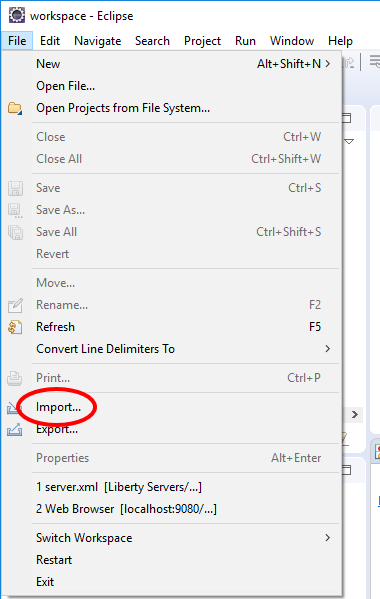

1.  Expand **Java EE**, select **EAR** File, then click **Next**

    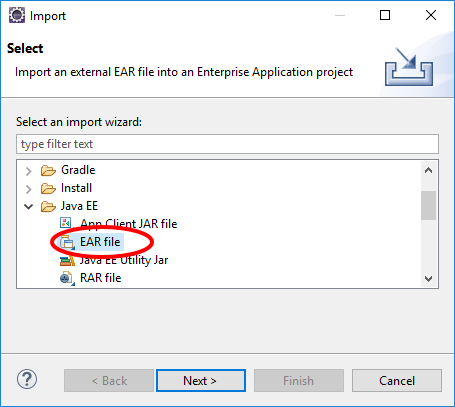

1.  Click **Browse**.

    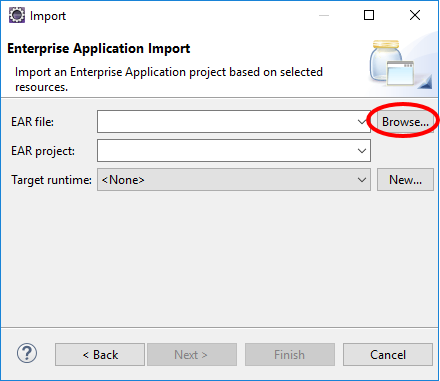

1.  Navigate to **{LAB_HOME}\labs\development\1\_LibertyMigrationToolkit** and select **daytrader20-ee5-src.ear**. Click **Open**

    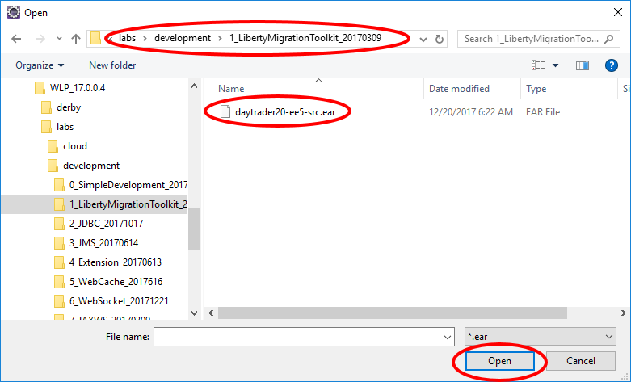

1.  Set **Target runtime** to **None**. Click **Next**

    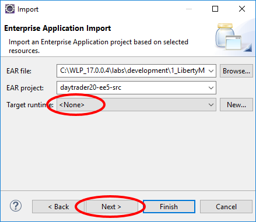

1.  Click **Next**

    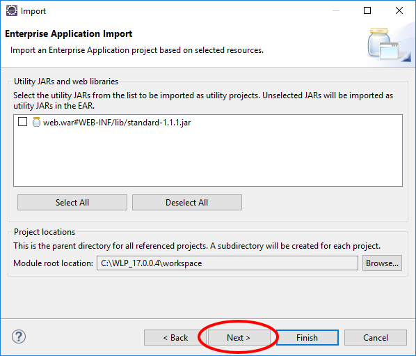

1.  The next panel shows different additional projects that will be created. Later we will configure the migration toolkit to scan these projects. Click **Finish**.

    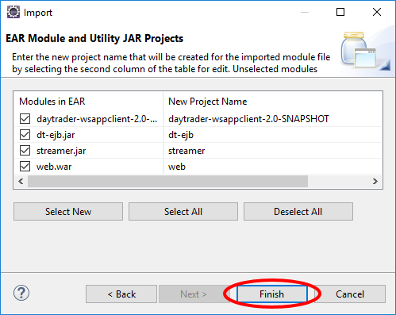{

## Scan the DayTrader Sample application

1.  Right-click on the **daytrader20-ee5-src** sample application that we imported, and navigate to **Software Analyzer Software Analyzer Configurations**
     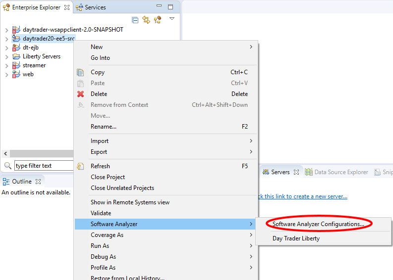

1.  Click **Software Analyzer** then click the **New** button

    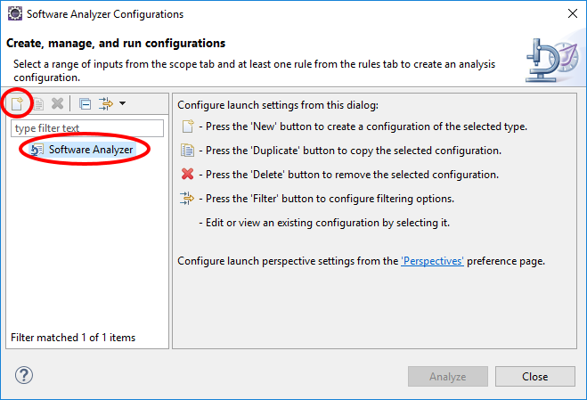

1.  Enter **DayTrader Liberty Core** as the name of the new configuration. Click **Analyze selected projects**, and choose the five Day Trader application related projects.

    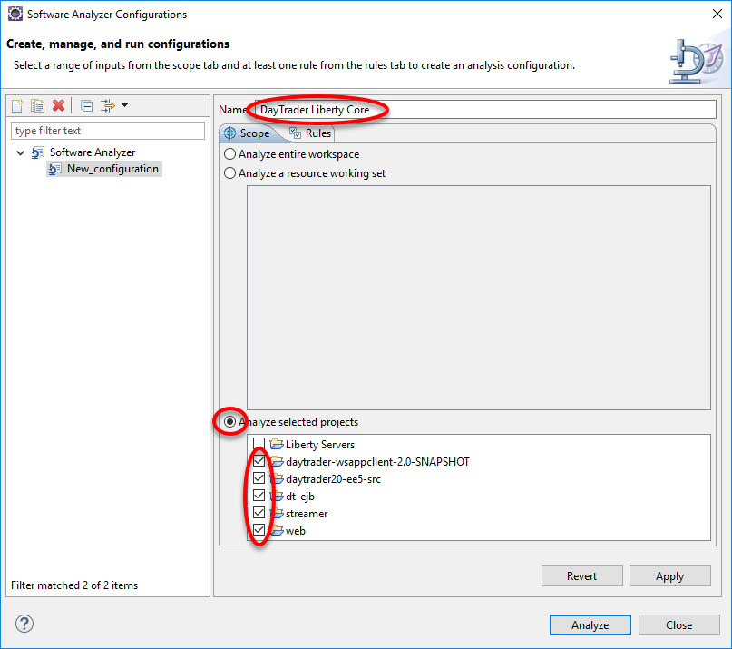

1.  Click **Rules**. Select **WebSphere Application Server Version Migration** from the **Rule Sets** drop-down. Then click **Set**

    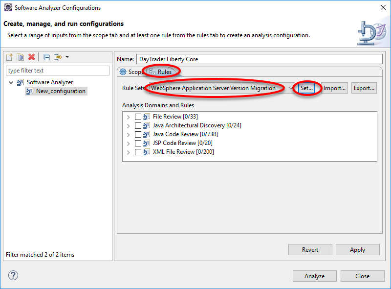

1.  In the pop-up, select **WebSphere Application Server V7.0** as the Source application server, **Liberty Core** as the Target application server, **Java EE 7** as Target Java EE version and **IBM Java 8** as the Target java version. Then click **OK**.

    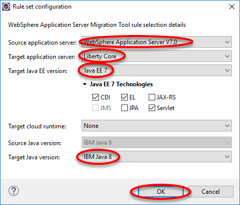

1.  Click **Apply** and then **Analyze**

    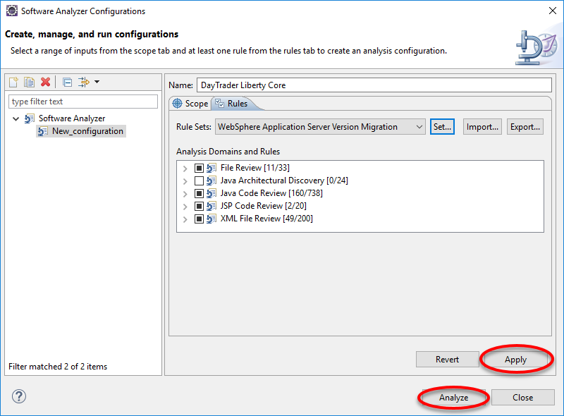

1.  Click **Software Analyzer Results** pane, if not already selected, to inspect the scan results. On the left is the scan history. There is currently only one scan for **DayTrader Liberty Core**. Click the **Java Code review** tab to inspect the results of scanning Java code.

    **Note:** There are results that apply to the **Liberty Core Edition**, and **Other Liberty Editions**.

    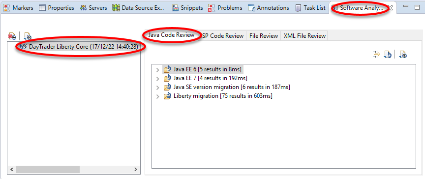

1.  Expand and click on **Liberty Migration Java Technology Support Liberty Core Low complexity Java Message Service**

    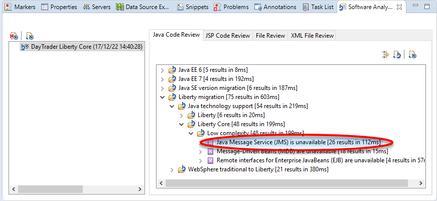

1.  Press **F1** key to bring up the help window. Note that the help message explains that even though JMS is not supported for Liberty core edition, it is available in other editions via other features. The same restriction applies to MDB and remote EJBs. If **F1** doesn’t work, **Click Window > Show View > Other > Help > Help**
    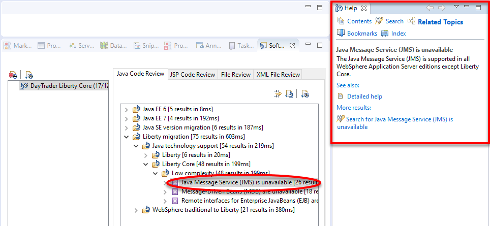

1.  Expand **Liberty** to examine additional scan results.

    1.  Under **Low complexity**, click on **getRealPath()** and read the text in the **Help** window to make it work in the Liberty.

        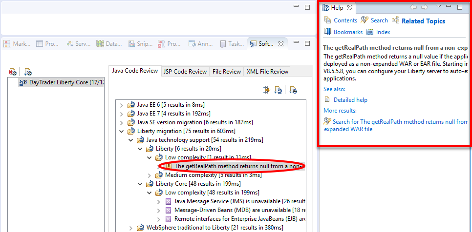

    1.  Under **Medium complexity**, click on **JAX-RPC** and read the **Help** text.

        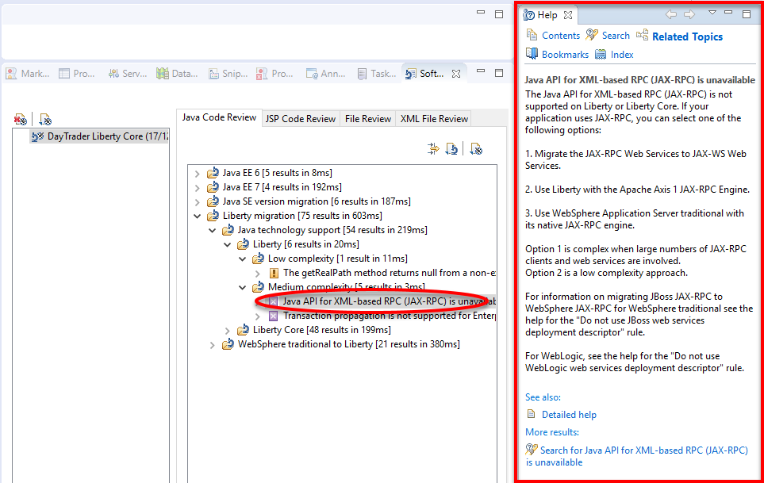

1.  Under **WebSphere traditional to Liberty** section, examine which third party APIs are not available in the Liberty

    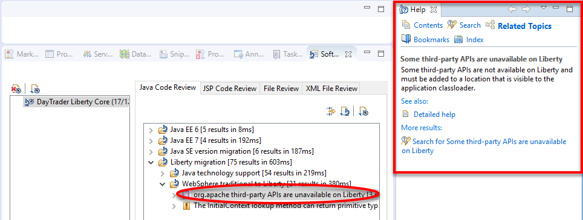

1.  Select **Liberty Core** and click the **Generate Report** button.

    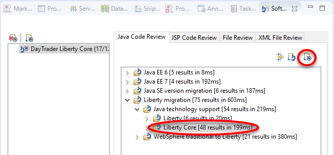

1. Click **OK** to view all the **Java Code Review** results

    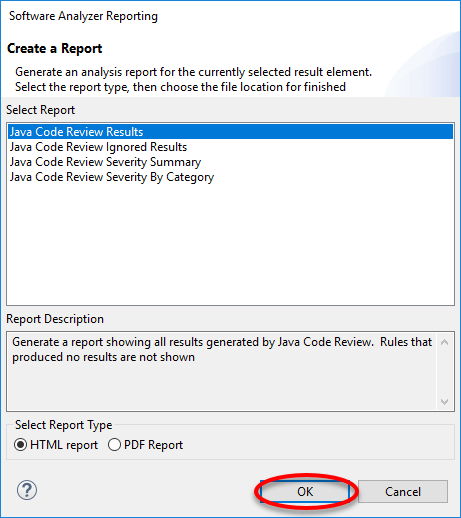

    The result will appear in a different pane
    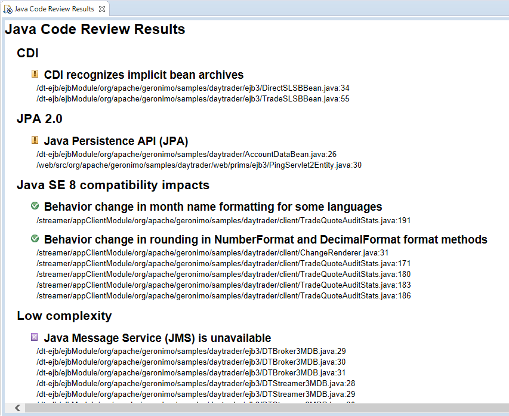

## Create Additional Scan Reports

1.  Right click on any **DayTrader** project and navigate to **Software Analyzer Software Analyzer Configurations…**

    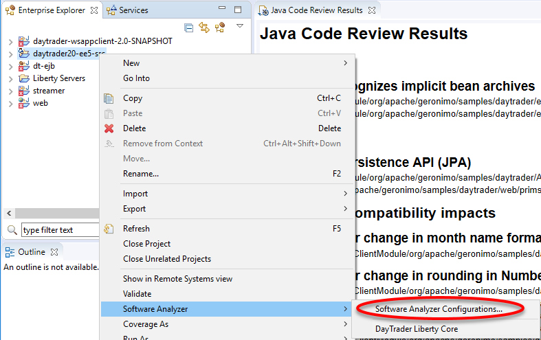

1.  Click **Software Analyzer** then click the **New** button.

    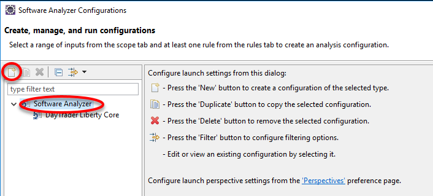

1.  Name the new configuration **Day Trader Liberty**, and select the same Day Trader related projects as before.

    

1.  Click **Rules** and select **WebSphere Application Server Version Migration** rule set. Click **Set**

    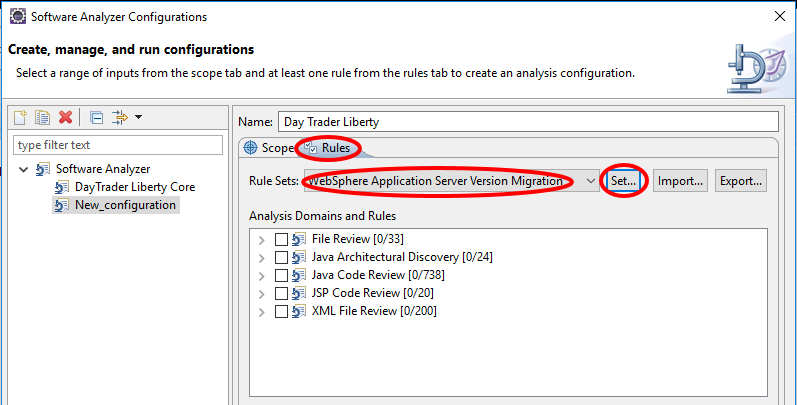

1.  In the popup, select **WebSphere Application Server V7.0** for source, **Liberty** for Target application server, **Java EE 7** for Target Java EE version, and **IBM Java 8** for Target Java version. Then click **OK**.
    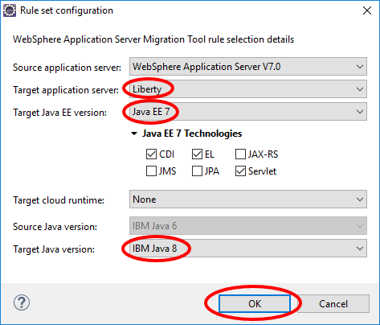

1.  Click **Apply** and then **Analyze**

    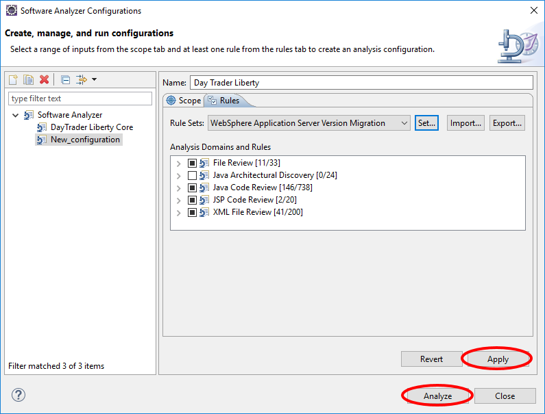

1.  Note there are now two runs in the scan history pane. The most recent run uses the Liberty rule set. Compared to the previous run, **no JMS**, **MDB, or EJB** issues are reported because they only apply to the **Liberty Core Edition**

    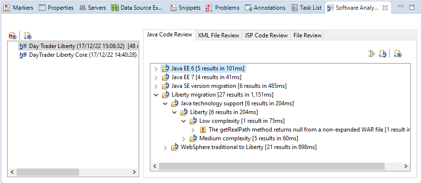

## Migration Toolkit for Application Binaries

1.  Install the migration toolkit for application binaries.

    1.  Set up a JAVA_HOME in your terminal window and add it to your path.

        1.  Linux

            `export JAVA_HOME={LAB_HOME}/wlp/java`

            `export PATH=$PATH:$JAVA_HOME/jre/bin`

        1. Windows

            `set JAVA_HOME={LAB_HOME}\wlp\java`

            `set PATH=%PATH%;%JAVA_HOME%\jre\bin`
        1. MAC No actions necessary    

    1.  Install the binary scanner

        `java -jar {LAB_HOME}/MigrationToolkit/binaryAppScannerInstaller.jar {LAB\_HOME} –acceptLicense`

    You should see output similar to the following:
~~~~
    Before you can use, extract, or install IBM WebSphere Application 
    Server Migration Toolkit for Application Binaries, you must accept the 
    terms of International License Agreement for Non-Warranted Programs and 
    additional license information. Please read the following license 
    agreements carefully.
  
     The --acceptLicense argument was found. This indicates that 
     you have accepted the terms of the license agreement.

     Extracting files to c:\\WLP\_17.0.0.4\\wamt

     Successfully extracted all product files.
~~~~
   This will create a directory under {LAB_HOME}/wamt. Examine the contents of the newly created directory.

1.  To see a summary of the available command line options, run the binary scanner with the **--help** option.

    `java -jar {LAB_HOME}/wamt/binaryAppScanner.jar --help`
~~~~
+-----------------------------------------------------------------------+
| **Notice**                                                            |
|                                                                       |
| -   It is a best practice to identify your custom application class   |
|     packages with the\                                                |
|     --includePackages option. By doing so, you avoid scanning Java EE |
|     and third-party packages which should not affect your migration   |
|     effort.\                                                          |
|     If no --includePackages or --excludePackages options are          |
|     explicitly specified, the tool now excludes Java EE and some      |
|     third-party packages by default. These packages are identified as |
|     scan options near the beginning of the report.                    |
|                                                                       |
| -   Previously, all classes packaged within the application were      |
|     scanned, even if they were located in third-party JARs. This      |
|     often caused reports to contain hundreds or even thousands of     |
|     results that could and should be ignored. The inclusion of those  |
|     results led to much confusion and inaccurate assessments of the   |
|     migration effort.                                                 |
+-----------------------------------------------------------------------+
~~~~

1.  Run the command

    `java -jar {LAB\_HOME}/wamt/binaryAppScanner.jar {LAB_HOME}/labs/development/1_MigrationToolkit/daytrader20-ee5-src.ear --evaluate --includePackages=”org.apache,wasdev.sample”`

2.  A browser window will open showing a report about the programming models used by the application and where they will run. Review the report to see what programming models are used in the day trader application, and where they will run:

    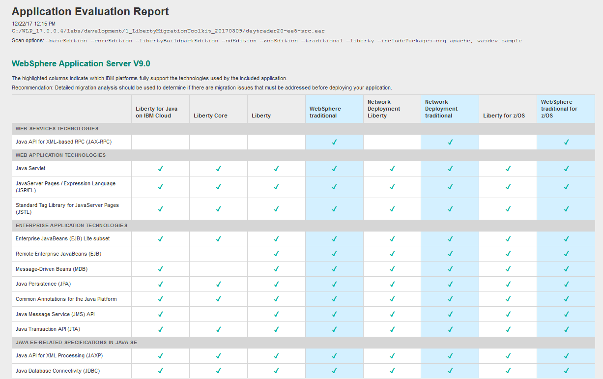

3.  Re-run the command, but this time with --analyze option.

    `java -jar {LAB\_HOME}/wamt/binaryAppScanner.jar {LAB_HOME}/labs/development/1_MigrationToolkit/daytrader20-ee5-src.ear --analyze --includePackages=”org.apache,wasdev.sample”`

4.  A browser window will open showing detailed information about which code may have to be changed:
    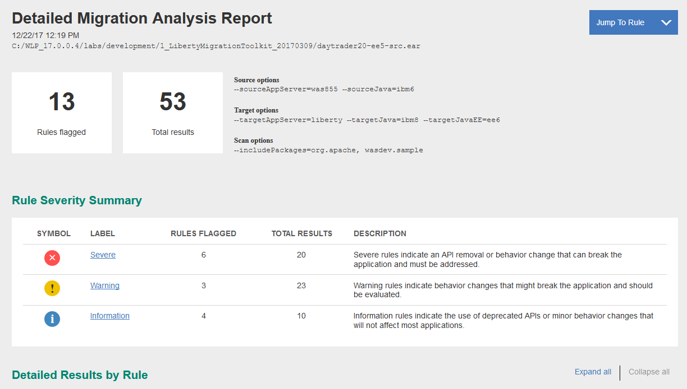

5.  Review the output.

## Summary

In this lab you have learned:

  - How to install and use Liberty Migration Toolkit on Eclipse

  - How to install and use Migration Toolkit for Application Binaries

# Notices

This information was developed for products and services offered in the U.S.A.

IBM may not offer the products, services, or features discussed in this document in other countries. Consult your local IBM representative for information on the products and services currently available in your area. Any reference to an IBM product, program, or service is not intended to state or imply that only that IBM product, program, or service may be used. Any functionally equivalent product, program, or service that does not infringe any IBM intellectual property right may be used instead. However, it is the user's responsibility to evaluate and verify the operation of any non-IBM product, program, or service.

IBM may have patents or pending patent applications covering subject matter described in this document. The furnishing of this document does not grant you any license to these patents. You can send license inquiries, in writing, to:

IBM Director of Licensing
IBM Corporation
North Castle Drive
Armonk, NY 10504-1785
U.S.A.

For license inquiries regarding double-byte (DBCS) information, contact the IBM Intellectual Property Department in your country or send inquiries, in writing, to:

IBM World Trade Asia Corporation
Licensing
2-31 Roppongi 3-chome, Minato-ku
Tokyo 106-0032, Japan

**The following paragraph does not apply to the United Kingdom or any other country where such provisions are inconsistent with local law:** INTERNATIONAL BUSINESS MACHINES CORPORATION PROVIDES THIS PUBLICATION "AS IS" WITHOUT WARRANTY OF ANY KIND, EITHER EXPRESS OR IMPLIED, INCLUDING, BUT NOT LIMITED TO, THE IMPLIED WARRANTIES OF NON-INFRINGEMENT, MERCHANTABILITY OR FITNESS FOR A PARTICULAR PURPOSE. Some states do not allow disclaimer of express or implied warranties in certain transactions, therefore, this statement may not apply to you.

This information could include technical inaccuracies or typographical errors. Changes are periodically made to the information herein; these changes will be incorporated in new editions of the publication. IBM may make improvements and/or changes in the product(s) and/or the program(s) described in this publication at any time without notice.

Any references in this information to non-IBM Web sites are provided for convenience only and do not in any manner serve as an endorsement of those Web sites. The materials at those Web sites are not part of the materials for this IBM product and use of those Web sites is at your own risk.

IBM may use or distribute any of the information you supply in any way it believes appropriate without incurring any obligation to you.

Any performance data contained herein was determined in a controlled environment. Therefore, the results obtained in other operating environments may vary significantly. Some measurements may have been made on development-level systems and there is no guarantee that these measurements will be the same on generally available systems. Furthermore, some measurements may have been estimated through extrapolation. Actual results may vary. Users of this document should verify the applicable data for their specific environment.

Information concerning non-IBM products was obtained from the suppliers of those products, their published announcements or other publicly available sources. IBM has not tested those products and cannot confirm the accuracy of performance, compatibility or any other claims related to non-IBM products. Questions on the capabilities of non-IBM products should be addressed to the suppliers of those products.

All statements regarding IBM's future direction and intent are subject to change or withdrawal without notice, and represent goals and objectives only.

This information contains examples of data and reports used in daily business operations. To illustrate them as completely as possible, the examples include the names of individuals, companies, brands, and products. All of these names are fictitious and any similarity to the names and addresses used by an actual business enterprise is entirely coincidental. All references to fictitious companies or individuals are used for illustration purposes only.

COPYRIGHT LICENSE:

This information contains sample application programs in source language, which illustrate programming techniques on various operating platforms. You may copy, modify, and distribute these sample programs in any form without payment to IBM, for the purposes of developing, using, marketing or distributing application programs conforming to the application programming interface for the operating platform for which the sample programs are written. These examples have not been thoroughly tested under all conditions. IBM, therefore, cannot guarantee or imply reliability, serviceability, or function of these programs.

##Trademarks and copyrights 

The following terms are trademarks of International Business Machines Corporation in the United States, other countries, or both:

  IBM          AIX        CICS             ClearCase      ClearQuest   Cloudscape   
  ------------ ---------- ---------------- -------------- ------------ ------------ --
  Cube Views   DB2        developerWorks   DRDA           IMS          IMS/ESA      
  Informix     Lotus      Lotus Workflow   MQSeries       OmniFind                  
  Rational     Redbooks   Red Brick        RequisitePro   System i                  
  *System z*   *Tivoli*   *WebSphere*      *Workplace*    *System p*                

Adobe, Acrobat, Portable Document Format (PDF), and PostScript are either registered trademarks or trademarks of Adobe Systems Incorporated in the United States, other countries, or both.

Cell Broadband Engine is a trademark of Sony Computer Entertainment, Inc. in the United States, other countries, or both and is used under license therefrom.

Java and all Java-based trademarks and logos are trademarks of Sun Microsystems, Inc. in the United States, other countries, or both. See Java Guidelines

Microsoft, Windows, Windows NT, and the Windows logo are registered trademarks of Microsoft Corporation in the United States, other countries, or both.

Intel, Intel logo, Intel Inside, Intel Inside logo, Intel Centrino, Intel Centrino logo, Celeron, Intel Xeon, Intel SpeedStep, Itanium, and Pentium are trademarks or registered trademarks of Intel Corporation or its subsidiaries in the United States and other countries.

UNIX is a registered trademark of The Open Group in the United States and other countries.

Linux is a registered trademark of Linus Torvalds in the United States, other countries, or both.

ITIL is a registered trademark and a registered community trademark of the Office of Government Commerce, and is registered in the U.S. Patent and Trademark Office.

IT Infrastructure Library is a registered trademark of the Central Computer and Telecommunications Agency which is now part of the Office of Government Commerce.

Other company, product and service names may be trademarks or service marks of others.

© Copyright IBM Corporation 2017.

The information contained in these materials is provided for informational purposes only, and is provided AS IS without warranty of any kind, express or implied. IBM shall not be responsible for any damages arising out of the use of, or otherwise related to, these materials. Nothing contained in these materials is intended to, nor shall have the effect of, creating any warranties or representations from IBM or its suppliers or licensors, or altering the terms and conditions of the applicable license agreement governing the use of IBM software. References in these materials to IBM products, programs, or services do not imply that they will be available in all countries in which IBM operates. This information is based on current IBM product plans and strategy, which are subject to change by IBM without notice. Product release dates and/or capabilities referenced in these materials may change at any time at IBM’s sole discretion based on market opportunities or other factors, and are not intended to be a commitment to future product or feature availability in any way.

IBM, the IBM logo and ibm.com are trademarks or registered trademarks of International Business Machines Corporation in the United States, other countries, or both. If these and other IBM trademarked terms are marked on their first occurrence in this information with a trademark symbol (® or ™), these symbols indicate U.S. registered or common law trademarks owned by IBM at the time this information was published. Such trademarks may also be registered or common law trademarks in other countries. A current list of IBM trademarks is available on the Web at “Copyright and trademark information” at ibm.com/legal/copytrade.shtml

Other company, product and service names may be trademarks or service marks of others.

