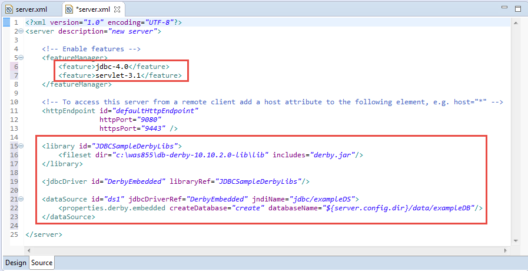

# JDBC Lab on Liberty

Deploying a data access application includes more than installing your web application archive (WAR) or enterprise archive (EAR) file onto a Liberty. Deployment can include tasks for configuring the data access resources of the server and overall runtime environment.

In this lab exercise, you will learn:

1.  Configure Derby Database on Liberty

1.  Create a sample JDBC servlet

1.  Run the sample JDBC Servlet

To run this lab, your workstation must meet the following requirements:

-   Approximately 3 GB of memory free to run the developer workbench and the server

-   Connectivity to the internet is *NOT* required

-   Please refer to the following table for file and resource location references on different operating systems.

Location Ref. |   OS    |     Absolute Path
 --------------| ------- | --------------------------
 *{LAB_HOME}*  | Windows |  `C:\\WLP_<VERSION>` or your choice
 *{LAB_HOME}*  | Linux   |  `~/WLP_<VERSION>` or your choice
 *{LAB_HOME}*  | Mac OSX |  `~/WLP_<VERSION>` or your choice

As prerequisites, you should:

1.  Complete Setup lab to set up the lab environment, and learn how to create a server using WebSphere Developer Tools.

1.  Install Derby Database

    1.  **For Windows**:  Extract **{LAB\_HOME}\\derby\\ db-derby-10.14.1.0-lib.zip** **to {LAB\_HOME}\\ db-derby-10.14.1.0-lib** directory.

    1. **For Linux or Mac** :  Extract **{LAB\_HOME}/derby/ db-derby-10.14.1.0-lib.tar.gz** **to {LAB\_HOME}/ db-derby-10.14.1.0-lib** directory

## Create and Configure Liberty Server for JDBC

1.  Start **Eclipse** from `{LAB_HOME}/wdt/eclipse` directory
    **Note:** On MAC, start eclipse from `{LAB_HOME}/wdt/eclipse/Eclipse.app/Contents/MacOS/eclipse`

1.  Create a new Liberty application server called **JDBCServer.**

    1.  Right Click on the **Servers** tab and Select **New Server**

        

    1.  c.  Select **Liberty Server**. Click **Next**

        

    1.  Click **New** in the New Server window to create a new Liberty Server

        

    1.  Enter the server name as **JDBCServer** and Click **Finish**

        

    1.  Click **Finish** in the New Server window after the new Liberty Server has been created, making sure **JDBCServer** shows in the combo box

        

1.  Double click Server Configuration for the **JDBCServer** to bring up **server.xml**

    

1.  Click on the **Source** tab.

    

1.  Remove the **jsp-2.3** feature from **server.xml**, and add the following features:

    **<feature>jdbc-4.0</feature>**

    **<feature>servlet-3.1</feature>**

1.  6.  Paste the following **DataSource** definition into **server.xml**. If you are using Linux or Mac you need to update directory location for the **fileset** tag to the following value: `{LAB_HOME}/db-derby-10.14.1.0-lib/lib`

~~~~
    <library id="JDBCSampleDerbyLibs">

    <fileset dir="{LAB_HOME}\db-derby-10.14.1.0-lib\lib" includes="derby.jar"/>

    </library>

    <jdbcDriver id="DerbyEmbedded" libraryRef="JDBCSampleDerbyLibs"/>

    <dataSource id="ds1" jdbcDriverRef="DerbyEmbedded" jndiName="jdbc/exampleDS">

    <properties.derby.embedded createDatabase="create" databaseName**="${server.config.dir}/data/exampleDB**"/>

    </dataSource>

    ~~~~

1.  Note that we had used **${server.config.dir}\data\exampleDB** as the location of the database. Once the **server.xml** has been updated you should see it as shown below.

    

1.  **Save** the configuration

## Create New Web Project

In this section we will create a new web project called **JDBC Sample** to deploy and run the JDBC servlet.

1.  Create a **Web Project** called **“JDBCSample”**

    1.  Select **File New Web Project**

    1.  Enter **JDBCSample** as the name

        

    1.  Click **Next**

    1.  Under **Target Runtime** select **Liberty Runtime **

    1.  Deselect **Add project to EAR**

        

    1.  Click **Finish**

    1.  Click **Open** if prompted to switch to **Web perspective**

### Create JDBC Servlet  
------------------------

1.  From the **Enterprise Explorer**, Right click **“JDBCSample”** project, and select **New Servlet**

    

1.  Use **wasdev.sample.jdbc** as the package, and **JdbcServlet** as the class

    

1.  Click **Finish**

1.  Replace the contents of **JdbcServlet.java** with `{LAB_HOME}/labs/development/2_JDBC/JdbcServlet.java`

1.  Review the servlet source code to learn how it is calling JDBC.

### Running the Sample JDBC Servlet

1.  Right click the “**JDBCSample”** project, and choose **Run As Run on Server**

    

1.  Choose the **JDBCServer** (if you have multiple servers created), then click **Next.**

    

1.  If you have multiple projects, just select **JDBCSample** as the project to run, and then click **Finish**

    

1.  WDT will run and open a browser to the application automatically as shown below:

    

1.  Check that `{LAB_HOME}\wlp\usr\servers\JDBCServer\data\exampleDB` is created.

1.  Check the contents of **server.xml.** WDT adds additional configuration automatically to set up a development environment.

    

## Clean up

1.  Right click on the **JDBC project** and select **Remove**

    

1.  Right click on the **JDBCServer** and select **Stop** to stop the server

    

## Summary

In this lab you have learned:

-   Configuring Derby Database on Liberty

-   Create a sample JDBC servlet

-   Run the sample JDBC Servlet

## Notices

This information was developed for products and services offered in the U.S.A.

IBM may not offer the products, services, or features discussed in this document in other countries. Consult your local IBM representative for information on the products and services currently available in your area. Any reference to an IBM product, program, or service is not intended to state or imply that only that IBM product, program, or service may be used. Any functionally equivalent product, program, or service that does not infringe any IBM intellectual property right may be used instead. However, it is the user's responsibility to evaluate and verify the operation of any non-IBM product, program, or service.

IBM may have patents or pending patent applications covering subject matter described in this document. The furnishing of this document does not grant you any license to these patents. You can send license inquiries, in writing, to:

IBM Director of Licensing
IBM Corporation
North Castle Drive
Armonk, NY 10504-1785
U.S.A.

For license inquiries regarding double-byte (DBCS) information, contact the IBM Intellectual Property Department in your country or send inquiries, in writing, to:

IBM World Trade Asia Corporation
Licensing
2-31 Roppongi 3-chome, Minato-ku
Tokyo 106-0032, Japan

**The following paragraph does not apply to the United Kingdom or any other country where such provisions are inconsistent with local law:** INTERNATIONAL BUSINESS MACHINES CORPORATION PROVIDES THIS PUBLICATION "AS IS" WITHOUT WARRANTY OF ANY KIND, EITHER EXPRESS OR IMPLIED, INCLUDING, BUT NOT LIMITED TO, THE IMPLIED WARRANTIES OF NON-INFRINGEMENT, MERCHANTABILITY OR FITNESS FOR A PARTICULAR PURPOSE. Some states do not allow disclaimer of express or implied warranties in certain transactions, therefore, this statement may not apply to you.

This information could include technical inaccuracies or typographical errors. Changes are periodically made to the information herein; these changes will be incorporated in new editions of the publication. IBM may make improvements and/or changes in the product(s) and/or the program(s) described in this publication at any time without notice.

Any references in this information to non-IBM Web sites are provided for convenience only and do not in any manner serve as an endorsement of those Web sites. The materials at those Web sites are not part of the materials for this IBM product and use of those Web sites is at your own risk.

IBM may use or distribute any of the information you supply in any way it believes appropriate without incurring any obligation to you.

Any performance data contained herein was determined in a controlled environment. Therefore, the results obtained in other operating environments may vary significantly. Some measurements may have been made on development-level systems and there is no guarantee that these measurements will be the same on generally available systems. Furthermore, some measurements may have been estimated through extrapolation. Actual results may vary. Users of this document should verify the applicable data for their specific environment.

Information concerning non-IBM products was obtained from the suppliers of those products, their published announcements or other publicly available sources. IBM has not tested those products and cannot confirm the accuracy of performance, compatibility or any other claims related to non-IBM products. Questions on the capabilities of non-IBM products should be addressed to the suppliers of those products.

All statements regarding IBM's future direction and intent are subject to change or withdrawal without notice, and represent goals and objectives only.

This information contains examples of data and reports used in daily business operations. To illustrate them as completely as possible, the examples include the names of individuals, companies, brands, and products. All of these names are fictitious and any similarity to the names and addresses used by an actual business enterprise is entirely coincidental. All references to fictitious companies or individuals are used for illustration purposes only.

COPYRIGHT LICENSE:

This information contains sample application programs in source language, which illustrate programming techniques on various operating platforms. You may copy, modify, and distribute these sample programs in any form without payment to IBM, for the purposes of developing, using, marketing or distributing application programs conforming to the application programming interface for the operating platform for which the sample programs are written. These examples have not been thoroughly tested under all conditions. IBM, therefore, cannot guarantee or imply reliability, serviceability, or function of these programs.

Trademarks and copyrights
=========================

The following terms are trademarks of International Business Machines Corporation in the United States, other countries, or both:

  IBM          AIX        CICS             ClearCase      ClearQuest   Cloudscape   
  ------------ ---------- ---------------- -------------- ------------ ------------ --
  Cube Views   DB2        developerWorks   DRDA           IMS          IMS/ESA      
  Informix     Lotus      Lotus Workflow   MQSeries       OmniFind                  
  Rational     Redbooks   Red Brick        RequisitePro   System i                  
  *System z*   *Tivoli*   *WebSphere*      *Workplace*    *System p*                

Adobe, Acrobat, Portable Document Format (PDF), and PostScript are either registered trademarks or trademarks of Adobe Systems Incorporated in the United States, other countries, or both.

Cell Broadband Engine is a trademark of Sony Computer Entertainment, Inc. in the United States, other countries, or both and is used under license therefrom.

Java and all Java-based trademarks and logos are trademarks of Sun Microsystems, Inc. in the United States, other countries, or both. See Java Guidelines

Microsoft, Windows, Windows NT, and the Windows logo are registered trademarks of Microsoft Corporation in the United States, other countries, or both.

Intel, Intel logo, Intel Inside, Intel Inside logo, Intel Centrino, Intel Centrino logo, Celeron, Intel Xeon, Intel SpeedStep, Itanium, and Pentium are trademarks or registered trademarks of Intel Corporation or its subsidiaries in the United States and other countries.

UNIX is a registered trademark of The Open Group in the United States and other countries.

Linux is a registered trademark of Linus Torvalds in the United States, other countries, or both.

ITIL is a registered trademark and a registered community trademark of the Office of Government Commerce, and is registered in the U.S. Patent and Trademark Office.

IT Infrastructure Library is a registered trademark of the Central Computer and Telecommunications Agency which is now part of the Office of Government Commerce.

Other company, product and service names may be trademarks or service marks of others.

© Copyright IBM Corporation 2018.

The information contained in these materials is provided for informational purposes only, and is provided AS IS without warranty of any kind, express or implied. IBM shall not be responsible for any damages arising out of the use of, or otherwise related to, these materials. Nothing contained in these materials is intended to, nor shall have the effect of, creating any warranties or representations from IBM or its suppliers or licensors, or altering the terms and conditions of the applicable license agreement governing the use of IBM software. References in these materials to IBM products, programs, or services do not imply that they will be available in all countries in which IBM operates. This information is based on current IBM product plans and strategy, which are subject to change by IBM without notice. Product release dates and/or capabilities referenced in these materials may change at any time at IBM’s sole discretion based on market opportunities or other factors, and are not intended to be a commitment to future product or feature availability in any way.

IBM, the IBM logo and ibm.com are trademarks or registered trademarks of International Business Machines Corporation in the United States, other countries, or both. If these and other IBM trademarked terms are marked on their first occurrence in this information with a trademark symbol (® or ™), these symbols indicate U.S. registered or common law trademarks owned by IBM at the time this information was published. Such trademarks may also be registered or common law trademarks in other countries. A current list of IBM trademarks is available on the Web at “Copyright and trademark information” at ibm.com/legal/copytrade.shtml

Other company, product and service names may be trademarks or service marks of others.

