# JMS and MDB Sample Lab

Liberty profile supports asynchronous messaging as a method of communication that is based on the Java™ Message Service (JMS) programming interface. The JMS interface provides a common way for Java programs (clients and Java EE applications) to create, send, receive, and read asynchronous requests as JMS messages. With the Liberty profile, you can configure multiple JMS messaging providers, which can be used by the JMS applications.

The following JMS messaging providers are supported in the Liberty profile:

1.  Liberty embedded messaging engine, as the JMS messaging provider

1.  Service integration bus, which is the default messaging provider of WebSphere® Application Server

1.  WebSphere MQ messaging provider, which uses the WebSphere MQ system as the provider

Your applications can use messaging resources from any of the three JMS providers. The choice of the provider is made based either on your messaging requirements or for integration with an existing messaging system. For example, you might want your applications to connect locally to the Liberty messaging provider without the need to configure any external messaging provider, in which case you would use the Liberty embedded messaging engine. Alternatively, you might want to integrate with your existing messaging infrastructure, such as WebSphere MQ. In such cases, you can either connect directly by using the WebSphere MQ messaging provider or configure a service integration bus with links to the WebSphere MQ network and then access the bus through the default messaging provider.

The scope of this lab is limited to **Liberty messaging**, an embedded messaging feature in the Liberty profile. It is a composable, flexible, and dynamic JMS messaging engine that runs within the Liberty profile. Liberty messaging is JMS 1.1 compliant and supports both the point-to-point and publish/subscribe messaging models.

In this lab exercise, you will learn:

1.  Enabling JMS messaging for the Liberty Profile

1.  Create a sample JMS P2P servlet

1.  Create a sample JMS PubSub servlet

1.  Create a sample JMS MDB

1.  Run all the sample JMS applications created

As prerequisites, you should:

1.  Complete Setup lab to set up the lab environment, and learn how to create a server using WebSphere Developer Tools.

1.  **Optional:** Complete the Simple Development Lab if you need a refresher on how to use eclipse with WebSphere Developer Tools (WDT)

    To run this lab, your workstation must meet the following requirements:

-   Approximately 3 GB of memory free to run the developer workbench and the server

-   Connectivity to the internet is *NOT* required

-   Please refer to the following table for file and resource location references on different operating systems.

Location Ref. |   OS    |     Absolute Path
 --------------| ------- | --------------------------
 *{LAB_HOME}*  | Windows |  `C:\\WLP_<VERSION>` or your choice
 *{LAB_HOME}*  | Linux   |  `~/WLP_<VERSION>` or your choice
 *{LAB_HOME}*  | Mac OSX |  `~/WLP_<VERSION>` or your choice

## Create and Configure Liberty Server for JMS

1.  Start **Eclipse** (eclipse.exe) from **{LAB\_HOME}/eclipse** directory

    **Note:** On MAC, start eclipse from `{LAB_HOME}/wdt/eclipse/Eclipse.app/Contents/MacOS/eclipse`

1.  Create a new Liberty Server called **JMSServer.**

    1.  Right Click on the **Servers** tab and Select **New Server**

        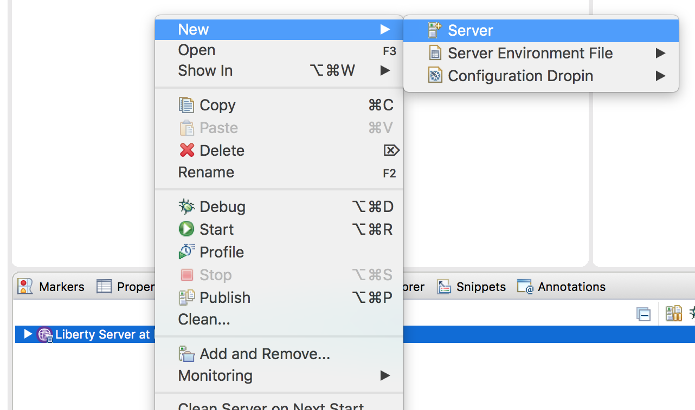

    1.  Select **Liberty Runtime** and Click **Next**

        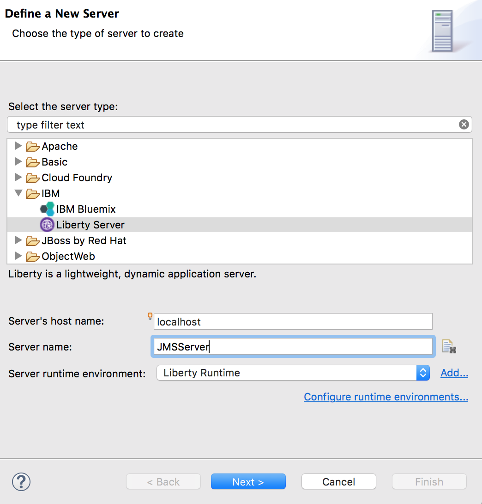

    1.  Click **New** and enter the server name as **JMSServer,** click **Finish** then **Finish** again.

        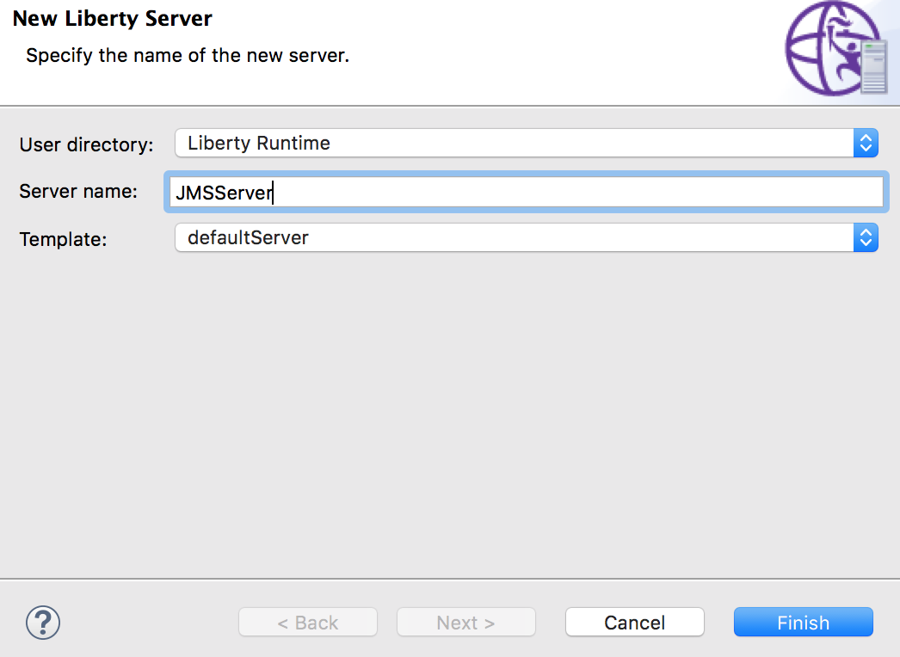

1.  Expand the definition of the newly created **Liberty Server.** Open (double-click) the **server.xml** of the configuration and click on the **Source** tab.

    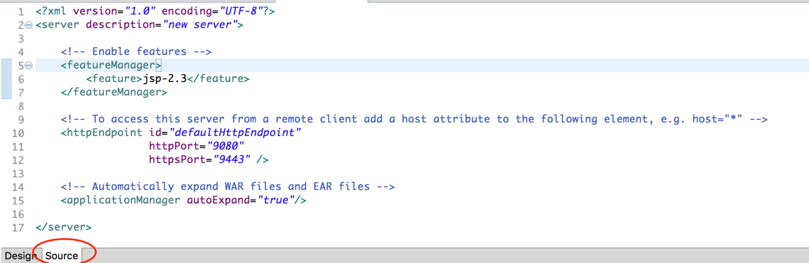

1.  Replace the contents of **server.xml** with the lab content at **{LAB_HOME}/labs/development/3_JMS/server.xml**

1.  This **server.xml** contains the **JMS resource definitions** that you will need to run the sample application.

1.  Review the changes in the **server.xml** that includes :

    1.  The features required for JMS, MDB, and built-in message engine

    1.  Queue and topic configuration for the built-in message engine

    1.  Activation Specification configuration for MDBs

    1.  Configurations for queue and topic connection factories

    1.  Association of JMS queues and topics with built-in message engine queues and topics.

## Create New Web Project

In this section we will create a new web project called **JMSSample** to deploy and run the JMS P2P and JMSPubSub servlets.

1.  Create a **Web Project** called **“JMSSample”**

    1.  Select **File New Web Project**

    1.  Enter **JMSSample** as the name

        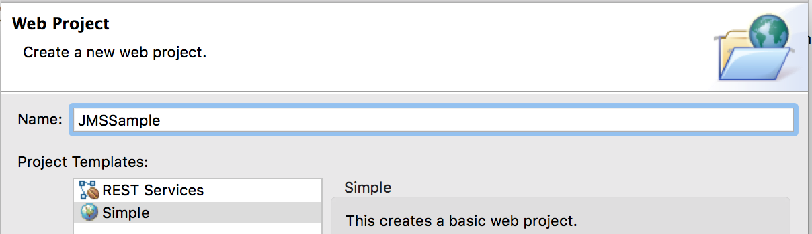

    1.  Click **Next**

    1.  Under **Target Runtime** select **Liberty Server**

    1.  Deselect **Add project to EAR**

    1.  Click **Finish**

        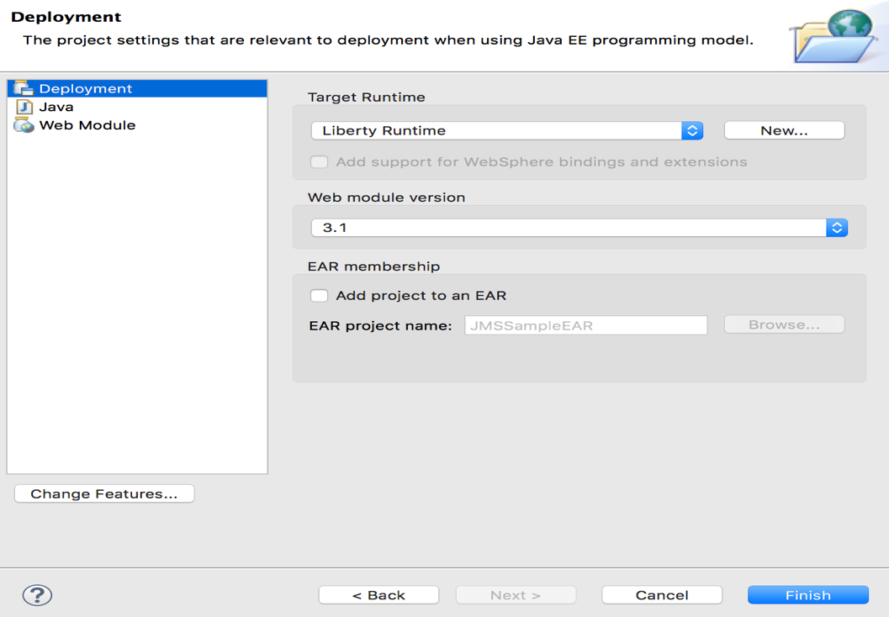

**Create JMSSampleP2P Servlet**
--------------------------------

1.  From the **Enterprise Explorer**, Right click **“JMSSample”** project, and select **New Servlet**

1.  Use **wasdev.sample.jms.web** as the package, and **JMSSampleP2P** as the class

    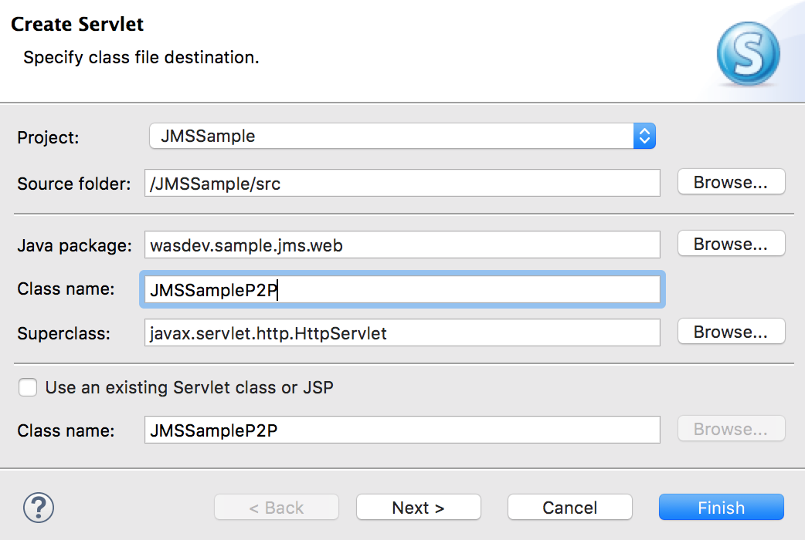

1.  Click **Finish**

1.  Replace the contents of **JMSSampleP2P.java** with `{LAB_HOME}/labs/development/3_JMS/JMSSampleP2P.java`

1.  Review the servlet source code.

1.  Skip this step if you don’t see compiler errors. If you see compiler errors, you need to configure the build path.

    1.  Right click on the **JMSSample** project then choose

        **Build Path Configure Build Path**

        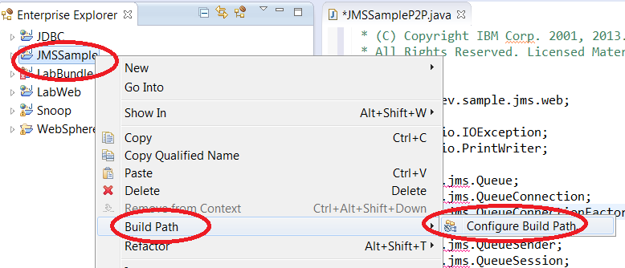

    1.  Select **Libraries** tab then click **Add External JARs**

        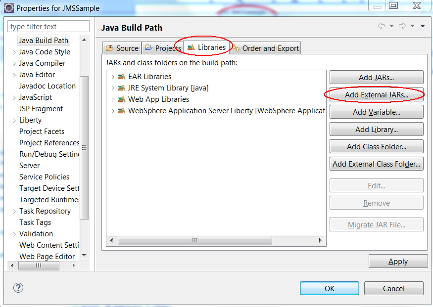

    1.  Navigate to **{LAB_HOME}\wlp\dev\api\spec** and select **com.ibm.ws.javaee.jms.2.0_1.0.19.jar**

    1.  Click **Open**

    1.  Verify the jar has been imported, then click **Apply and Close**

        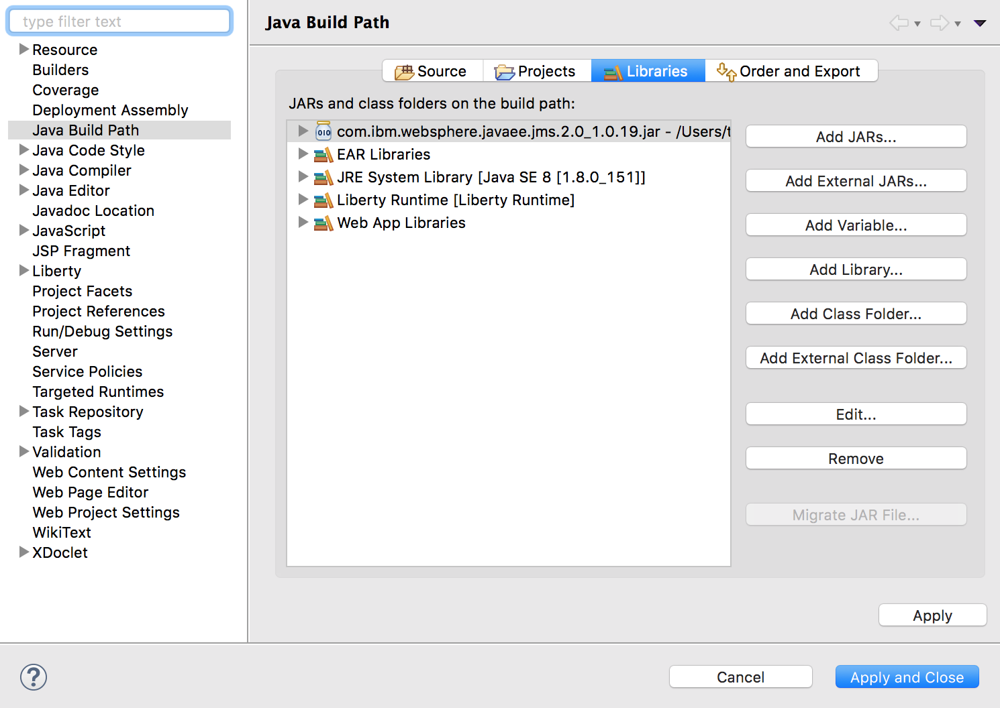

1.  The servlet accepts a request on

    `http://<host>:<port>/JMSSample/JMSSampleP2P?action=<action>`

    where the action is one of the following :

    1.  **sendAndReceive**: Sends a message defined by the queue **jndi_INPUT_Q**, then receives a message from it.

    1.  **sendMessage**: Sends a message to the queue **jndi_INPUT_Q**

    1.  **receiveAllMessageSelectors**: Sends a message to the queue **jndi_INPUT_Q**, then receives all messages on the queue.

    1.  **mdbRequestResponse**: Sends a message to the **MDBQ**, which will be received by the Sample MDB. The MDB sends a reply on **MDBREPLYQ**, which is then received by this method.

## Create JMSSamplePubSub Servlet

1.  From the **Enterprise Explorer**, Right click **“JMSSample”** project, and select **New Servlet**

1.  Use **wasdev.sample.jms.web** as the package, and **JMSSamplePubSub** as the class

1.  Replace the contents of **JMSSamplePubSub.java** with the contents of `{LAB_HOME}/labs/development/3_JMS/JMSSamplePubSub.java`

1.  This servlet accepts a request on

    `http://<host>:<port>/JMSSample/JMSSamplePubSub?action=<action>`

    where the action is one of the following:

    1.  **nonDurableSubscriber**: Creates a non-durable subscriber for topic **jmsTopic**, sends a message, then receives message.

    1.  **durableSubscriber**: Creates a durable subscriber for topic **jmsTopic**, sends then receives message.

    1.  **publishMessages**: Publishes 5 messages to topic **jmsTopic**.

    1.  **unsubscribeDurableSubscriber:** Opens durable subscriber **DURATEST**, receives all messages, then un-unsubscribe.

## Create JMS Sample MDB

1.  From the **Enterprise Explorer**, Right click **“JMSSample”** project, and select **New Other**

    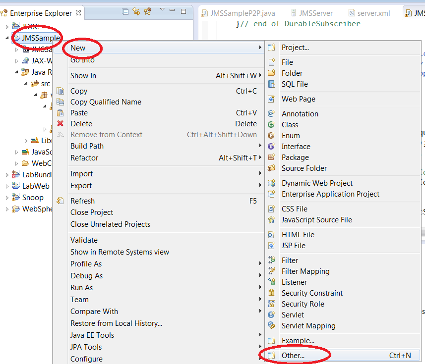

1.  Type ejb to filter, then choose **Message Driven Bean (EJB 3.x)**.

    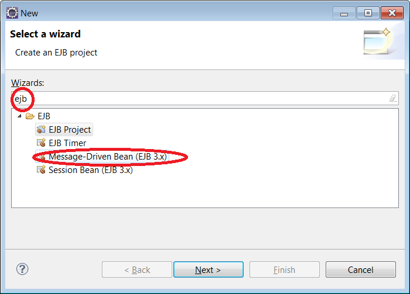

1.  Click **Next.**

1.  Enter **wasdev.sample.jms.mdb** for package name, and **SampleMDB** for class name.

1.  Click **Finish**.

    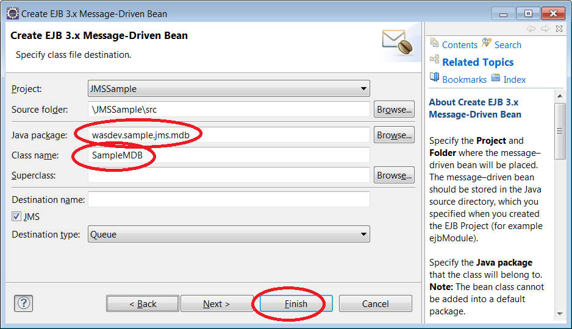

1.  Replace the contents of **SampleMDB.java** with the contents of `{LAB_HOME}/labs/development/3_JMS/SampleMDB.java`

1.  This MDB is to be configured to process messages on **MDBQ**, and send a reply via **MDBREPLYQ.**

## Running the Sample JMS Application

1.  Right click the **JMSSample** project, and choose **Run As Run on Server**

    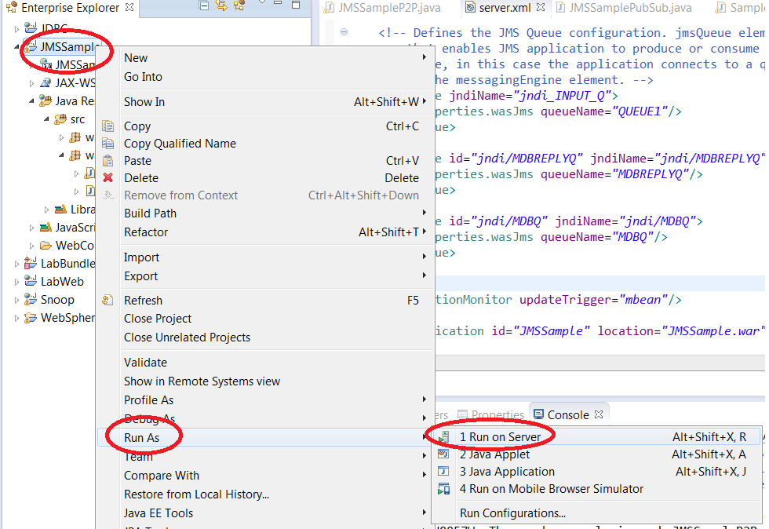

1.  Choose the **JMSServer** (if you have multiple servers created), then click **Next.**

    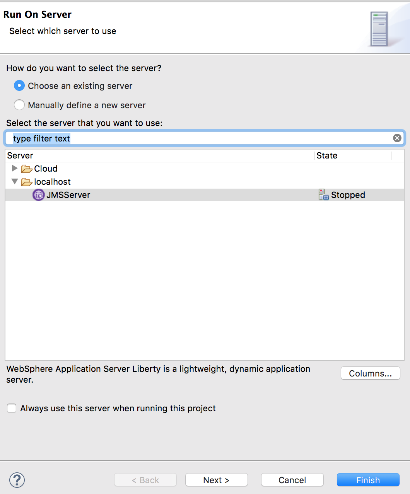

1.  If you have multiple projects, just select **JMSSample** as the project to run, and then click **Finish**

    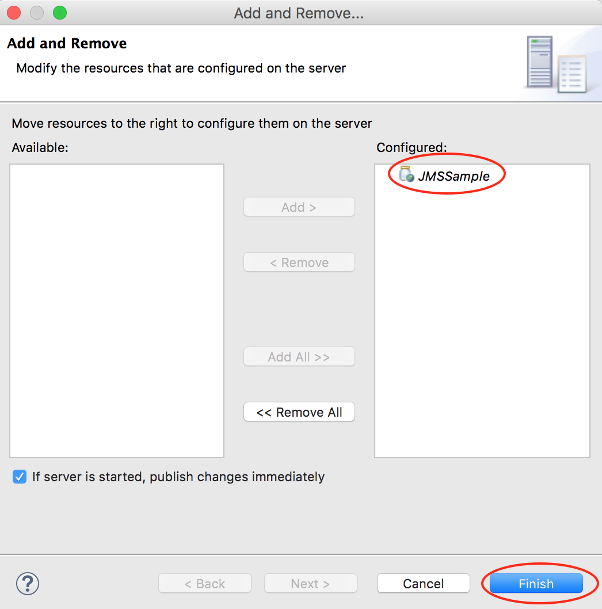

1.  Test point to point messaging by pointing your browser to the following URLs:

    1.  <http://localhost:9124/JMSSample/JMSSampleP2P?ACTION=sendAndReceive>

    1.  <http://localhost:9124/JMSSample/JMSSampleP2P?ACTION=sendMessage>

    1.  <http://localhost:9124/JMSSample/JMSSampleP2P?ACTION=receiveAllMessages>

    1.  <http://localhost:9124/JMSSample/JMSSampleP2P?ACTION=receiveAllMessagesSelectors>

    1.  <http://localhost:9124/JMSSample/JMSSampleP2P?ACTION=mdbRequestResponse>

        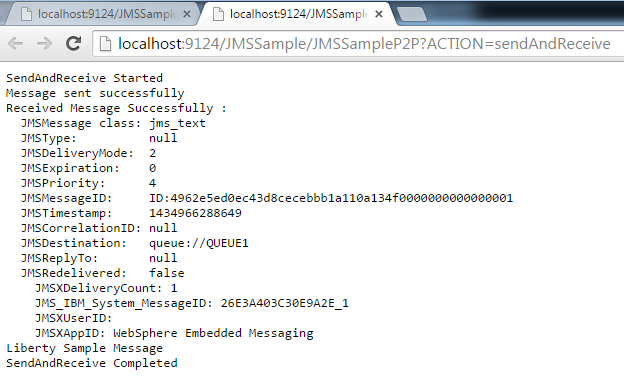

1.  Test pub sub by pointing your browser to:

    1.  <http://localhost:9124/JMSSample/JMSSamplePubSub?ACTION=nonDurableSubscriber>

    1. <http://localhost:9124/JMSSample/JMSSamplePubSub?ACTION=durableSubscriber>

    1. <http://localhost:9124/JMSSample/JMSSamplePubSub?ACTION=publishMessages>

    1.  <http://localhost:9124/JMSSample/JMSSamplePubSub?ACTION=unsubscribeDurableSubscriber>

     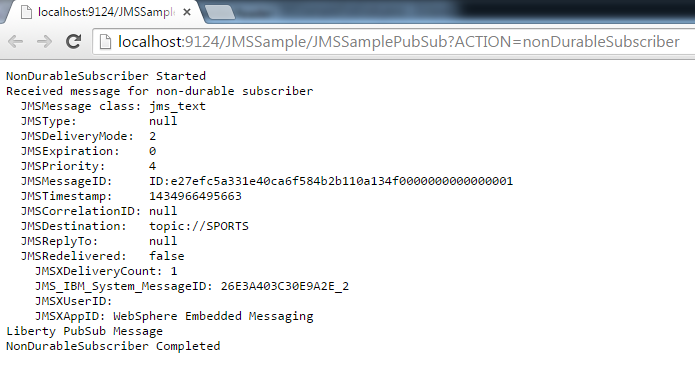

## Clean up

1.  Right click on the **JMSSample** application (on the server) and select **Remove** to remove the application.

1.  Right click on the **JMSServer** and select **Stop** to stop the server

## Summary

In this lab you have learned:

-   Enabling JMS messaging for the Liberty Profile

-   Create a sample JMS P2P servlet

-   Create a sample JMS PubSub servlet

-   Create a sample JMS MDB

-   Run all the sample JMS applications created

## Notices

This information was developed for products and services offered in the U.S.A.

IBM may not offer the products, services, or features discussed in this document in other countries. Consult your local IBM representative for information on the products and services currently available in your area. Any reference to an IBM product, program, or service is not intended to state or imply that only that IBM product, program, or service may be used. Any functionally equivalent product, program, or service that does not infringe any IBM intellectual property right may be used instead. However, it is the user's responsibility to evaluate and verify the operation of any non-IBM product, program, or service.

IBM may have patents or pending patent applications covering subject matter described in this document. The furnishing of this document does not grant you any license to these patents. You can send license inquiries, in writing, to:

IBM Director of Licensing
IBM Corporation
North Castle Drive
Armonk, NY 10504-1785
U.S.A.

For license inquiries regarding double-byte (DBCS) information, contact the IBM Intellectual Property Department in your country or send inquiries, in writing, to:

IBM World Trade Asia Corporation
Licensing
2-31 Roppongi 3-chome, Minato-ku
Tokyo 106-0032, Japan

**The following paragraph does not apply to the United Kingdom or any other country where such provisions are inconsistent with local law:** INTERNATIONAL BUSINESS MACHINES CORPORATION PROVIDES THIS PUBLICATION "AS IS" WITHOUT WARRANTY OF ANY KIND, EITHER EXPRESS OR IMPLIED, INCLUDING, BUT NOT LIMITED TO, THE IMPLIED WARRANTIES OF NON-INFRINGEMENT, MERCHANTABILITY OR FITNESS FOR A PARTICULAR PURPOSE. Some states do not allow disclaimer of express or implied warranties in certain transactions, therefore, this statement may not apply to you.

This information could include technical inaccuracies or typographical errors. Changes are periodically made to the information herein; these changes will be incorporated in new editions of the publication. IBM may make improvements and/or changes in the product(s) and/or the program(s) described in this publication at any time without notice.

Any references in this information to non-IBM Web sites are provided for convenience only and do not in any manner serve as an endorsement of those Web sites. The materials at those Web sites are not part of the materials for this IBM product and use of those Web sites is at your own risk.

IBM may use or distribute any of the information you supply in any way it believes appropriate without incurring any obligation to you.

Any performance data contained herein was determined in a controlled environment. Therefore, the results obtained in other operating environments may vary significantly. Some measurements may have been made on development-level systems and there is no guarantee that these measurements will be the same on generally available systems. Furthermore, some measurements may have been estimated through extrapolation. Actual results may vary. Users of this document should verify the applicable data for their specific environment.

Information concerning non-IBM products was obtained from the suppliers of those products, their published announcements or other publicly available sources. IBM has not tested those products and cannot confirm the accuracy of performance, compatibility or any other claims related to non-IBM products. Questions on the capabilities of non-IBM products should be addressed to the suppliers of those products.

All statements regarding IBM's future direction and intent are subject to change or withdrawal without notice, and represent goals and objectives only.

This information contains examples of data and reports used in daily business operations. To illustrate them as completely as possible, the examples include the names of individuals, companies, brands, and products. All of these names are fictitious and any similarity to the names and addresses used by an actual business enterprise is entirely coincidental. All references to fictitious companies or individuals are used for illustration purposes only.

COPYRIGHT LICENSE:

This information contains sample application programs in source language, which illustrate programming techniques on various operating platforms. You may copy, modify, and distribute these sample programs in any form without payment to IBM, for the purposes of developing, using, marketing or distributing application programs conforming to the application programming interface for the operating platform for which the sample programs are written. These examples have not been thoroughly tested under all conditions. IBM, therefore, cannot guarantee or imply reliability, serviceability, or function of these programs.

Trademarks and copyrights
=========================

The following terms are trademarks of International Business Machines Corporation in the United States, other countries, or both:

  IBM          AIX        CICS             ClearCase      ClearQuest   Cloudscape   
  ------------ ---------- ---------------- -------------- ------------ ------------ --
  Cube Views   DB2        developerWorks   DRDA           IMS          IMS/ESA      
  Informix     Lotus      Lotus Workflow   MQSeries       OmniFind                  
  Rational     Redbooks   Red Brick        RequisitePro   System i                  
  *System z*   *Tivoli*   *WebSphere*      *Workplace*    *System p*                

Adobe, Acrobat, Portable Document Format (PDF), and PostScript are either registered trademarks or trademarks of Adobe Systems Incorporated in the United States, other countries, or both.

Cell Broadband Engine is a trademark of Sony Computer Entertainment, Inc. in the United States, other countries, or both and is used under license therefrom.

Java and all Java-based trademarks and logos are trademarks of Sun Microsystems, Inc. in the United States, other countries, or both. See Java Guidelines

Microsoft, Windows, Windows NT, and the Windows logo are registered trademarks of Microsoft Corporation in the United States, other countries, or both.

Intel, Intel logo, Intel Inside, Intel Inside logo, Intel Centrino, Intel Centrino logo, Celeron, Intel Xeon, Intel SpeedStep, Itanium, and Pentium are trademarks or registered trademarks of Intel Corporation or its subsidiaries in the United States and other countries.

UNIX is a registered trademark of The Open Group in the United States and other countries.

Linux is a registered trademark of Linus Torvalds in the United States, other countries, or both.

ITIL is a registered trademark and a registered community trademark of the Office of Government Commerce, and is registered in the U.S. Patent and Trademark Office.

IT Infrastructure Library is a registered trademark of the Central Computer and Telecommunications Agency which is now part of the Office of Government Commerce.

Other company, product and service names may be trademarks or service marks of others.

© Copyright IBM Corporation 2018.

The information contained in these materials is provided for informational purposes only, and is provided AS IS without warranty of any kind, express or implied. IBM shall not be responsible for any damages arising out of the use of, or otherwise related to, these materials. Nothing contained in these materials is intended to, nor shall have the effect of, creating any warranties or representations from IBM or its suppliers or licensors, or altering the terms and conditions of the applicable license agreement governing the use of IBM software. References in these materials to IBM products, programs, or services do not imply that they will be available in all countries in which IBM operates. This information is based on current IBM product plans and strategy, which are subject to change by IBM without notice. Product release dates and/or capabilities referenced in these materials may change at any time at IBM’s sole discretion based on market opportunities or other factors, and are not intended to be a commitment to future product or feature availability in any way.

IBM, the IBM logo and ibm.com are trademarks or registered trademarks of International Business Machines Corporation in the United States, other countries, or both. If these and other IBM trademarked terms are marked on their first occurrence in this information with a trademark symbol (® or ™), these symbols indicate U.S. registered or common law trademarks owned by IBM at the time this information was published. Such trademarks may also be registered or common law trademarks in other countries. A current list of IBM trademarks is available on the Web at “Copyright and trademark information” at ibm.com/legal/copytrade.shtml

Other company, product and service names may be trademarks or service marks of others.

