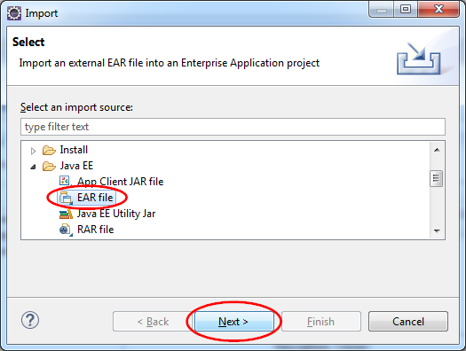
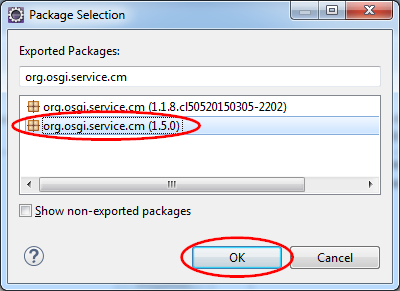
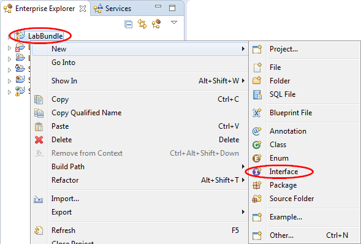
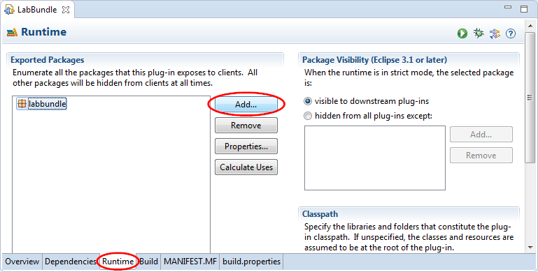
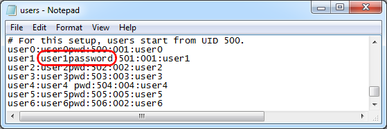
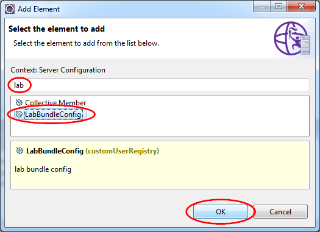
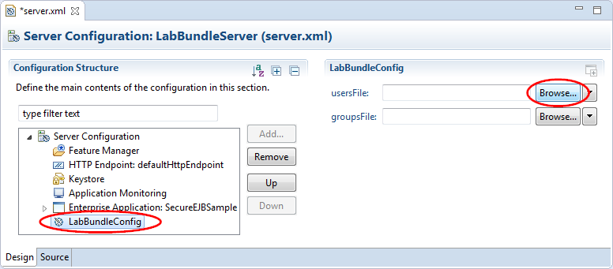
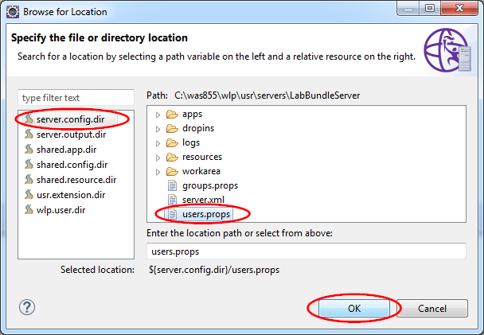

# Liberty extension With your own user feature

This lab will show you

1.  How to take an existing java library and use it to create your own Liberty feature.

1.  How to create your own custom user registry as a new Liberty feature.

1.  How to receive configuration properties from the liberty server.xml file and inject those properties for use by your feature.

1.  How to expose new APIs from your feature to be called by your application

1.  How to create new metatype that describes your new configuration so that it can be configured automatically from WDT.

Please refer to the following table for file and resource location references on different operating systems.

Location Ref. |   OS    |     Absolute Path
 --------------| ------- | --------------------------
 *{LAB_HOME}*  | Windows |  `C:\\WLP_<VERSION>` or your choice
 *{LAB_HOME}*  | Linux   |  `~/WLP_<VERSION>` or your choice
 *{LAB_HOME}*  | Mac OSX |  `~/WLP_<VERSION>` or your choice

## Prerequisites

The following preparation must be completed prior to beginning this lab:

1.  Complete the Getting Started lab to set up the lab environment.

1.  *Optional:* Complete the Simple Development lab if you need a refresher on how to use eclipse and WDT.

## Wrap the user registry sample in an OSGi bundle

1.  Start Eclipse.

1.  Create a new Liberty Server with the **Server Name** as LabBundleServer.

    

1.  Create an OSGi Bundle project called **LabBundle**.

    1.  Click **File > New > OSGi Bundle Project**. If the option is not available, use **File > New > Others** then select **OSGi Bundle Project**.

        

    1.  Enter LabBundle as the **Project Name** in the New OSGi Bundle Project window.

    1.  Select the **LabBundleServer** as the **Target runtime**. (If you have multiple servers created in the workspace, you may have to select **Liberty Runtime** as the target runtime.)

    1.  Clear the **Add bundle to application** check box because we will use this in a feature rather than in an application.

    1.  Click **Next**.

        

        

        

    1.  Click **Next** to accept the default source and output folder.

    1.  Select the **Generate an activator, a Java class that controls the life cycle of the bundle** check box.

        

    1.  Click **Finish**.

1.  Set WDT to expose SPI on the classpath.

    1.  In Eclipse select **Window > Preferences**.

    1.  Expand **Plug-in Development** in the navigation pane of the Preferences window and click **Target Platform**.

    1.  Select **LabBundleServer with SPI** (Or **Liberty Runtime with SPI**) in the **Target definitions** list, then click **OK**.

        

1.  Import the supplied Java library into the LabBundle project:

    1.  With the **LabBundle** project selected in the Enterprise Explorer view, click **File > Import**.

    1.  In the Import window, expand **General** and click **File System**, then click **Next**.

        

    1.  Enter the directory `{LAB_HOME}\labs\development\4_UserFeature` in the **From directory** field.

    1.  Check the **FileRegistrySample.java** in the file navigation view.

    1.  Set LabBundle/src/labbundle as the **Into folder**, then click **Finish.**

        

        Note: The Java file will show compilation errors such as UserRegistry cannot be resolved to a type. The reason is that as an OSGi bundle **LabBundle** doesn’t yet import the required Java package in its manifest. We will fix this in the next step.

    1.  Expand **Java Problems** in the Markers view. Right click on the first red “x” occurrence of CertificateMapFailedException and select **Quick Fix**. (Note: this may show up for you in the Problems view instead of the Markers view.)

        

    1.  Select **Add import to the bundle manifest** in the **Select a fix** list on the Quick Fix window, then click **Finish**. This will launch a manifest editor in the main window.

        

    1.  Click the **Add** button in the Imported Packages view of the LabBundle manifest editor’s Dependencies tab.

        

    1.  Select **com.ibm.websphere.security** and **com.ibm.websphere.security.cred** from the Package Selection window’s main list, then click **OK**. (Hold the **Ctrl** key to make multiple selections)

        

    1.  Save the manifest and this should clear up all of the red “x” errors for LabBundle.

        

1.  Next we’ll code the generated Activator class to initialize the FileRegistrySample class.

    1.  Open the Activator.java file in the editor. To save time, paste the contents of Activator.java included with the lab into the Activator.java pane in Eclipse. We’ll review the code from here on.

    1.  Note the additional imports that were added:
~~~~
        **import** java.rmi.RemoteException;

        **import** java.util.Properties;

        **import** com.ibm.websphere.security.CustomRegistryException;

        **import** com.ibm.websphere.security.UserRegistry;
~~~~
    1.  Note that the Activator class now extends FileRegistrySample, so the framework can instantiate the registry as part of bundle initialization. It looks like the line below.

        **public class** Activator **extends** FileRegistrySample **implements** BundleActivator

    1.  We have added three more class variables. The variable userFiles keeps track of the users for the custom user registry. The variable groupsFile keeps track of the groups for the custom user registry. These locations are currently hard coded, but will be enhanced later in this lab.

      **Be sure to replace the *{LAB_HOME}* and *<timestamp>* with the correct values**. On Mac and Linux, replace the \\\\ file separator characters with / characters. The variable curRef keeps track of the registration of this custom user registry as an OSGi service.
~~~~
        private String usersFile = "{LAB_HOME}\labs\development\4_UserFeature\users.props";

        private String groupsFile = "{LAB_HOME}\labs\development\4_UserFeature\groups.props";

        private ServiceRegistration<UserRegistry> curRef = null;
~~~~
    1.  A new default constructor was added by WDT:
~~~~
        public Activator() **throws** RemoteException {

        super();

        // **TODO** Auto-generated constructor stub

        }
        ~~~~

    1.  Review the start method. It initializes the locations of usersFile and groupsFile in the parent class, and registers the custom user registry as an OSGi service.

    1.  Review the stop method where the service is deregistered.

## Package the custom user registry sample as a feature

1.  Create a Liberty Feature Project called **LabFeature**.

    1.  Click **File > New > Other**, expand **OSGi** and click **Liberty Feature Project** in the **Select a wizard** list of the New window, then click **Next**.

        

    1.  Enter LabFeature for the **Project name**, click **Next**.

        

    1.  Check the **LabBundle 1.0.0** in the **Contained Bundles** list of the New Liberty Feature Project window, then click **Finish**.

        

1.  Install the feature to the Liberty runtime. This adds your feature to Liberty runtime installation and makes it available to use in Liberty server configurations.

    1.  Right click **LabFeature** in the Enterprise Explorer view and click **Install Feature**.

        

    1.  Ensure the target runtime is selected and click **Finish**. Note: you may be presented with **LabBundleServer** as the target runtime.

        

        **Note:** After making any changes to an installed feature or the bundles it contains, update the feature in the runtime by right clicking the feature project and selecting **Update Feature**.

3.  Configure the feature into the server instance that was created earlier in the lab.

    1.  Expand **LabBundleServer** in the Server view and double click **Server Configuration** to open the configuration editor.

        

    1.  Select **Feature Manager** from the Configuration Structure view, then click the **Add** button in the Feature Manager view.

        

    1.  Type usr in the **type filter text** field of the Add Feature window to refine the feature list, then select usr:LabFeature and click **OK**.

        

    1.  Save the **server.xml** file

    1.  Select the **LabBundleServer** in the Server view and start it by clicking the green  button to the right. Save the changes to server.xml if prompted.

        

## Configure a secure application

Test the feature with a secure application.

1.  Import SecureEJBSample.ear into the Eclipse workspace.

    1.  From the menu click **File > Import**.

    1.  Expand **Java EE** from the **Select an import source** list on the Import window and click **EAR file**, then click **Next**.

      

    1.  Click the Browse button on the Import window.

      

    1.  Locate the `{LAB_HOME}\labs\development\4_UserFeature\SecureEJBSample.ear` file include with this lab in the Open dialog window.

      

    1.  Select **LabBundleServer** (or **Liberty Server**) for the Target Runtime, then click **Finish**.

      

1.  *Optional:* Review the sample code
    1.  The servlet SecureEJBServlet requires the caller to have a ***servletRole*** and simply calls the local stateless session bean.

    1.  The local SampleSecureStatelessBean requires caller with ***ejbRole*** and simply returns a message.

1.  Remove compile error for SecureEJBSample\_WEB

    1.  Right click **SecureEJBSample_WEB** in the Enterprise Explorer view and click **Build Path > Configure Build Path**.

      

    1.  Click the **Projects** tab then click the **Add** button.

      

    1.  Check **SecureEJBSample_EJB** and **LabBundle** from the **Select project to add** list then click **OK**.

    **Note:** we’ll need LabBundle later in this lab to allow the web application to call new APIs in the feature.

      

    1.  Click **OK** again to complete the build path configuration. This will clear all of the compilation errors.

      

1.  Deploy the SecureEJBSample application.

    1.  Right click the **SecureEJBSample** project from the Enterprise Explorer view, then click **Run As > Run on Server**.

        

    1.  Select **LabBundleServer** under **localhost** on the Run On Server window, then click **Next**.

        

    1.  Make sure **SecureEJBSample** is the only application listed in the **Configured** list on the Add and Remove view, then click **Finish**.

        

        When the application was added to the LabBundleServer, WDT automatically added any features that the application needs to satisfy its API requirements. You will see that the ***ejblite-3.2*** feature was added to the LabBundleServer configuration file since the application uses a local EJB. Quality of service features, such as application security, are not added automatically, allowing an iterative approach to testing. We will test the application first without any security constraints applied.

    1.  Test the application in *insecure* mode. Invoke the application by clicking on the URL in the server Console window: <http://localhost:9080/SecureEJBSample/>.

        

    1.  Successful test should show the following in the browser.

        

        Note that security isn’t applied until an *appSecurity* feature is added.

1.  Enable security on the server

    1.  Open the server.xml configuration file by expanding the **LabBundleServer** in the Server view and double click **Server Configuration**. We will be modifying the configuration in Source view.

    1.  Add the **appSecurity-2.0** feature to the server.
~~~~
        <featureManager>
           <feature>jsp-2.3</feature>
           <feature>ejbLite-3.2</feature>
           <feature>usr:LabFeature</feature>
           <feature>localConnector-1.0</feature>
        <feature>appSecurity-2.0</feature>
        </featureManager>
~~~~

    Now that application security is being applied by the server, note that users cannot access the app until auth bindings have been configured.

    1.  To configure the auth bindings for the application, replace the `<enterpriseApplication>` element values with the contents below in the server.xml.

~~~~
    <enterpriseApplication id="SecureEJBSample"
       location="SecureEJBSample.ear" name="SecureEJBSample">

       <application-bnd>

          <security-role name="servletRole">
              <special-subject type="ALL_AUTHENTICATED_USERS"/>
          </security-role>

          <security-role name="ejbRole">
              <user name="user1"></user>
          </security-role>

        </application-bnd>

    </enterpriseApplication>
~~~~

  **NOTE:** that for the above mapping, all authenticated user may access the servlet, while only *user1* is able to access the EJB.

  **NOTE:** If something goes wrong with the cut and paste, you can either cut and paste from the `{LAB_HOME}/labs/development/44_UserFeature/server.xml` file or replace the LabBundleServer’s `server.xml` with the one in the lab directory.

   4.  Save the changes. WDT will republish the changes automatically.

1.  Test the new security configuration

    1.  Select **LabBundleServer** in the Server view, then click the green  button to restart it.

        

    1.  Rerun the application by clicking on the URL in the server Console window: <http://localhost:9080/SecureEJBSample/>.

    1.  Basic Auth will display a login dialog box. Enter user1 for **User Name** and user1pwd for **Password**. This should succeed as this user is defined in the user.props file being accessed by the custom user registry code in the feature, and the user is configured in the application binding to have access to the EJB.

        

    1.  This should succeed in displaying the following in the browser window.

        

    1.  Close all browser windows and try with **User Name** user2 and **Password** user2pwd. This should fail when calling the EJB since, although it is a valid user, it is not configured to have access to the EJB.

        

    1.  Review the file `{LAB_HOME}labs\development\4_UserFeature\users.props` for other users to try. Try a user not in the registry.

1.  If you need to modify the application and re-test, browser sessions from previous test may still be active or not invalidated. Use another browser not built into eclipse. Close all browsers then reopen and copy and paste the URL from the console log in WDT.

1.  Remember to update after any changes to the feature, which will also restart the server. Right click on **LabFeature** in the Enterprise Explorer view and click **Update Feature**.

## Allow user to specify registry file locations in server.xml

1.  Rather than hard coding the location of users.props and groups.props, it is better for the User Registry feature to receive those as configuration properties from the server.xml. Change the **Activator** class to implement the **org.osgi.service.cm.ManagedService** interface.

    1.  Expand the **LabBundle** project in the Enterprise Explorer view and double click **Manifest: LabBundle**.

        

    1.  Click the **Add** button in the Imported Packages view of the manifest editor’s Dependencies panel.

        

    1.  Search for org.osgi.service.cm on the Package Selection window and select the **org.osgi.service.cm (1.5.0)** bundle, then click **OK**.

        

    1.  Save the manifest.

2.  Enhance Activator.java to accept the locations of users.props and groups.props from server.xml.

    1.  Open LabBundle project’s Activator.java in Eclipse. Copy and paste the contents of `{LAB_HOME}labs\development\4_UserFeature\Activator1.java` into `Activator.java`.

       **Note:** Just copy and replace the contents. Do not create a new file. Let’s review the changes.

    1.  The class definition has changed to also implement ManagedService as shown below.

     ~~~~

     public class Activator extends FileRegistrySample implements BundleActivator, ManagedService** {

     ~~~~

    1. The class variables usersFile and groupsFile are no longer hardcoded with the locations of users.props and groups.props.

        ~~~~
        usersFile = (String) properties.get(usersFileAttr);

        …

        groupsFile = (String) properties.get(groupsFileAttr);
        ~~~~

    1.  The new variable CFG_PID holds the service *Persistent Identifier (PID)* used to register this feature as a *MangedService*.

        `private String CFG_PID = "customUserRegistry";`

    1.  The start method no longer initializes the parent class. Instead, it registers the feature as a *MangagedService* under the PID CFG_PID. This allows the feature to pick up changes to the server configuration, and the initialization will take place in the updated method.

    1.  The stop method now also unregisters the *ManagesService*.

    1.  The updated method receives server configuration changes to initialize location of users.props and groups.props.

1.  Save the modified Activator.java file.

1.  Right click the **LabFeature** project in the Enterprise Explorer and click **Update Feature**.

    

1.  Copy the user registry data files users.props and groups.props under the `{LAB_HOME}labs\development\4_UserFeature\` directory into the server configuration directory `{LAB_HOME}\wlp\\usr\servers\LabBundleServer` directory.

    

1. Expand **LabBundleServer** in the Server view and double click **Server Configuration** to open the Server Configuration editor, then add the customUserRegistry configuration properties as show below to server.xml in the Source view.

    ~~~~
    <customUserRegistry usersFile="${server.config.dir}/users.props"

    groupsFile="${server.config.dir}/groups.props" />
    ~~~~

    **Note** This configuration element causes a validation error in the Server Configuration editor because the new element is not recognized. We will fix that in the next part of the lab but it can be safely ignored.

1.  Test the new security feature

    1.  Close all browser windows. Open a new browser window and point to <http://localhost:9080/SecureEJBSample/>.

    1.  Basic Auth will display a login dialog box, enter user1 for **User Name** and user1pwd for **Password**.

    1.  Check console output and ensure you see these lines:

        

    **Note:** if you need to modify the application and re-test, browser sessions from previous test may still be active or not invalidated. Use another browser not built into eclipse. Close all browsers then reopen and copy and paste the URL from the console log in WDT.

## Exposing new API from the feature

In this section, we will show you

1.  How to expose a new method from the feature to be callable by applications.

1.  How to make an object available in the feature available through JNDI so it can be looked up by applications.

We will change the sample to allow you to change a password in the sample file registry.

1.  Create a new interface

    1.  Right click **LabBundle** in the Enterprise Explorer view and click **New > Interface**.

        

    1.  Enter labapi for **Package** name, and MyRegistry for interface **Name**, then click **Finish**.

        

    1.  Add a new method below to the interface.

        public void changePassword(String user, String password);

        

1.  Update FileRegistrySample.java

    1.  In the Enterprise Explorer view, expand **LabBundle > src > labbundle** and double click FileRegistrySample.java.

        

    1.  Copy the contents of `{LAB_HOME}labs\development\4_UserFeature\FileRegistrySample2.java` into `FileRegistrySample.java` in Eclipse. This changes the FileRegistrySample class to also implement the new MyRegistry interface, and adds the implementation of the changePassword method.

    1.  ***Optional:*** Review the implementation of changePassword method. Note how it searches for the user from the registry, and updates the new password to the file.

    1.  Save the file.

3.  Bind the registry into JNDI so that the application can look it up and call the changePassword method.

    1.  In the Enterprise Explorer view, expand **LabBundle > src > labbundle** and double click Activator.java.

        

    1.  Copy the contents of `{LAB_HOME}labs\development\4_UserFeature\\Activator2.java` into `Activator.java` in Eclipse.

    1.  Let’s review the changes:

        1.  In the start method, we are adding another service registration for the MyRegistry interface. The osgi.jndi.service.name property will tell the runtime to bind the registry to the global JNDI name myRegistry.

            ~~~~
            registryProperties.put("osgi.jndi.service.name", "myRegistry");

            curRefMyRegistry = context.registerService( MyRegistry.class, registry,registryProperties);
           ~~~~
        1. In the stop method, the service curRefMyRegistry is unregistered.

    1.  Save the file.

1.  Export the **labapi** package from the LabBundle OSGi bundle, and expose it as API to applications.

    1.  In the Enterprise Explorer view, expand **LabBundle** and double click **Manifest:LabBundle** to open the manifest editor.

        

    1.  Click the **Runtime** tab, then click the **Add** button in the Exported Packages view.

        

    1.  Select **labapi** from the **Select packages to export** list, then click **OK**.

        

    1.  Save the manifest file.

    1.  In the Enterprise Explorer view, expand **LabFeature** and double click **Manifest:LabFeature** to open the Liberty Feature Manifest editor.

        

    1.  Click the **Add** button in the IBM API Packages view of the Overview tab.

        

    1.  Select **labapi** on the **Packages** window, then click **OK**.

        

    1.  Save the manifest file.

    1.  Update the feature in the Liberty runtime installation by right click **LabFeature** in the Enterprise Explorer view then click **Update Feature**.

5.  Update the application

    1.  Create a new **password.jsp**.

        1.  Right click **SecureEJBSample_WEB** in the Enterprise Explorer view and click **New > JSP File**.

            

        1. In the New JSP File window enter password.jsp for the **File name**, then click **Finish**.

            

        1. Copy and paste the contents of `{LAB_HOME}\labs\development\4_UserFeature\password.jsp` into `password.jsp` in Eclipse. The result looks like:

            

        1. Save the JSP file.

    1.  Update the security deployment descriptor for the JSP to add a security role, and to ensure confidentiality when performing password change.

        1.  Right click **SecureEJBSample_WEB** in the Enterprise Explorer and click **Java EE Tools > Generate Deployment Descriptor Stub**.

            

        1. Expand **SecureEJBSample > WebContent > WEB-INF** in the Enterprise Explorer view and double click web.xml to open the deployment descriptor editor.

            

        1. Click **Web Application** in the Overview list, then click **Add**.

            

        1. Search for security and select **Security Constraint** from the list, then click **OK**.

            

        1.  Click **Web Resource Collection** in the Overview list. In the Details view, enter password for **Web Resource Name**, indicating password.jsp, then click Add and enter ** /* ** for the **URL Pattern**.

            

        1. Click **Security Constraint** in the Overview list. Click the **Add** button in the Details view and enter servletRole for **Role Name**. In the User Data Constraint view, select **CONFIDENTIAL** for **Transport Guarantee**.

            

        1. Save the deployment descriptor.

    1.  Create a new ChangePassword servlet.

        1.  Right click **SecureEJBSample_WEB** in the Enterprise Explorer and click **New > Servlet**.

            

        1. On the Create Servlet window, enter **labservlet** for **Java package**, and ChangePassword for **Class name**, then click **Finish**.

            

        1. Copy the contents of `{LAB_HOME}\labs\development\4_UserFeature\ChangePassword.java` into `ChangePassword.java` in Eclipse.

        1. Save the new servlet.

    1.  Update server.xml to enable SSL in order to support CONFIDENTIAL transport guarantee for both password.jsp and the ChangePassword servlet.

        1.  Expand **LabBundleServer** in the Server view and double click **Server Configuration** to open the server configuration editor. Click on the **Source** tab to edit the XML directly.

            

        1. Add SSL feature into the <featureManager> element, and add the <keyStore> configuration as shown below using the XML snippets provided below.

          `<feature>transportSecurity-1.0</feature>`

            And

            `<keyStore password="{xor}Mz49Dz4sLCgwLTs="></keyStore>`

            The key store password is the encoded form of **labPassword**.

            

        1. Save the server.xml.

1.  Test the application

    1.  Make sure the LabBundleServer is started and synchronized.

    1.  Verify the SecureEJBSample still works.

        1.  Close all browser windows.

        1. Point your browser to: <http://localhost:9080/SecureEJBSample/>

        1. Login with **User Name** user1 and **Password** user1pwd, and you should see this in the browser.

            

    1.  Test password change.

        1.  Close all browser windows. In a new browser window, point your browser to: <https://localhost:9443/SecureEJBSample/password.jsp>

        1. Accept security exceptions in the browser

        1. Login with User Name **user1** and Password **user1pwd**. You should see the password.jsp rendered for user1.

            

        1. Enter a new password and click **Submit**.

            

        1.  Review `{LAB_HOME}\wlp\usr\servers\LabBundleServer\users.props` and verify the password has been updated.

            

        1. Close all browser windows and login again with the new password.

        1. **Optional:** to avoid forgetting your new password the next time you login, change the password back to **user1pwd**.

## Optional: Add configuration metadata

The following steps will expose the new feature bundle configuration properties in WebSphere Developer Tools (WDT). This will correct the validation error we encountered in Section 4.5 step 6 above.

1.  Create a new **OSGI-INF** folder.

    1.  In the Enterprise Explorer view, right click **LabBundle** > **BundleContent**, then click **New > Folder**.

        

    1.  Enter **OSGI-INF** for **Folder name** on the New Folder window, then click **Finish**.

        

1.  Add a new file **metatype.xml** to the **OSGI-INF** folder.

    1.  In the Enterprise Explorer view, right click **LabBundle > BundleContent > OSGI-INF**, then click **New > File**.

        

    1.  On the **New File** window, verify that LabBundle/BundleContent/OSGI-INF is entered or selected as the parent folder. Enter **metatype.xml** for the **File name**, then click **Finish**.

        

        **Note:** The metatype file for configuration definition must be an XML file in the OSGI-INF directory of the OSGi bundle, but it can have any name (with the .xml suffix).

1.  Copy the contents of `{LAB_HOME}\labs\development\4_UserFeature\metatype.xml` into the new `metatype.xml` file created in Eclipse.

    

    **Note:** that the Designate pid must be customUserRegistry to match the service PID used to register the ManagedService implementation in Activator.java.

## Optional: IBM Extensions to the OSGi metatype service

The WDT configuration editor recognizes some extensions to the OSGi metatype specification for a better presentation in an editor, which makes it easier to work with file locations in this case.

1.  Modify the root <metatype> element in the metatype.xml to include the ibm schema namespace definition as show below.
~~~~
        <metatype:MetaData xmlns:metatype="http://www.osgi.org/xmlns/metatype/v1.1.0" xmlns:ibm="http://www.ibm.com/xmlns/appservers/osgi/metatype/v1.0.0">
~~~~
1.  Add **ibm:type=”location”** to the end of the **`<AD>`** elements as demonstrated below.

        ~~~~
        <AD name="usersFile" description="User file location" id="usersFile" type="String" default="" ibm:type="location" />

        <AD name="groupsFile" description="Group file location" id="groupsFile" type="String"* default="" ibm:type="location" />

        ~~~~

1.  These changes will allow users to browse for the user and group files in the Liberty server configuration editor *(seen in step 6)*.

      

1.  Update the installed feature

    1.  In the Enterprise Explorer view, right click **LabFeature**, then click **Update Feature**.

    1.  If server.xml is open, close it.

        **Tip:** Always close and re-open the server.xml editor after adding/updating metatype files.

1. Confirm that **LabBundleConfig** can be edited in the Design view of the server configuration editor.

    1. Expand **LabBundleServer** in the Server view and double click **Server Configuration** to open `server.xml` in the server configuration editor. You should already have **LabBundleConfig** configured from previous lab steps. If not, create it as follows:

    1. In the Configuration Structure view, click **Server Configuration**, then click **Add**.
   

    1. In the Add Element window search for lab and select **LabBundleConfig** from the list, then click **OK**.

      

    1. With **LabBundleConfig** selected in the Configuration Structure view of the editor, enter the **${server.config.dir}/users.props** for **usersFile** and **${server.config.dir}/groups.props** for **groupsFile** in the LabBundleConfig view.

      

    If you had chosen to complete the addition of IBM Extensions in step 4 above, you may also browse for the file location using path variables.

        1.  With **LabBundleConfig** selected in the Configuration Structure view of the editor, click the **Browse** button next to the **usersFile** field in the LabBundleConfig view.

           

        1.  In the Browse for Location window, select server.config.dir from the path variable list and select users.props from the path navigation view, then click **OK**.

            

        1.  Repeat the procedure for the **groupsFile** field and select the groups.props file.

            

    1.  Switch to the **Source** tab and review the added XML.

        

        Delete the original entry that you added manually for customUserRegistry, if it is still there.

    1.  Save the server.xml file.

1.  Test the application.

    1.  The LabBundleServer should still be running, but if not please start the server.

    1.  Close all browser windows. In a new browser window, point your browser to: <http://localhost:9080/SecureEJBSample/>

    1.  Basic Auth will display a login dialog box, enter user1 for **User Name** and user1pwd **Password**. Verify the application responded successfully as shown below.

        

    1.  You can review the user.props file for other users.

**Note** If you need to modify the application and re-test, browser sessions from previous test may still be active or not invalidated. Use another browser not built into Eclipse. Close all browser windows then reopen and copy and paste the URL from the console log in WDT.

**Note** You can update the configuration properties while the server is running. The new values are injected into the feature and the registry is reinitialized with the new values without any need to restart the server.

**Note** The schemas for feature and configuration descriptions can be generated using commands in `{LAB_HOME}/wlp/bin/tools`. Check the WebSphere Knowledge Center on **ws-schemagen.jar** for details.

This concludes the Liberty Extension Lab.

## Notices

This information was developed for products and services offered in the U.S.A.

IBM may not offer the products, services, or features discussed in this document in other countries. Consult your local IBM representative for information on the products and services currently available in your area. Any reference to an IBM product, program, or service is not intended to state or imply that only that IBM product, program, or service may be used. Any functionally equivalent product, program, or service that does not infringe any IBM intellectual property right may be used instead. However, it is the user's responsibility to evaluate and verify the operation of any non-IBM product, program, or service.

IBM may have patents or pending patent applications covering subject matter described in this document. The furnishing of this document does not grant you any license to these patents. You can send license inquiries, in writing, to:

IBM Director of Licensing
IBM Corporation
North Castle Drive
Armonk, NY 10504-1785
U.S.A.

For license inquiries regarding double-byte (DBCS) information, contact the IBM Intellectual Property Department in your country or send inquiries, in writing, to:

IBM World Trade Asia Corporation
Licensing
2-31 Roppongi 3-chome, Minato-ku
Tokyo 106-0032, Japan

**The following paragraph does not apply to the United Kingdom or any other country where such provisions are inconsistent with local law:** INTERNATIONAL BUSINESS MACHINES CORPORATION PROVIDES THIS PUBLICATION "AS IS" WITHOUT WARRANTY OF ANY KIND, EITHER EXPRESS OR IMPLIED, INCLUDING, BUT NOT LIMITED TO, THE IMPLIED WARRANTIES OF NON-INFRINGEMENT, MERCHANTABILITY OR FITNESS FOR A PARTICULAR PURPOSE. Some states do not allow disclaimer of express or implied warranties in certain transactions, therefore, this statement may not apply to you.

This information could include technical inaccuracies or typographical errors. Changes are periodically made to the information herein; these changes will be incorporated in new editions of the publication. IBM may make improvements and/or changes in the product(s) and/or the program(s) described in this publication at any time without notice.

Any references in this information to non-IBM Web sites are provided for convenience only and do not in any manner serve as an endorsement of those Web sites. The materials at those Web sites are not part of the materials for this IBM product and use of those Web sites is at your own risk.

IBM may use or distribute any of the information you supply in any way it believes appropriate without incurring any obligation to you.

Any performance data contained herein was determined in a controlled environment. Therefore, the results obtained in other operating environments may vary significantly. Some measurements may have been made on development-level systems and there is no guarantee that these measurements will be the same on generally available systems. Furthermore, some measurements may have been estimated through extrapolation. Actual results may vary. Users of this document should verify the applicable data for their specific environment.

Information concerning non-IBM products was obtained from the suppliers of those products, their published announcements or other publicly available sources. IBM has not tested those products and cannot confirm the accuracy of performance, compatibility or any other claims related to non-IBM products. Questions on the capabilities of non-IBM products should be addressed to the suppliers of those products.

All statements regarding IBM's future direction and intent are subject to change or withdrawal without notice, and represent goals and objectives only.

This information contains examples of data and reports used in daily business operations. To illustrate them as completely as possible, the examples include the names of individuals, companies, brands, and products. All of these names are fictitious and any similarity to the names and addresses used by an actual business enterprise is entirely coincidental. All references to fictitious companies or individuals are used for illustration purposes only.

COPYRIGHT LICENSE:

This information contains sample application programs in source language, which illustrate programming techniques on various operating platforms. You may copy, modify, and distribute these sample programs in any form without payment to IBM, for the purposes of developing, using, marketing or distributing application programs conforming to the application programming interface for the operating platform for which the sample programs are written. These examples have not been thoroughly tested under all conditions. IBM, therefore, cannot guarantee or imply reliability, serviceability, or function of these programs.

Trademarks and copyrights

The following terms are trademarks of International Business Machines Corporation in the United States, other countries, or both:

  IBM          AIX        CICS             ClearCase      ClearQuest   Cloudscape   
  ------------ ---------- ---------------- -------------- ------------ ------------ --
  Cube Views   DB2        developerWorks   DRDA           IMS          IMS/ESA      
  Informix     Lotus      Lotus Workflow   MQSeries       OmniFind                  
  Rational     Redbooks   Red Brick        RequisitePro   System i                  
  *System z*   *Tivoli*   *WebSphere*      *Workplace*    *System p*                

Adobe, the Adobe logo, PostScript, and the PostScript logo are either registered trademarks or trademarks of Adobe Systems Incorporated in the United States, and/or other countries.

IT Infrastructure Library is a registered trademark of the Central Computer and Telecommunications Agency which is now part of the Office of Government Commerce.

Intel, Intel logo, Intel Inside, Intel Inside logo, Intel Centrino, Intel Centrino logo, Celeron, Intel Xeon, Intel SpeedStep, Itanium, and Pentium are trademarks or registered trademarks of Intel Corporation or its subsidiaries in the United States and other countries.

Linux is a registered trademark of Linus Torvalds in the United States, other countries, or both.

Microsoft, Windows, Windows NT, and the Windows logo are trademarks of Microsoft Corporation in the United States, other countries, or both.

ITIL is a registered trademark, and a registered community trademark of The Minister for the Cabinet Office, and is registered in the U.S. Patent and Trademark Office.

UNIX is a registered trademark of The Open Group in the United States and other countries.

Java and all Java-based trademarks and logos are trademarks or registered trademarks of Oracle and/or its affiliates.

Cell Broadband Engine is a trademark of Sony Computer Entertainment, Inc. in the United States, other countries, or both and is used under license therefrom.

Linear Tape-Open, LTO, the LTO Logo, Ultrium, and the Ultrium logo are trademarks of HP, IBM Corp. and Quantum in the U.S. and other countries.

© Copyright IBM Corporation 2017.

The information contained in these materials is provided for informational purposes only, and is provided AS IS without warranty of any kind, express or implied. IBM shall not be responsible for any damages arising out of the use of, or otherwise related to, these materials. Nothing contained in these materials is intended to, nor shall have the effect of, creating any warranties or representations from IBM or its suppliers or licensors, or altering the terms and conditions of the applicable license agreement governing the use of IBM software. References in these materials to IBM products, programs, or services do not imply that they will be available in all countries in which IBM operates. This information is based on current IBM product plans and strategy, which are subject to change by IBM without notice. Product release dates and/or capabilities referenced in these materials may change at any time at IBM’s sole discretion based on market opportunities or other factors, and are not intended to be a commitment to future product or feature availability in any way.

IBM, the IBM logo and ibm.com are trademarks of International Business Machines Corp., registered in many jurisdictions worldwide. Other product and service names might be trademarks of IBM or other companies. A current list of IBM trademarks is available on the Web at “Copyright and trademark information” at www.ibm.com/legal/copytrade.shtml.

