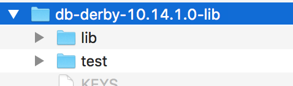
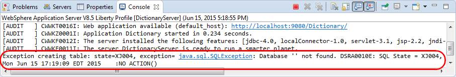
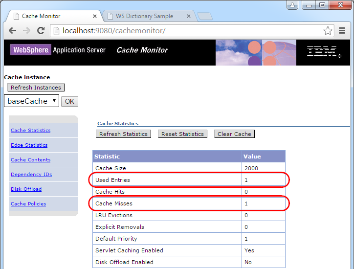

# WebCache

In this lab we will import an existing web application called *DictionaryApp*, which uses servlet and Java Server Pages (JSP) with JDBC. This lab demonstrates the use of Model-View-Controller architecture in a web application, with the web browser displaying the view rendered via JSPs, Servlet as controllers, and plain old java objects used to access the data model stored in a relational database.

We will first get the application working and demonstrate the assistance that WDT will provide in configuring the server correctly for the imported application. Then we will review the code to see how everything fits together.

The final and optional portion of this lab demonstrates how to use web caching to improve the performance of your application.

Please refer to the following table for file and resource location references on different operating systems.

Location Ref. |   OS    |     Absolute Path
 --------------| ------- | --------------------------
 *{LAB_HOME}*  | Windows |  `C:\\WLP_<VERSION>` or your choice
 *{LAB_HOME}*  | Linux   |  `~/WLP_<VERSION>` or your choice
 *{LAB_HOME}*  | Mac OSX |  `~/WLP_<VERSION>` or your choice  

##  Prerequisites

The following preparation must be completed prior to beginning this lab:

1.  Complete the Getting Started lab to set up the lab environment, and learn how to create a server using Eclipse with WebSphere Developer Tools (WDT).

1.  Optional: complete the Simple Development lab if you need a refresher on how to use eclipse and WDT.

## Installing Derby relational database

If you have not already installed Derby:

1.  Extract `{LAB_HOME}\derby\<db-derby-lib-archive>` to `{LAB_HOME}\db-derby-10.14.1.0-lib` directory.

    OS specific `<db-derby-lib-archive>` file name:

    - **Windows:** db-derby-10.14.1.0-lib.zip

    - **Linux/Mac:** db-derby-10.14.1.0-lib.tar.gz

## Create a new server

1.  Using the procedure learned in the Getting Started lab, create a new Liberty application server called **DictionaryServer**.

    

## Import the Dictionary web application

1.  Click **File > Import** from the menu. Expand **Web** and select **WAR file** on the Import window, then click **Next**.

    

1.  Click **Browse** on the WAR Import view.

1.  Use the Open dialog to locate the Dictionary.war file and click **Open**.

1.  Clear the **Add project to an EAR** checkbox, and verify the **Target runtime** is set to **Liberty Runtime**, and click **Finish**.

    

1.  In the Enterprise Explorer view, expand the **Dictionary** project and review its **Java Resources** and **Web Content** folders. You will see a servlet, 2 JSPs and some plain Java classes.

    

## Install the application to the server

We haven’t configured the server to run this application yet, so first let’s see how much of that WDT can do for us. Look at your server configuration first and note which features are configured. Then add the imported application:

1.  In the Enterprise Explorer view, right click the **Dictionary** project, then click **Run As > Run on server**.

    

1.  On the Run On Server window, select **DictionaryServer** from the **Server** list, then click **Finish**.

    

21.  You should see an error reported in the Console tab.

    

    You may also see errors in the browser window.

    

1.  The messages indicate that the error is related to the database. Bring up the server configuration of DictionaryServer by expanding **DictionaryServer** in the Server view and double clicking **Server Configuration**.

    

1.  Now, let’s add the features we need. Switch to the **Design** view, making sure you have selected **Feature Manager** in the Configuration Structure view, then click **Add**.

    

1.  In the **Add Element** window, enter servlet for the filter and select servlet-3.1 from the element list, then click **OK**.

    

1.  Use the following screenshot as a reference for the end result. However, we still need to configure a data source to solve the initial problem.

    

1.  In the same **Design** tab we have been working, click **Server Configuration** in the Configuration Structure view, then click **Add**.

    

1.  In the Add Element window, enter datasource for the filter and select **Data Source** from the element list, then click **OK**.

    

1.  With **Data Source** selected in the Configuration Structure view, enter ds1 for **ID** and jdbc/DictionaryDB for **JNDI name** in the Data Source view.

    

1. In the Configuration Structure view, right click **Data Source**, then click **Add > JDBC Driver**.

    

1. With **JDBC Driver** selected in the Configuration Structure view, click the **Add** button in the JDBC Driver view to add a shared library reference.

    

1. In the Shared Library view, click the **Add** button next to the **Fileset reference** list.

    

1. In the Fileset view, click the down arrow button ( next to the **Browse** button and click **Absolute Path**.

    

1. Navigate to and select the `{LAB_HOME}\db-derby-10.14.1.0-lib\lib` directory in the Browse For Folder window, then click **OK**.

    

1. Still in the Fileset view,

    1.  Deselect the **Case sensitive** check box

    1  click the **Browse** button for **Includes pattern**.

        

1. Select derby.jar from the include file list, then click **OK**.

    

1. Click on the **Source** tab and the server.xml entry for the data source should look similar to this:

~~~~
<dataSource id="ds" jndiName="jdbc/DictionaryDB">
  <jdbcDriver>
     <library>
         <fileset dir="{LAB_HOME)/db-derby-10.14.1.0-lib/lib" caseSensitive="false"></fileset>
     </library>
  </jdbcDriver>
</dataSource>
~~~~

1.  Save the server configuration. Point your browser to <http://localhost:9080/Dictionary/>, and refresh the page if needed. You should see an application error message in the Console about database not found.

    

    This is because the database does not exist. With most databases you have to create the database explicitly before they can be used, but with Derby you can set a property to indicate that the database should be created on first use. We will do that now.

1.  Open the server.xml again, if not already open, and click on the **Design** tab. Right click **Data Source** in the Configuration Structure view and click **Add > Derby Embedded Properties**.

    

1.  In the Derby Embedded Properties view, enter create for **Create database** and for **Database name**. This will create, on first use, a database called **DictionaryDatabase** under the server’s directory.

    

1.  In the Source view for server.xml, the new data source definition now looks like:

~~~
<dataSource id="ds1" jndiName="jdbc/DictionaryDB">
   <jdbcDriver>
       <library>
          <fileset caseSensitive="false" dir="{LAB_HOME}\\db-derby-10.10.2.0-lib\lib" includes="derby.jar"></fileset>
      </library>
   </jdbcDriver>

   <properties.derby.embedded createDatabase="create" databaseName="data/DictionaryDatabase"/>

</dataSource>
~~~

1.  Save the server.xml. The application should now run successfully. Try to look up IBM, whose definition is pre-populated. Add some entries to the dictionary. Try looking them up. Then stop the server, restart it, and see if your entries can still be found. If they can, that is what we refer to as *persistence*, data that survives when the server process is stopped and restarted.

##  Code walk-through

The overall architecture of Dictionary application is shown below:

DictionaryApp uses the *Model View Controller (MVC)* architecture by implementing DictionaryJDBCAdapter.java, a database adapter, as the *model*, showentry.jsp and history.jsp as the *view*, and DictionaryServlet.java as the *controller*.

A user accesses DictionaryApp through the DictionaryServlet entry point. From there, DictionaryServlet.java will process any requests from the user by calling into the database adapter, DictionaryJDBCAdapter.java. After DictionaryJDBCAdapter.java has processed the data, DictionaryServlet generates a new view provided by history.jsp and showentry.jsp and the result is returned back to the user’s browser as HTML.

The history of words recently entered by the user is generated by history.jsp, while the rest of the page that allows the user to enter or define a word are generated by showentry.jsp. You can request history.jsp by entering <http://localhost:9080/Dictionary/history.jsp> in the browser.

Browse the .jsp files. Note how JSPs are basically HTML with embedded Java code to make it easier to construct web pages. Note how `history.jsp` tracks the 5 most recent user entered words via the session state. ***Session state*** is information that the application server keeps track on behalf of each user’s session. It is the mechanism commonly used to implement a shopping cart. Also note how `showentry.jsp` generates the **LOOKUP** and **DEFINE** buttons, and displays the words and definitions via the request parameters (passed from the servlet, which we will see later).

Browse the DictionaryServlet and note how it processes the request parameters from the incoming URL. Read the comments carefully and determine how it handles LOOKUP and DEFINE operations, and how it then generates the resulting view via history and show entry JSPs.

Browse the DictionaryJDBCAdapter and associated classes to see how it uses JDBC to call to the database to look up a word, or to define a word. Note how it creates a table in the database if one does not already exist, and pre-populates the table with the definition for “IBM”.

## Optional: Add dynamic caching

***Dynamic caching*** can dramatically improve the performance of your application by caching the results of servlets and JSPs. Liberty contains a built-in per-server dynamic caching provider that you can use in production. In this section we will demonstrate how to use the built-in dynamic caching feature.

### Caching design for Dictionary application

For the dictionary application, the requirements are:

-   The output line that contains the user's history is not cached, as it changes with each user interaction.

-   The results of prior look ups, whether or not successful, are cached so that subsequent look ups of the same word are re-displayed without having to go to the database again. Previous words entered by the user are used as the keys to identify the cache.

-   The cache associated with a prior look up of a word is invalidated if the user tries to define or redefine that word. This enable a new database operation to update the definition.

This is summarized pictorially as follows:

### Caching policy

The `cachespec.xml` allows you to define the cache policy for your application. It is included with the sample application, and located at `WEB-INF\cachespec.xml`           

Browse `cachespec.xml` and carefully read the comments to understand how the rules implement the caching requirements from the previous section.

### Installing Cache Monitor application

The cache monitor application is a sample application that is essential for understanding and debugging web caching. It is available on the WebSphere Liberty repository.

1.  Install the web cache monitor feature by running the command:

    `{LAB\_HOME}\wlp\bin\installUtility install webCacheMonitor-1.0`

1.  Restart Eclipse so WDT can pick up the new feature just installed.

### Testing the application with Web Cache enabled

1.  Double click **DictionaryServer > Server Configuration** in the Server view to open the server.xml editor, then add the following features in the **Source** view.

     ~~~
    <feature>webCache-1.0</feature>

    <feature>webCacheMonitor-1.0</feature>
    ~~~

    

1.  Restart the server.

1.  Point your browser to the cache monitor at <http://localhost:9080/cachemonitor> and note the **Used Entries**, **Cache Hits**, and **Cache Misses** are all 0.

    

1.  Open another tab or windows in the browser, and point to the Dictionary servlet. Then lookup IBM.

    

1.  This should return the definition:

    

1.  Go back to the cache monitor tab, click **Refresh Statistics**. Since this is first lookup after server restart, the **Cache Misses** should show as 1. After this look up completed, a new entry is created in the cache, showing **Used Entries** count as 1.

    

1.  Click **Cache Contents** to examine the content of the cache. It will show that:

    1.  The full **Cache ID** (or key) is:

        `/DictionaryWeb/com.ibm.dictionaryapp.servlet.DictionaryServlet.class:word=IBM:action=LOOKUP:requestType=GET`

    1.  The Dependency ID is:

        `word:IBM`

        

1.  1lick on the Cache ID to see what is in the cache for that ID. Notice the fragment from `showentry.jsp` is part of the cache, while the fragment from `history.jsp` is not in the cache.

    {width="5.71in" height="4.92in"}

1.  Go back to the Dictionary servlet window and look up WWW. If WWW is not already defined, define it. The go back to the cache monitor window, and click on **Cache Contents** again. This should show two entries in the cache, with the new one for WWW.

    

1. Verify look ups can be served from the cache. This is much faster comparing to having to go to the database each time:

    1.  Click on **Cache Statistics** and check number of **Cache Hits**.

    1.  Go back to the Dictionary servlet window and look up IBM again.

    1.  Go back to the cache monitor window and click **Refresh Statistics**. Verify **Cache Hits** has increased.

        

1. Go back to the Dictionary servlet window and look up a word not in the dictionary: RAM. Go back to the **Cache Contents** and check that one more entry is added to the cache.

    

1. Click on the **Cache ID** for the new entry and take note what has been cached. Next time you look up the word RAM, the same page asking the user to define RAM will be served from the cache again, with the exception of the history.jsp fragment, which will be regenerated.

    

1. Go back to the Dictionary servlet windows and define RAM as ***Random Access Memory***. Go back to the cache monitor and click on **Cache Contents** and note that the cache entry for the word=RAM entry has disappeared. This is due to the invalidation rule. The cache entry for the word RAM has a **Dependency ID** of word=RAM. When the word is defined, the invalidation rule in `cachespec.xml` specifies that any cache entry whose **Dependency ID** matches the **Invalidation ID** is invalidated.

    

1. Go back to the Dictionary servlet window and look up RAM again. Since the cache entry was invalidated, the content is not served from the cache. Instead, the **DictionaryServlet** is ran and the results are fetched from the database. Go back to the cache monitor window and click on **Cache Contents** and verify that a new entry is created for the word RAM. Click on the **Cache ID** and ensure the cached page now contains the full definition.

    {

    

1. Experiment with different combinations of lookup and define and verify via cache monitor that the cache is updated as expected.

## Clean up after lab
------------------

1.  Remove **Dictionary** application from the server by expanding the **DictionaryServer** in the Server view and right clicking **Dictionary** then click **Remove**.

1.  Stop the **DictionaryServer** by right clicking the **DictionaryServer** in the Server view then click **Stop**.

# Notices {#notices .HeadingAppendix}

This information was developed for products and services offered in the U.S.A.

IBM may not offer the products, services, or features discussed in this document in other countries. Consult your local IBM representative for information on the products and services currently available in your area. Any reference to an IBM product, program, or service is not intended to state or imply that only that IBM product, program, or service may be used. Any functionally equivalent product, program, or service that does not infringe any IBM intellectual property right may be used instead. However, it is the user's responsibility to evaluate and verify the operation of any non-IBM product, program, or service.

IBM may have patents or pending patent applications covering subject matter described in this document. The furnishing of this document does not grant you any license to these patents. You can send license inquiries, in writing, to:

IBM Director of Licensing\
IBM Corporation\
North Castle Drive\
Armonk, NY 10504-1785\
U.S.A.

For license inquiries regarding double-byte (DBCS) information, contact the IBM Intellectual Property Department in your country or send inquiries, in writing, to:

IBM World Trade Asia Corporation\
Licensing\
2-31 Roppongi 3-chome, Minato-ku\
Tokyo 106-0032, Japan

**The following paragraph does not apply to the United Kingdom or any other country where such provisions are inconsistent with local law:** INTERNATIONAL BUSINESS MACHINES CORPORATION PROVIDES THIS PUBLICATION "AS IS" WITHOUT WARRANTY OF ANY KIND, EITHER EXPRESS OR IMPLIED, INCLUDING, BUT NOT LIMITED TO, THE IMPLIED WARRANTIES OF NON-INFRINGEMENT, MERCHANTABILITY OR FITNESS FOR A PARTICULAR PURPOSE. Some states do not allow disclaimer of express or implied warranties in certain transactions, therefore, this statement may not apply to you.

This information could include technical inaccuracies or typographical errors. Changes are periodically made to the information herein; these changes will be incorporated in new editions of the publication. IBM may make improvements and/or changes in the product(s) and/or the program(s) described in this publication at any time without notice.

Any references in this information to non-IBM Web sites are provided for convenience only and do not in any manner serve as an endorsement of those Web sites. The materials at those Web sites are not part of the materials for this IBM product and use of those Web sites is at your own risk.

IBM may use or distribute any of the information you supply in any way it believes appropriate without incurring any obligation to you.

Any performance data contained herein was determined in a controlled environment. Therefore, the results obtained in other operating environments may vary significantly. Some measurements may have been made on development-level systems and there is no guarantee that these measurements will be the same on generally available systems. Furthermore, some measurements may have been estimated through extrapolation. Actual results may vary. Users of this document should verify the applicable data for their specific environment.

Information concerning non-IBM products was obtained from the suppliers of those products, their published announcements or other publicly available sources. IBM has not tested those products and cannot confirm the accuracy of performance, compatibility or any other claims related to non-IBM products. Questions on the capabilities of non-IBM products should be addressed to the suppliers of those products.

All statements regarding IBM's future direction and intent are subject to change or withdrawal without notice, and represent goals and objectives only.

This information contains examples of data and reports used in daily business operations. To illustrate them as completely as possible, the examples include the names of individuals, companies, brands, and products. All of these names are fictitious and any similarity to the names and addresses used by an actual business enterprise is entirely coincidental. All references to fictitious companies or individuals are used for illustration purposes only.

COPYRIGHT LICENSE:

This information contains sample application programs in source language, which illustrate programming techniques on various operating platforms. You may copy, modify, and distribute these sample programs in any form without payment to IBM, for the purposes of developing, using, marketing or distributing application programs conforming to the application programming interface for the operating platform for which the sample programs are written. These examples have not been thoroughly tested under all conditions. IBM, therefore, cannot guarantee or imply reliability, serviceability, or function of these programs.

Trademarks and copyrights

The following terms are trademarks of International Business Machines Corporation in the United States, other countries, or both:

  IBM          AIX        CICS             ClearCase      ClearQuest   Cloudscape   
  ------------ ---------- ---------------- -------------- ------------ ------------ --
  Cube Views   DB2        developerWorks   DRDA           IMS          IMS/ESA      
  Informix     Lotus      Lotus Workflow   MQSeries       OmniFind                  
  Rational     Redbooks   Red Brick        RequisitePro   System i                  
  *System z*   *Tivoli*   *WebSphere*      *Workplace*    *System p*                

Adobe, the Adobe logo, PostScript, and the PostScript logo are either registered trademarks or trademarks of Adobe Systems Incorporated in the United States, and/or other countries.

IT Infrastructure Library is a registered trademark of the Central Computer and Telecommunications Agency which is now part of the Office of Government Commerce.

Intel, Intel logo, Intel Inside, Intel Inside logo, Intel Centrino, Intel Centrino logo, Celeron, Intel Xeon, Intel SpeedStep, Itanium, and Pentium are trademarks or registered trademarks of Intel Corporation or its subsidiaries in the United States and other countries.

Linux is a registered trademark of Linus Torvalds in the United States, other countries, or both.

Microsoft, Windows, Windows NT, and the Windows logo are trademarks of Microsoft Corporation in the United States, other countries, or both.

ITIL is a registered trademark, and a registered community trademark of The Minister for the Cabinet Office, and is registered in the U.S. Patent and Trademark Office.

UNIX is a registered trademark of The Open Group in the United States and other countries.

Java and all Java-based trademarks and logos are trademarks or registered trademarks of Oracle and/or its affiliates.

Cell Broadband Engine is a trademark of Sony Computer Entertainment, Inc. in the United States, other countries, or both and is used under license therefrom.

Linear Tape-Open, LTO, the LTO Logo, Ultrium, and the Ultrium logo are trademarks of HP, IBM Corp. and Quantum in the U.S. and other countries.

© Copyright IBM Corporation 2018.

The information contained in these materials is provided for informational purposes only, and is provided AS IS without warranty of any kind, express or implied. IBM shall not be responsible for any damages arising out of the use of, or otherwise related to, these materials. Nothing contained in these materials is intended to, nor shall have the effect of, creating any warranties or representations from IBM or its suppliers or licensors, or altering the terms and conditions of the applicable license agreement governing the use of IBM software. References in these materials to IBM products, programs, or services do not imply that they will be available in all countries in which IBM operates. This information is based on current IBM product plans and strategy, which are subject to change by IBM without notice. Product release dates and/or capabilities referenced in these materials may change at any time at IBM’s sole discretion based on market opportunities or other factors, and are not intended to be a commitment to future product or feature availability in any way.

IBM, the IBM logo and ibm.com are trademarks of International Business Machines Corp., registered in many jurisdictions worldwide. Other product and service names might be trademarks of IBM or other companies. A current list of IBM trademarks is available on the Web at “Copyright and trademark information” at www.ibm.com/legal/copytrade.shtml.

