# WebSockets

In this lab we will learn how to use WebSocket via a sample application demonstrating five different patterns:

1.  An annotated endpoint

1.  Use of encoders and decoders

1.  Programmatically configured extended endpoint

1.  Ping and pong with client.

1.  Parameter processing

Please refer to the following table for file and resource location references on different operating systems.

Location Ref. |   OS    |     Absolute Path
 --------------| ------- | --------------------------
 *{LAB_HOME}*  | Windows |  `C:\\WLP_<VERSION>` or your choice
 *{LAB_HOME}*  | Linux   |  `~/WLP_<VERSION>` or your choice
 *{LAB_HOME}*  | Mac OSX |  `~/WLP_<VERSION>` or your choice  

Prerequisites
-------------

The following preparation must be completed prior to beginning this lab:

1.  Complete the Getting Started lab to set up the lab environment, and learn how to create a server using Eclipse with WebSphere Developer Tools (WDT).

1.  ***Optional***: Complete the Simple Development lab if you need a refresher on how to use Eclipse and WDT.

## Create a new server

1.  Start Eclipse.

1.  Using the procedure learned in the Getting Started lab, create a new Liberty profile application server called **WebSocketServer**.

    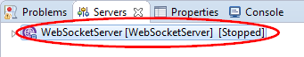

## Import the WebSocket sample application

1.  Click **File > Import** from the Eclipse menu. Expand **Web** and select **WAR file** on the Import window, then click **Next**.

    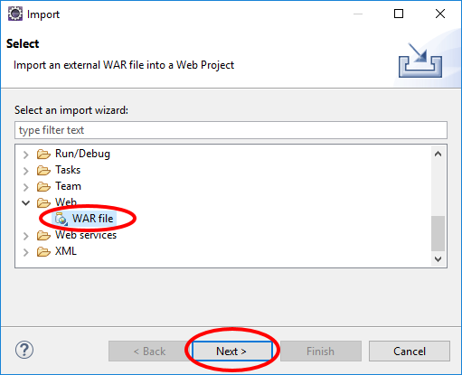

1.  Click **Browse** on the WAR Import view.

    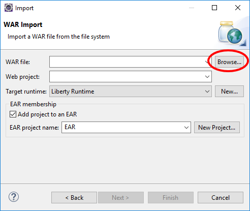

1.  Use the Open dialog to locate the `{LAB_HOME}\labs\development\6_WebSocket\WebsocktApp.war` file and click **Open**.

    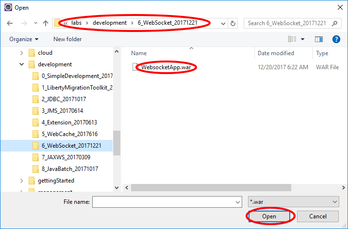

1.  Clear the **Add project to an EAR** checkbox, and verify the **Target runtime** is set to **Liberty Runtime** or the appropriate Target runtime, and click **Finish**.

    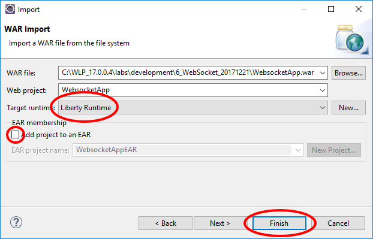

## Run the sample application

1.  In the Enterprise Explorer view, right click the **WebsocketApp** project, then click **Run As > Run on server**.

    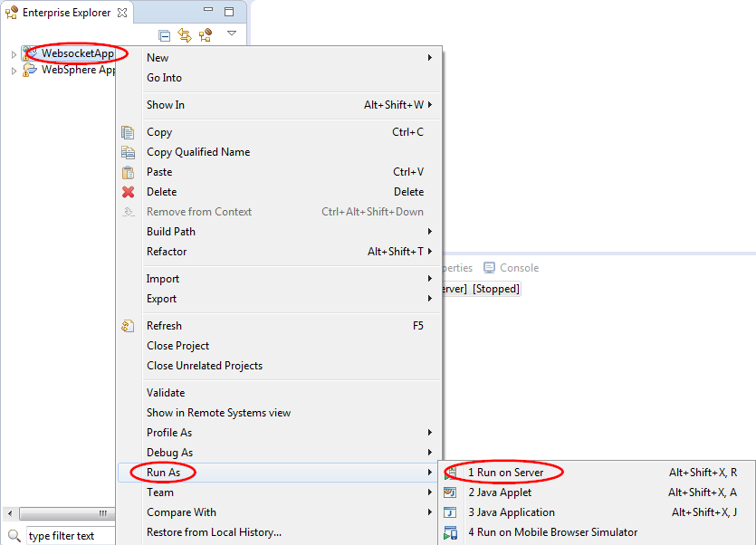

1.  On the Run On Server window, select **WebSocketServer** from the **Server** list, then click **Finish**.

    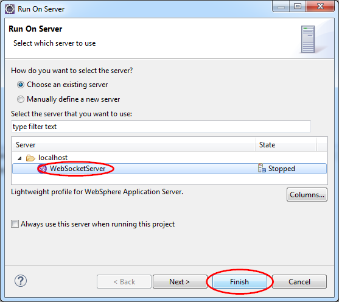

1.  After the server starts running, Eclipse may automatically bring up a browser for you to interact with the application. However, the browser in Eclipse does not yet support WebsocketApp. You must switch to a browser that supports WebsocketApp, such as a recent version of Chrome, Firefox, or Internet Explorer.

1.  Start a browser that supports WebsocketApp, and go to <http://localhost:9080/WebsocketApp>.

    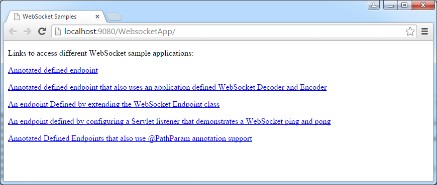

1.  Click on any of the links and follow the instructions for demonstration. For example, when you enter a message in the text box, the browser sends the message to the server via the WebSocket protocol. The server then echoes the message back.

    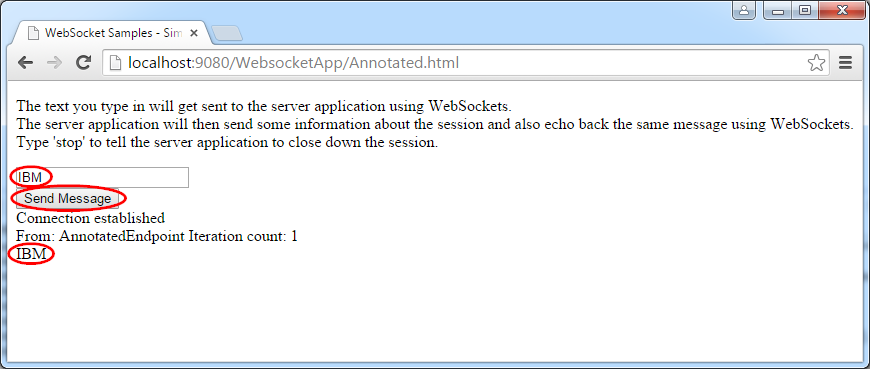

1.  Type stop in the text box in each section of the sample to shut down the session.

    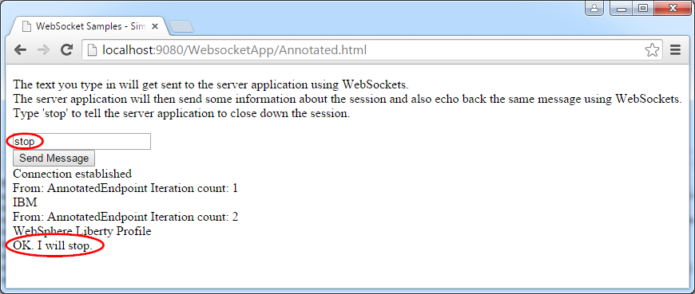

## Code walk-through

### index.html

The file index.html is the main entry point to the WebsocketApp application. It can found in the Enterprise Explorer view at **WebsocketApp > WebContent > index.html**.

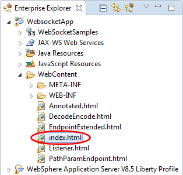

Double click index.html to bring it up in the editor. Note that it contains links to the five different patterns of WebSocket protocol usage:

~~~~
<!DOCTYPE html>

<html>

<head>

   <title>WebSocket Samples</title>

</head>

<body>

 

    Links to access different WebSocket sample applications:
 

    <a href="./Annotated.html">Annotated defined endpoint</a>
 

    <a href="./DecodeEncode.html">Annotated defined endpoint that also uses an application defined WebSocket Decoder and Encoder</a>
 

    <a href="./EndpointExtended.html">An endpoint Defined by extending the WebSocket Endpoint class</a>
 

    <a href="./Listener.html">An endpoint defined by configuring a Servlet listener that demonstrates a WebSocket ping and pong</a>
 

    <a href="./PathParamEndpoint.html">Annotated Defined Endpoints that also use @PathParam annotation support</a>
</body>

</html>
~~~~

### Simple Annotated endpoint

The simple annotated endpoint pattern demonstrates how to define a simple WebSocket endpoint to receive and send messages.

### Annotated.html

Open the file Annotated.html in the editor. Review the source code:

~~~~
<!DOCTYPE html>

<html>
   <head>
     <title>WebSocket Samples - Simple Annotated Endpoint</title>
  </head>
  <body>
  
The text you type in will get sent to the server application using WebSockets.
     The server application will then send some information about the session and also echo back the same message using WebSockets.
     Type 'stop' to tell the server application to close down the session.
  

  

     <input id=*"inputmessage"* type=*"text"* />
  

  

     <input type=*"submit"* value=*"Send Message"* onclick="send()" />
  

  

      
  </body>
</html>
~~~~

Note that:
1.  The HTML defines an `<input>` of type *text* and id *inputmessage* for you to type in a text string.

1.  It defines an `<input>` of type *submit* that is displayed as a button with the label **Send Message**. When you click on the button, the method `send()` is called.

1.  The supplied client side JavaScript

    1.  Defines a variable named webSocket that is used to access the server via the URL `ws://<host>/WebSocketApp/SimpleAnnotated`.

    1.  The are several callbacks defined for the WebSocket protocol:

        1. onError: for displaying any error message.

        1. onOpen: to display a message when the WebSocket is opened. This is done during initialization of the page.

        1. onMessage: to display any message returned by the server.

    1.  The send() method sends the actual message that you entered in the text box to the server via the WebSocket protocol. Afterwards, the callbacks are called as the events occur. If nothing goes wrong, the onMessage() method is called when the server returns with a message.

### AnnotatedEndpoint.java

In the Enterprise Explorer view, navigate to **WebsocketApp > Java Resrouces > src> wasdev.sample.websocket.annotated > AnnotatedEndpoint.java**

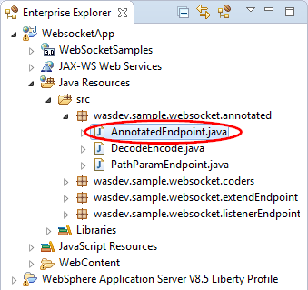

Double click AnnotatedEndpoint.java to bring it up in the editor.
~~~~
package wasdev.sample.websocket.annotated;
import java.io.IOException;
import javax.websocket.CloseReason;
import javax.websocket.EndpointConfig;
import javax.websocket.OnClose;
import javax.websocket.OnError;
import javax.websocket.OnMessage;
import javax.websocket.OnOpen;
import javax.websocket.Session;
import javax.websocket.server.ServerEndpoint;

/* The ServerEndpoint annotation value is the name of the WebSocket Endpoint for this application/endpoint. JavaScript to access from a WebSocket capable browser would be: ws://<Host Name>:<port>/<Context-Root>/SimpleAnnotated */

@ServerEndpoint(value = "/SimpleAnnotated")

public class** AnnotatedEndpoint {

   Session currentSession = null;

   int count = 0;

    /* OnOpen will get called by WebSockets when the connection has been established successfully using WebSocket handshaking with the HTTP Request - Response processing. */

    @OnOpen
    public void  onOpen(Session session, EndpointConfig ec) {

    // Store the WebSocket session for later use.

     currentSession = session;
   }

 /* Using the OnMessage annotation for this method will cause this method to get called by WebSockets when this connection has received a WebSocket message from the other side of the connection. The message is derived from the WebSocket frame payloads of one, and only one, WebSocket message. */

 @OnMessage
 public void receiveMessage(String message) {

    try {
       count++;
       if (message.toLowerCase().equals("stop")) {
        // send a WebSocket message back to the other endpoint that says we will stop.
        currentSession.getBasicRemote().sendText("OK. I will stop.");
        // Sleep to let the other side get the message before stopping - a bit kludgy, but this is just a sample!

        try {
           Thread.sleep(1000);
           } catch (InterruptedException e) {
            }
             currentSession.close();
             } else {
                /* send the message back to the other side with the iteration count. Notice we can send multiple message without having to receive messages in between.*/
                currentSession.getBasicRemote().sendText("From: " + this.getClass().getSimpleName() + " Iteration count: " + count);
                currentSession.getBasicRemote().sendText(message);
               }
            } catch (IOException ex) {
              // no error processing will be done for this sample
             }
          }
   // Using the OnClose annotation will cause this method to be called when the WebSocket Session is being closed.

   @OnClose
   public void** onClose(Session session, CloseReason reason) {
     // no clean up is needed here for this sample
   }

   /* Using the OnError annotation will cause this method to be called when the WebSocket Session has an error to report. For the Alpha version of the WebSocket implemention on Liberty, this will not be called on error conditions. */

   @OnError
   public void onError(Throwable t) {
     // no error processing will be done for this sample
   }
 }

 ~~~~

Note that:

1.  The `@ServerEndpoint` annotation defines the URI for this endpoint, which is `ws://<host>:<port>/<context-root>/SimpleAnnotated.`

1.  The onOpen() method is called when a new session is established.

1.  The onMessage() method is called when a message is received from the client.

    1.  If the message is stop, the current session is closed.

    1.  Otherwise, the message is echoed back to the caller with a prefix From followed by the class name and iteration count.

1.  Two other callbacks onClose() and onError() are currently unimplemented.

### Decode encode

The *decode encode* pattern demonstrates how to write your own decoder and encoder for the messages.

### DecodeEncode.html

Open DecodeEncode.html in an editor and examine its source. Note that this HTML is the same as Annotated.html except that the URI ends in /DecodeEncode.

### DecodeEncode.java

Open DecodeEncode.java in the editor:

~~~~
package wasdev.sample.websocket.annotated;

import java.io.IOException;
import javax.websocket.CloseReason;
import javax.websocket.EncodeException;
import javax.websocket.EndpointConfig;
import javax.websocket.OnClose;
import javax.websocket.OnError;
import javax.websocket.OnMessage;
import javax.websocket.OnOpen;
import javax.websocket.Session;
import javax.websocket.server.ServerEndpoint;
import wasdev.sample.websocket.coders.FormatIn;

//The ServerEndpoint annotation value is the name of the WebSocket Endpoint for this application/endpoint.
//JavaScript to access from a WebSocket capable browser would be: ws://<Host Name>:<port>/<Context-Root>/DecodeEncode

// there is an application defined Decoder and an application defined Encoder for messages of the given Decoder and Encoder type for this endpoint.

@ServerEndpoint(value = "/DecodeEncode",
   decoders = { wasdev.sample.websocket.coders.DecoderOne.class },
   encoders = { wasdev.sample.websocket.coders.EncoderOne.class })

public class  DecodeEncode {
  Session currentSession = null;
  int count = 0;

  /* OnOpen will get called by WebSockets when the connection has been established successfully using WebSocket handshaking with the HTTP Request - Response processing.*/

  @OnOpen
  public void onOpen(Session session, EndpointConfig ec) {
    // Store the WebSocket session for later use.
    currentSession = session;
  }

  /* Using the OnMessage annotation for this method will cause this method to get called by WebSockets when this connection has received a WebSocket message from the other side of the connection that could be decoded into an application defined FormatIn object.  The message is derived from the WebSocket frame payloads of one, and only one, WebSocket message. */

  @OnMessage
  public void** decodeTextSendBackEncodedText(FormatIn decodedObject) {
    count++;

    String message = decodedObject.getDecodedString();
    try {
      if (message.equals("STOP")) {

        /* use sendText to avoid the encoder that is looking for String types on sendObject to encode.  send a WebSocket message back to the other endpoint that says we will stop.

        currentSession.getBasicRemote().sendText("ok, I will stop");

        Sleep to let the other side get the message before stopping - a bit kludgy, but this is just a sample!  */

    try{
      Thread.*sleep*(1000);
      } catch (InterruptedException e) {

      }
      currentSession.close();
       } else {
         // WebSockets will identify the "String" type as a type to encode by EncoderOne class, and call the encoder

         currentSession.getBasicRemote().sendObject(message);
       }
        } catch (IOException e) {
           System.out.println("Caught unexpected IOException: " + e);
        } catch (EncodeException e) {
           System.out.println("Caught unexpected EncodeException: " + e);
        }
       }

       // Using the OnClose annotation will cause this method to be called when the WebSocket Session is being closed.

       @OnClose
       public void onClose(Session session, CloseReason reason) {
         // no clean up is needed here for this sample
        }

        /* Using the OnError annotation will cause this method to be called when the WebSocket Session has an error to report. For the Alpha version of the WebSocket implentation on Liberty, this will not be called on error conditions. */

      @OnError
      public void** onError(Throwable t) {
        // no error processing will be done for this sample
      }
    }

~~~~

Note that:

1.  The @ServerEndpoint annotation defines the URl that ends in /Decodeencode, and also the decoder and encoder classes.

~~~~
   @ServerEndpoint(value = "/DecodeEncode",
      decoders = { wasdev.sample.websocket.coders.DecoderOne.class },
     encoders = { wasdev.sample.websocket.coders.EncoderOne.class })
~~~~

1.  The `@OnMessage` annotation is applied to the `decodeTextSendBackEncodedText()` method to process the message from the client. The input parameter decodeObject is of type FormatIn, which is the type of the decoded message after the decoder DecoderOne decodes the input message.

### DecodeOne.java

Open DecoderOne.java in the editor. Note that it is a very simple decoder that uses the FormatIn.java class to decode a message.

~~~~
package wasdev.sample.websocket.coders;

import javax.websocket.DecodeException;
import javax.websocket.Decoder;
import javax.websocket.EndpointConfig;

// This is coded to be a Text type decoder, and it will decode incoming messages into object of type FormatIn.

public class DecoderOne implements Decoder.Text<FormatIn> {

   public DecoderOne() {

   }

    @Override
    public void destroy() {
     }

   @Override
   public void init(EndpointConfig config) {

   }
   @Override
   public FormatIn decode(String s) throws DecodeException {
     // For the incoming String, create a new FormatIn object and allow this object to decode the String data.
     FormatIn f = **new** FormatIn();
     f.doDecoding(s);
     return f;
  }

   @Override
   public boolean willDecode(String s) {
     // For the sample, we will always try to encode whatever String we receive

     return true

   }
 }
 ~~~~

### EncodeOne.java

Open EncodeOne.java in the editor. Note that it is a very simple encoder that transforms vowels to numbers:

-   A to 4

-   E to 3

-   I to 1

-   O to 0

-   U to 6

~~~~

package wasdev.sample.websocket.coders;

import javax.websocket.EncodeException;
import javax.websocket.Encoder;
import javax.websocket.EndpointConfig;

// This is coded to be a Text type encoder, and it will encode outgoing Strings that we sent using the sendObject method.

public class EncoderOne implements Encoder.Text<String> {

  @Override
  public void destroy() {
   }

   @Override
   public void init(EndpointConfig arg0) {
   }

   @Override
   public String encode(String s) throws EncodeException {
     // encoding will be to replace the upper case vowels with numbers.
     // A = 4, E = 3, I = 1, O = 0, and U = 6.
     String output = null;
     if (s == null) {
       return "";
      }

      output = s.replace("A", "4");
      output = output.replace("E", "3");
      output = output.replace("I", "1");
      output = output.replace("O", "0");
      output = output.replace("U", "6");

      return output;
    }
  }

~~~~

Re-run the sample using these variations for input text:

-   Lower case input should be converted to upper case

-   The vowels *AEIOU* should be converted to their numeric equivalent.

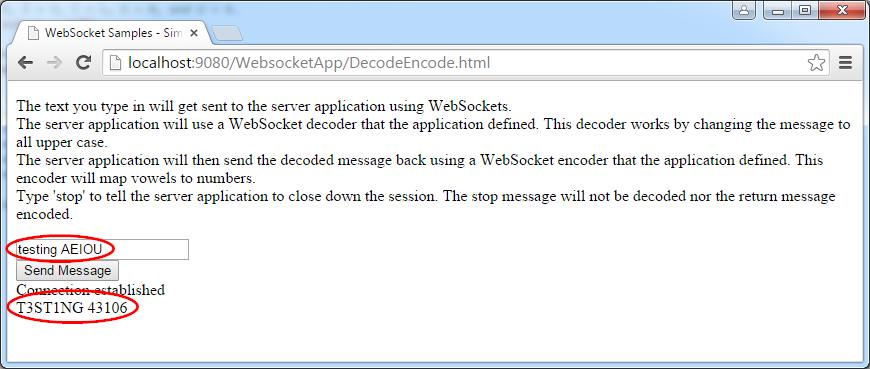

### Extended Endpoint Pattern

Using the extended endpoint pattern enables you to define a WebSocket endpoint programmatically rather than via annotations.

### EndpointExtended.html

This HTML is the same as `Annotated.html` except that the WebSocket URI ends in `/ExtendedEndpoint`.

### EEServerApplicationConfig.java

This class implements the ServerApplicationConfig interface enabling you to define the endpoint configurations programmatically.

~~~~
package wasdev.sample.websocket.extendEndpoint;

import java.util.HashSet;
import java.util.Set;
import javax.websocket.Endpoint;
import javax.websocket.server.ServerApplicationConfig;
import javax.websocket.server.ServerEndpointConfig;

 public class  EEServerApplicationConfig  implements  ServerApplicationConfig {
    @Override
    public** Set<Class<?>> getAnnotatedEndpointClasses(Set<Class<?>> arg0) {

      // Accept for usage any endpoint classes that have been found for this application.

      return** arg0;
   }

    @Override
    public Set<ServerEndpointConfig> getEndpointConfigs(Set<Class<? **extends** Endpoint>> arg0) {

      // Intialize and return the endpoint configuration object that will be used for our coded endpoint in this application.

      Set<ServerEndpointConfig> configs = **new** HashSet<ServerEndpointConfig>();

      EEServerEndpointConfig config = **new** EEServerEndpointConfig();
      configs.add(config);
      return** configs;
     }
   }
~~~~

The `getAnnotatEndpointClasses()` method enables you decided which endpoint classes to be used. In our example, we allow all valid endpoint classes that are found by the runtime. The getEndpointConfigs() method allows you to decide the configurations for each endpoint.

### EEServerEndpointConfig.java

This class implements the ServerEndpointConfig interface to programmatically define the configuration of an endpoint. Note the `getEndpointClass()` method returns a valid endpoint class ExtendedEndpoint. The `getPath()` method returns the URI for this endpoint.

~~~~
package wasdev.sample.websocket.extendEndpoint;

import java.util.List;
import java.util.Map;
import javax.websocket.Decoder;
import javax.websocket.Encoder;
import javax.websocket.Extension;
import javax.websocket.server.ServerEndpointConfig;

public class EEServerEndpointConfig implements ServerEndpointConfig {
   /* the uri path to use to get to this endpoint. JavaScript to access from a WebSocket capable browser would be: ws://<Host Name>:<port>/<Context-Root>/ExtendedEndpoint */

   String uriPath = "/ExtendedEndpoint";

   public** EEServerEndpointConfig() {
     // no-arg constructor
   }

   @Override
   public Class<?> getEndpointClass() {
     return ExtendedEndpoint.class;
   }

   @Override
   public String getPath() {
     return uriPath;
   }

   @Override
   public Configurator getConfigurator() {
     ServerEndpointConfig.Configurator x = **new** ServerEndpointConfig.Configurator();
     return** x;
   }

    @Override
    public Map<String, Object> getUserProperties() {
      return** **null**;
    }

    @Override
    public List<Extension> getExtensions() {
      return null;
    }

    @Override

    public List<String> getSubprotocols() {
      return null;
    }

    @Override
    public** List<Class<? **extends** Decoder>> getDecoders() {
      return null;
    }

    @Override
    public List<Class<? extends Encoder>> getEncoders() {
      return null;
     }
   }

~~~~

### ExtendedEndpoint.java

This class is the actual endpoint, and defines the message handler used to handle message.

~~~~
package wasdev.sample.websocket.extendEndpoint;

import javax.websocket.CloseReason;
import javax.websocket.Endpoint;
import javax.websocket.EndpointConfig;
import javax.websocket.MessageHandler;
import javax.websocket.Session;

public class ExtendedEndpoint extends Endpoint {

  /* onOpen will get called by WebSockets when the connection has been established successfully using WebSocket handshaking with the HTTP Request - Response processing. */

  @Override
  public void onOpen(final Session session, EndpointConfig ec) {
     // Set up the object that will receive messages sent from the other side of this connection.

      MessageHandler.Whole<String> handler = **new** EEMessageHandler(session);
      session.addMessageHandler(handler);
    }

     // onClose will be called when the WebSocket Session is being closed.
  @Override
  public void onClose(Session session, CloseReason reason) {}

    // onError will be called when the WebSocket Session has an error to report. For the Alpha version
    // of the WebSocket implemention on Liberty, this will not be called on error conditions.

  @Override
  public void onError(Session session, Throwable thr) {}

  }

  ~~~~
### EEMessageHandler.java

This class defines the message handler used to process String inputs. Note the onMessage() method uses String type input parameter.

~~~~
package wasdev.sample.websocket.extendEndpoint;

import java.io.IOException;
import javax.websocket.MessageHandler;
import javax.websocket.Session;

public class EEMessageHandler implements MessageHandler.Whole<String> {
  int count = 0;
  Session currentSession = null;

  public** EEMessageHandler(Session session) {
     // store the session so our onMessage method can use it later
     currentSession = session;
   }
   /* onMessage will be called by WebSockets when this connection has received
   a WebSocket message from the other side of the connection.
   The message is derived from the WebSocket frame payloads of one, and only one, WebSocket message. */

  @Override
  public void onMessage(String message) {

    try {
      count++;
      if (message.toLowerCase().equals("stop")) {
        // send a WebSocket message back to the other endpoint that says we will stop.

        currentSession.getBasicRemote().sendText("OK. I will stop.");

        // Sleep to let the other side get the message before stopping - a bit kludgy, but this is just a sample!

        try {
          Thread.*sleep*(1000);
          } **catch** (InterruptedException e) {
         }

          currentSession.close();
          } else {
            /* send the message back to the other side with the iteration count. Notice we can send multiple message without having to receive messages in between.*/
             currentSession.getBasicRemote().sendText("From: " + **this**.getClass().getSimpleName()
              + " Iteration count: " + count);
              currentSession.getBasicRemote().sendText(message);
              } **catch** (IOException ex) {
                 // no error processing will be done for this sample
               }
             }
           }
~~~~

### Listener Pattern

The listener pattern demonstrates the server pinging the web browser. This is useful for keep-alive. It also demonstrates how to programmatically add a new endpoint during web application servlet context initialization.

### Listener.html

This HTML is similar to Annotated.html except that the WebSocket URI ends in `/listenerEndpoint`. Read the introduction text which explains how the sample is supposed to work:

1.  After you enter some text and click on the **Request Ping** button, a message is sent to the server.

2.  The server sends a *ping* to the browser, and upon receipt the browser immediately sends back a *pong* automatically. This is a feature of a browser that supports WebSocket.

3.  After the server receives the *pong*, the reply HTML is sent back to the browser for you to verify the *pong* was successfully received. Note that there is currently no API in the browser for JavaScript to intercept pings or pongs.

### ServletListener.java

This class programmatically creates a new endpoint during servlet context initialization in the contextInitialized() method.

### ListenerEndpointConfig.java

This class implements the endpoint configuration for the ListenerEndpoint endpoint class.

### ListenerEndpoint.java

This class implements the WebSocket endpoint for the sample application. Note that in the onOpen() method, two message handlers are created.

1.  The first message handler processes a PongMessage from the browser, and returns the verification that a *pong* message was received via HTML to the browser.

2.  The second message handler processes the string from the text box entered by the user. It initiates a *ping* message back to the browser. When the browser returns with a *pong*, the first message handler will handle the *pong*.

### Path Parameter Pattern

This pattern demonstrates how to process path parameters via annotations.

### PathParamEndpoint.html

This HTML sends a WebSocket URL containing path parameters: `ws:<host>:<port>/WebsocketApp/SimplePathParam/rentals/LakeViewProperties/C/111/2/299999.99/true/199.45`

### PathParamEndpoint.java

Note the annotation that defines the path parameters:
~~~~
@ServerEndpoint(value = "/SimplePathParam/rentals/{name}/{building}/{home-number}/{no-of-rooms}/{property-val}/{pets-allowed}/{maintenance-fee}")
~~~~
Also note how the parameters appear in the method that processes the message:

~~~~

@OnMessage

public String echoText(String message,
   @PathParam("pets-allowed") Boolean isPetsAllowed,
   @PathParam("property-val") Double propertyValue,
   @PathParam("name") String name,
   @PathParam("building") char building,
   @PathParam("home-number") Integer homeNumber,
   @PathParam("no-of-rooms") short noOfRooms,
   @PathParam("maintenance-fee") float maintFee) {

      . . .

}

~~~~

## Clean up after Lab

1.  Remove Websocket Application from the server. Right click on the **WebsocketApp** application and select **Remove**

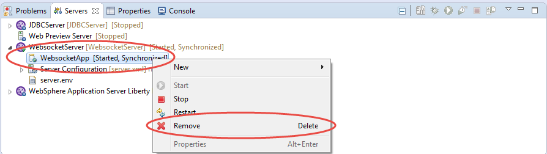

1.  Stop the WebsocketServer. Right click on the **WebsocketServer** and select **Stop** to stop the server

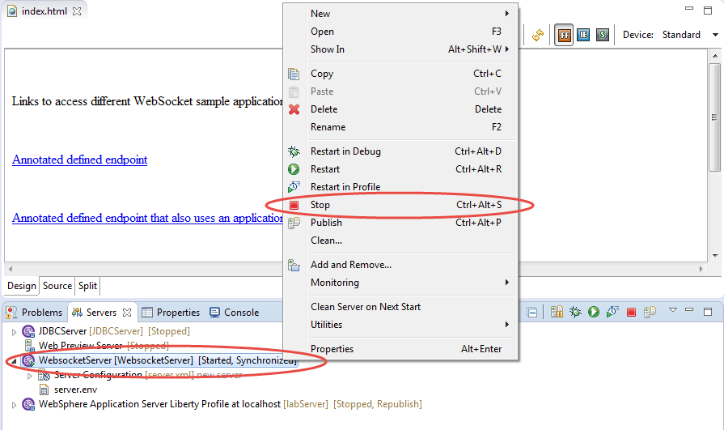

# Notices

This information was developed for products and services offered in the U.S.A.

IBM may not offer the products, services, or features discussed in this document in other countries. Consult your local IBM representative for information on the products and services currently available in your area. Any reference to an IBM product, program, or service is not intended to state or imply that only that IBM product, program, or service may be used. Any functionally equivalent product, program, or service that does not infringe any IBM intellectual property right may be used instead. However, it is the user's responsibility to evaluate and verify the operation of any non-IBM product, program, or service.

IBM may have patents or pending patent applications covering subject matter described in this document. The furnishing of this document does not grant you any license to these patents. You can send license inquiries, in writing, to:

IBM Director of Licensing\
IBM Corporation\
North Castle Drive\
Armonk, NY 10504-1785\
U.S.A.

For license inquiries regarding double-byte (DBCS) information, contact the IBM Intellectual Property Department in your country or send inquiries, in writing, to:

IBM World Trade Asia Corporation\
Licensing\
2-31 Roppongi 3-chome, Minato-ku\
Tokyo 106-0032, Japan

**The following paragraph does not apply to the United Kingdom or any other country where such provisions are inconsistent with local law:** INTERNATIONAL BUSINESS MACHINES CORPORATION PROVIDES THIS PUBLICATION "AS IS" WITHOUT WARRANTY OF ANY KIND, EITHER EXPRESS OR IMPLIED, INCLUDING, BUT NOT LIMITED TO, THE IMPLIED WARRANTIES OF NON-INFRINGEMENT, MERCHANTABILITY OR FITNESS FOR A PARTICULAR PURPOSE. Some states do not allow disclaimer of express or implied warranties in certain transactions, therefore, this statement may not apply to you.

This information could include technical inaccuracies or typographical errors. Changes are periodically made to the information herein; these changes will be incorporated in new editions of the publication. IBM may make improvements and/or changes in the product(s) and/or the program(s) described in this publication at any time without notice.

Any references in this information to non-IBM Web sites are provided for convenience only and do not in any manner serve as an endorsement of those Web sites. The materials at those Web sites are not part of the materials for this IBM product and use of those Web sites is at your own risk.

IBM may use or distribute any of the information you supply in any way it believes appropriate without incurring any obligation to you.

Any performance data contained herein was determined in a controlled environment. Therefore, the results obtained in other operating environments may vary significantly. Some measurements may have been made on development-level systems and there is no guarantee that these measurements will be the same on generally available systems. Furthermore, some measurements may have been estimated through extrapolation. Actual results may vary. Users of this document should verify the applicable data for their specific environment.

Information concerning non-IBM products was obtained from the suppliers of those products, their published announcements or other publicly available sources. IBM has not tested those products and cannot confirm the accuracy of performance, compatibility or any other claims related to non-IBM products. Questions on the capabilities of non-IBM products should be addressed to the suppliers of those products.

All statements regarding IBM's future direction and intent are subject to change or withdrawal without notice, and represent goals and objectives only.

This information contains examples of data and reports used in daily business operations. To illustrate them as completely as possible, the examples include the names of individuals, companies, brands, and products. All of these names are fictitious and any similarity to the names and addresses used by an actual business enterprise is entirely coincidental. All references to fictitious companies or individuals are used for illustration purposes only.

COPYRIGHT LICENSE:

This information contains sample application programs in source language, which illustrate programming techniques on various operating platforms. You may copy, modify, and distribute these sample programs in any form without payment to IBM, for the purposes of developing, using, marketing or distributing application programs conforming to the application programming interface for the operating platform for which the sample programs are written. These examples have not been thoroughly tested under all conditions. IBM, therefore, cannot guarantee or imply reliability, serviceability, or function of these programs.

Trademarks and copyrights
=========================

The following terms are trademarks of International Business Machines Corporation in the United States, other countries, or both:

  IBM          AIX        CICS             ClearCase      ClearQuest   Cloudscape   
  ------------ ---------- ---------------- -------------- ------------ ------------ --
  Cube Views   DB2        developerWorks   DRDA           IMS          IMS/ESA      
  Informix     Lotus      Lotus Workflow   MQSeries       OmniFind                  
  Rational     Redbooks   Red Brick        RequisitePro   System i                  
  *System z*   *Tivoli*   *WebSphere*      *Workplace*    *System p*                

Adobe, the Adobe logo, PostScript, and the PostScript logo are either registered trademarks or trademarks of Adobe Systems Incorporated in the United States, and/or other countries.

IT Infrastructure Library is a registered trademark of the Central Computer and Telecommunications Agency which is now part of the Office of Government Commerce.

Intel, Intel logo, Intel Inside, Intel Inside logo, Intel Centrino, Intel Centrino logo, Celeron, Intel Xeon, Intel SpeedStep, Itanium, and Pentium are trademarks or registered trademarks of Intel Corporation or its subsidiaries in the United States and other countries.

Linux is a registered trademark of Linus Torvalds in the United States, other countries, or both.

Microsoft, Windows, Windows NT, and the Windows logo are trademarks of Microsoft Corporation in the United States, other countries, or both.

ITIL is a registered trademark, and a registered community trademark of The Minister for the Cabinet Office, and is registered in the U.S. Patent and Trademark Office.

UNIX is a registered trademark of The Open Group in the United States and other countries.

Java and all Java-based trademarks and logos are trademarks or registered trademarks of Oracle and/or its affiliates.

Cell Broadband Engine is a trademark of Sony Computer Entertainment, Inc. in the United States, other countries, or both and is used under license therefrom.

Linear Tape-Open, LTO, the LTO Logo, Ultrium, and the Ultrium logo are trademarks of HP, IBM Corp. and Quantum in the U.S. and other countries.

© Copyright IBM Corporation 2017.

The information contained in these materials is provided for informational purposes only, and is provided AS IS without warranty of any kind, express or implied. IBM shall not be responsible for any damages arising out of the use of, or otherwise related to, these materials. Nothing contained in these materials is intended to, nor shall have the effect of, creating any warranties or representations from IBM or its suppliers or licensors, or altering the terms and conditions of the applicable license agreement governing the use of IBM software. References in these materials to IBM products, programs, or services do not imply that they will be available in all countries in which IBM operates. This information is based on current IBM product plans and strategy, which are subject to change by IBM without notice. Product release dates and/or capabilities referenced in these materials may change at any time at IBM’s sole discretion based on market opportunities or other factors, and are not intended to be a commitment to future product or feature availability in any way.

IBM, the IBM logo and ibm.com are trademarks of International Business Machines Corp., registered in many jurisdictions worldwide. Other product and service names might be trademarks of IBM or other companies. A current list of IBM trademarks is available on the Web at “Copyright and trademark information” at www.ibm.com/legal/copytrade.shtml.

