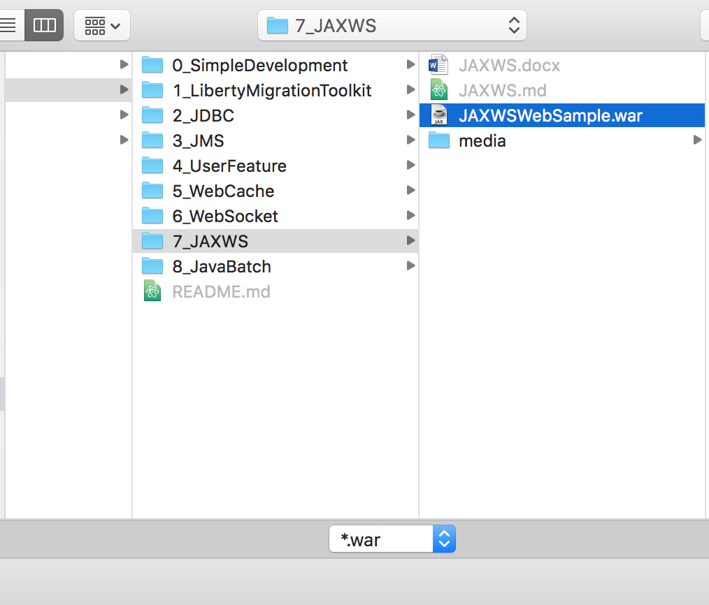

#JAXWS Web Service

In this lab we will learn how to use JAXWS web service via a sample application demonstrating seven different patterns:

1.  A web service stub client
1.  A web service dynamic client
1.  A POJO based endpoint
1.  Handler chain
1.  Web service message context
1.  Catalog support
1.  MTOM support

Please refer to the following table for file and resource location references on different operating systems.

Location Ref. |   OS    |     Absolute Path
 --------------| ------- | --------------------------
 *{LAB_HOME}*  | Windows |  `C:\\WLP_<VERSION>` or your choice
 *{LAB_HOME}*  | Linux   |  `~/WLP_<VERSION>` or your choice
 *{LAB_HOME}*  | Mac OS |  `~/WLP_<VERSION>` or your choice  

## Prerequisites

The following preparation must be completed prior to beginning this lab:

1.  Complete the Getting Started lab to set up the lab environment, and learn how to create a server using Eclipse with WebSphere Developer Tools (WDT).

1.  ***Optional:*** complete the Simple Development lab if you need a refresher on how to use Eclipse and WDT.

## Create a new server

1.  Start Eclipse.

1.  Using the procedure learned in the Getting Started lab, create a new Liberty profile application server called **JAXWSServer**.

    

## Import the JAXWS sample application

1.  Click **File > Import** from the Eclipse menu. Expand **Web** and select **WAR file** on the Import window, then click **Next**.

    

2.  Click **Browse** on the WAR Import view.

   

3.  Use the Open dialog to locate the `{LAB_HOME}\labs\development\7_JAXWS\ JAXWSWebSample.war` file and click **Open**.

    

4.  Clear the **Add project to an EAR** checkbox, and verify the **Target runtime** is set to **WebSphere Application Server Liberty**, and click **Finish**.

    

## Run the sample application

1.  In the Enterprise Explorer view, right click the **JAXWSWebSample** project, then click **Run As > Run on server**.

    

1.  On the Run On Server window, select **JAXWSServer** from the **Server** list, then click **Finish**.

    

2.  Expand **JAXWSServer** in the Server view and double click **Server Configuration**. Inspect server.xml and ensure the `jaxws-2.2` feature has been added automatically by WDT.

    

3.  After the server starts running, Eclipse may automatically bring up a browser for you to interact with the application. You may also start your browser and go to the URL location.

 <http://localhost:9080/JAXWSWebSample/>.

4.  Interact with each of the seven scenarios per instructions provided on the web page.

    

Code walk-through
-----------------

### index.jsp

The index.jsp is the main entry point to the sample application. In the Enterprise Explorer view, navigate to **JAXWSWebSample > WebContent** and double click on `index.jsp`. This displays the contents of `index.jsp` in Eclipse. Note that the code creates a table for the seven scenarios, with a separate link to each. The highlight below shows the link to the first scenario.

### WebService stub client

1. Open `simple_webservice_sample.jsp` and note how it displays the instructions for the demo in the .jsp, and then routes the request to SimpleStubClientServlet:
~~~~
<form action="<%=request.getContextPath()%>/SimpleStubClientServlet"> target='_self' method='POST'>
~~~~

1. Open `wasdev.sample.jaxws.web.simple.client.SimpleStubClientServlet.java` and examine its contents. Note how it respond to the servlet path /SimpleStubClientServlet, invokes the web service via SimpleEcho stub, and forwards the results back to `simple_websiervice_sample.jsp`.

   

1. Examine the file `wasdev.sample.jaxws.web.simple.client.SimpleEcho.java`.

 **Note** It defines the client web service interface, with the echo method. This is used by the SimpleStubClientServlet to make a web service call.

1. Examine the file `wasdev.sample.jaxws.web.simple.SimpleEcho.java` and note the web service implementation that merely echoes its input.

  ~~~~
  package wasdev.sample.jaxws.web.simple;

  import javax.jws.WebService;

  @WebService
  public class SimpleEcho {

     public String echo(String value) {

        return "Echo Response [" + value + "]";
     }

  }
  ~~~~

### WebService dynamic client

1. Open `simple_webserviceprovider_sample.jsp` and note how it displays the instructions for the demo in the `.jsp`, and then routes the request to SimpleDynamicClientServlet:
~~~~
<form action="<%=request.getContextPath()%>/SimpleDynamicClient" target='_self' method='POST'>
~~~~
1. Open `wasdev.sample.jaxws.web.simple.client.SimpleDynamicClientServlet.java`, and note how it uses a MessageFactory to dynamically create a message, and the Service class to create a web service client reference. No actual Java client interface is required.

3. Examine the file `wasdev.sample.jaxws.web.simple.SimpleEchoProvider.java`, which is the server side implementation of the service. Note how it uses the MessageFactory to retrieve the message and process the message. No actual Java interface is needed.

### POJO based endpoint

1. Open `webxml_sample.jsp` and note how it displays the instructions for the demo in the `.jsp`, and then routes the request  to /simpleHelloWorldWebXmLClientServlet:
~~~~
<form action="<%=request.getContextPath()%>/SimpleHelloWorldWebXmlClientServlet" target='_self' method='POST'>
~~~~

1. Open `wasdev.sample.jaxws.web.webxml.client.SimpleHelloWorldWebXmlClientServlet`, and note how it demonstrates using four different ways to get a web service client:

1.  Declaring a variable of the type Service with the `@WebServiceRef` annotation that maps it to the SimpleHelloWorldWebXmlService class.
    ~~~~
    @WebServiceRef(value = SimpleHelloWorldWebXmlService.class)

    private Service service;
    ~~~~

1.  Declaring a variable of the type SimpleHelloWorldWebXmlService with the `@WebServiceRef` annotation.
    ~~~~
    @WebServiceRef

    private SimpleHelloWorldWebXmlService simpleHelloWorldWebXmlService;
    ~~~~

1.  Declaring a variable of the web service interface type SimpleHelloWorldWebXml, with the `@WebServiceRef` annotation that maps it to the SimpleHelloWorldWebXmlService class.
    ~~~~
    @WebServiceRef(value = SimpleHelloWorldWebXmlService.class)

    private SimpleHelloWorldWebXml simpleHelloWorldWebXml;
    ~~~~
1.  Declaring a variable of the type SimpleHelloWorldWebXmlService with the `@Resource` annotation.
    ~~~~
    @Resource
    private SimpleHelloWorldWebXmlService simpleHelloWorldWebXmlService2;
    ~~~~

1. Open `wasdev.sample.jaxws.web.webxml.client.SimpleHelloWorldWebXmlService`, the implementation of the client service. Note the `@WebServiceClient` annotation:
  ~~~~
  @WebServiceClient(name = "SimpleHelloWorldWebXmlService", targetNamespace = "http://webxml.web.jaxws.sample.wasdev/",  wsdlLocation = "WEB-INF/wsdl/SimpleHelloWorldWebXmlService.wsdl")
  ~~~~
**Note** The web service client is connecting to the path /CustomizedHelloworld:
~~~~
url = new URL(baseUrl, "http://localhost:9080/JaxWsLibertyDemo/CustomizedHelloWorld?wsdl");
~~~~
1. Open `web.xml` and note that /CustomizedHelloWorld is mapped to a servlet SimpleHelloWorld:

  ~~~~
  <servlet>
     <display-name>SimpleHelloWorld</display-name>
     <servlet-name>SimpleHelloWorld</servlet-name>
    <servlet-class>
      wasdev.sample.jaxws.web.webxml.SimpleHelloWorldWebXml
    </servlet-class>
  </servlet>

  <servlet-mapping>
     <servlet-name>SimpleHelloWorld</servlet-name>
     <url-pattern>/CustomizedHelloWorld</url-pattern>
  </servlet-mapping>
  ~~~~
1. Open `wasdev.sample.jaxws.web.webxml.SimpleHelloWorldWebXml.java`, and note that it is just a POJO that implements the web service.

### Handler Chain

1. Open `handler_sample.jsp` and note how it displays the instructions for the demo in the `.jsp`, and then routes the request to /HandlerClientServlet:
  ~~~~
  <form action="<%=request.getContextPath()%>/HandlerClientServlet" target='_self' method='POST'>
  ~~~~
1. Open `wasdev.sample.jaxws.web.handler.client.HandlerClientServlet`, and note that it declares and client handler chain, and uses a client service RouteTrackerService:
  ~~~~
  @HandlerChain(file = "handler-client.xml")

  ….

  @WebServiceRef(value = RouteTrackerService.**class**)

  private RouteTracker routeTracker;
  ~~~~
1. Open `wasdev.sample.jaxws.web.handler.client.handler-client.xml`, and note that it declares two handlers:
~~~~
  <handler-chain>
     <handler>
     <handler-name>LogicalHandler</handler-name>
     <handler-class>
        wasdev.sample.jaxws.web.handler.client.TestClientLogicalHandler
     </handler-class>
   <init-param>
      <param-name>arg0</param-name>
      <param-value>testInitParam</param-value>
   </init-param>
  </handler>
  <handler>
   <handler-name>SOAPHandler</handler-name>
   <handler-class>
      wasdev.sample.jaxws.web.handler.client.TestClientSOAPHandler
    </handler-class>
   </handler>

  </handler-chain>
~~~~
1. Open `wasdev.sample.jaxws.web.handler.client.TestClientLogicalHandler` and note that it contains a minimal implementation of a LogicalHandler.

1. Open `wasdev.sample.jaxws.web.handler.client.TestClienSOAPHandler` and note that it contains a minimal implementation of a SOAPHandler.

1. Open `wasdev.sample.jaxws.web.handler.client.RouteTrackerService` and note that points to the RouteTrackerService server side implementation:
~~~~
url = **new** URL(baseUrl, "http://localhost:9080/JaxWsLibertyDemo/RouteTrackerService?wsdl");
~~~~
1. Open `wasdev.sample.jaxws.web.handler.RouteTracker` and note it implements the RouteTracker service, and uses handler chain defined in handler-test.xml:
  ~~~~
  @WebService(name = "RouteTracker", serviceName = "RouteTrackerService", portName = "RouteTrackerPort", targetNamespace = "http://web.jaxws.sample.wasdev/")

  @HandlerChain(file = "handler-test.xml")

  public class** RouteTracker {
      @SuppressWarnings({ "rawtypes", "unchecked" })
      public** String track(@WebParam(name = "message") String message) {
        System.out.println(getClass().getName());
        return "response [" + message + "] Please check the outputs on the console";
     }
   }
  ~~~~
1. Bring up `wasdev.sample.jaxws.web.handler.handler-test.xml` and note it uses two handlers:
  ~~~~
  <handler-chain>
     <handler>
        <handler-name>LogicalHandler</handler-name>
        <handler-class>
          wasdev.sample.jaxws.web.handler.TestLogicalHandler
       </handler-class>
       <init-param>
          <param-name>arg0</param-name>
          <param-value>testInitParam</param-value>
       </init-param>
     </handler>
     <handler>
        <handler-name>SOAPHandler</handler-name>
        <handler-class>wasdev.sample.jaxws.web.handler.TestSOAPHandler
        </handler-class>
     </handler>
  </handler-chain>
  ~~~~

The implementation of the server side handler is similar to client side handler. Therefore, we will not discuss them here.

After you submit the query for this scenario in the browser, check the Console view in Eclipse to ensure that the handlers are called. It’ll look like this:

### Web Service message context

1. Open `webservicecontext_sample.jsp` and note how it displays the instructions for the demo in the .jsp, and then routes the request to /WebServiceContextServlet:
~~~~
<form action="<%=request.getContextPath()%>/WebServiceContextServlet"  target='_self' method='POST'>
~~~~
1. Open `wasdev.sample.jaxws.web.webservicecontext.client.WebServiceContextServlet`, and note that it defines a variable of type WebServiceContextQueryService with the `@WebServiceRef` annotation, and it calls the query method on the web service to get a string:
  ~~~~
  @WebServiceRef(value = WebServiceContextQueryService.class)

  private WebServiceContextQuery contextQuery;

  @Override
  protected void doPost(HttpServletRequest request, HttpServletResponse response) throws ServletException, IOException {

     String echoParameter = request.getParameter("submit");
     if (echoParameter != null) {
       setEndpointAddress((BindingProvider) contextQuery, request, "WebServiceContextQueryService");
       String responseMessage = contextQuery.query();
       request.setAttribute("output", responseMessage);
      }
   request.getRequestDispatcher("webservicecontext_sample.jsp").forward(request, response);

  }
  ~~~~
1. Open `wasdev.sample.jaxws.web.webservicecontext.client.WebServiceContextQueryService`, and note that it connects to a URL path at /WebserviceContextQueryService:
~~~~
url = **new** URL(baseUrl, "http://localhost:9080/JaxWsLibertyDemo/WebServiceContextQueryService?wsdl");
~~~~
1. Open `wasdev.sample.jaxws.web.webservicecontext.client.WebServiceContextQuery.java`, the service interface, and note that it is defined as a web service with one method query.

1. Open `wasdev.sample.jaxws.web.webservicecontext.WebServiceContextQuery.java`, and note that it simply returns all the properties in the MessageContext as a string.

### Catalog

1. Open `catalog_sample.jsp` and note how it displays the instructions for the demo in the `.jsp`, and then routes the request to /CatalogclientServlet:
~~~~
<form action="<%=request.getContextPath()%>/CatalogClientServlet" target='_self' method='POST'>
~~~~
1. Open `wasdev.sample.jaxws.web.catalog.client.CatalogServlet.java`, and note that it defines a variable calculatorPortTypes with the `@WebServiceRef` annotation mapping to the service endpoint interface Calculator:
  ~~~~
  @WebServiceRef(value = Calculator.**class**)

  private CalculatorPortType calculatorPortType;
  ~~~~
Also note the call to setEndpointAddress in the base class uses /Calculator as path:
  ~~~~
  setEndpointAddress((BindingProvider) calculatorPortType, request, "Calculator");
  ~~~~
1. Open `wasdev.sample.jaxws.web.catalog.client.Calculator.java`, and note that it is defined with the `@WebServiceClient` annotation, with a non-existent wsdlLocation of <http://foo.org/calculator.wsdl>.
  ~~~~
  @WebServiceClient(name = "Calculator",
  targetNamespace = "http://catalog.web.jaxws.sample.wasdev",
  wsdlLocation = "http://foo.org/calculator.wsdl")

  public class Calculator extends Service
  ~~~~
1. Open WEB-INF/jax-ws-catalog.xml. Note it redefines the location of the WSDL file to be at wsdl/cauculator.wsdl.
  ~~~~
  <?xml version=*"1.0"* encoding=*"UTF-8"*?>

  <catalog xmlns="urn:oasis:names:tc:entity:xmlns:xml:catalog" prefer="system">
    <system systemId="http://foo.org/calculator.wsdl" uri="wsdl/calculator.wsdl" />
  </catalog>
  ~~~~
Double check that `WEB-INF/wsdl/calculator.wsdl` exists.

1. With the WSDL available, the client is able to make a request to the server. Open `wasdev.sample.jaxws.web.catalog.Calculator.java` and note it defines a web service endpoint interface whose name is CalculatorPortType.

1. Open `wasdev.sample.jaxws.web.catalog.CalculatorService.java` and note that it implements the web service endpoint’s method to add two numbers.

### MTOM support

***MTOM*** stands for **Message Transmission and Optimization Mechanism**, a way to send binary data. The MTOM sample transmits binary image between client and server, with or without MTOM enabled.

1. Run the sample with MTOM enabled, and note that the message is a MIME multi-part message with XOP (XML-Binary Optimized Packaging), similar to this:
  ~~~~
  Request Message: Accept : [*/*] Cache-Control : [no-cache] connection : [keep-alive] Content-Length : [1270] content-type : [multipart/related;
  type="application/xop+xml";
  boundary="uuid:859cdb17-ddc3-4536-9a70-313c789b592f";
  start="<root.message@cxf.apache.org>";
  start-info="text/xml"] Host : [localhost:9080] Pragma : [no-cache] SOAPAction : [""] User-Agent : [Apache CXF 2.6.2-ibm-s20130829-0230]
  ------=_Part_0_1837574876.1434745215329 Content-Type: text/xml;
  charset=utf-8
  <soap:Envelope xmlns:soap="http://schemas.xmlsoap.org/soap/envelope/">
  <soap:Header>
    <Action xmlns="http://www.w3.org/2005/08/addressing">
      http://jaxws.service/ImageServiceImpl/uploadImageRequest
    </Action>
    <MessageID xmlns="http://www.w3.org/2005/08/addressing">
      urn:uuid:5eb16644-5d17-4f21-be54-3a3d2c0d8e84
    </MessageID>
    <To xmlns="http://www.w3.org/2005/08/addressing">
      http://localhost:9080/JAXWSWebSample/ImageServiceImplService
    </To>
    <ReplyTo xmlns="http://www.w3.org/2005/08/addressing">
       <Address>
        http://www.w3.org/2005/08/addressing/anonymous
      </Address>
    </ReplyTo>
  </soap:Header>
  <soap:Body>
    <a:uploadImage xmlns:a="http://jaxws.service/">
      <arg0>111</arg0>
      <arg1>
        <xop:Include xmlns:xop="http://www.w3.org/2004/08/xop/include" href="cid:2b3bd2bb-c38a-4781-9822-cafe8cbde00b-1@cxf.apache.org"/>
      </arg1>
    </a:uploadImage>
  </soap:Body>
  </soap:Envelope> ------=_Part_0_1837574876.1434745215329 Content-Type: application/octet-stream Content-Transfer-Encoding: binary Content-ID:
  <2b3bd2bb-c38a-4781-9822-cafe8cbde00b-1@cxf.apache.org>   ------=_Part_0_1837574876.1434745215329--
  ~~~~

1. Run the sample with MTOM disabled, and note that the message is a regular SOAP message, similar to this:
  ~~~~
  Request Message: Accept : [*/*] Cache-Control : [no-cache] connection : [keep-alive] Content-Length : [710] content-type : [text/xml; charset=UTF-8] Host : [localhost:9080] Pragma : [no-cache] SOAPAction : [""] User-Agent : [Apache CXF 2.6.2-ibm-s20130829-0230]
  <soap:Envelope xmlns:soap="http://schemas.xmlsoap.org/soap/envelope/">
     <soap:Header>
        <Action xmlns="http://www.w3.org/2005/08/addressing">
           http://jaxws.service/ImageServiceImpl/uploadImageRequest
        </Action>
        <MessageID xmlns="http://www.w3.org/2005/08/addressing">
           urn:uuid:c8f12ba7-c2f6-48e1-9d79-335926607071
        </MessageID>
        <To xmlns="http://www.w3.org/2005/08/addressing">
           http://localhost:9080/JAXWSWebSample/ImageServiceImplService
        </To>
        <ReplyTo xmlns="http://www.w3.org/2005/08/addressing">
            <Address>
              http://www.w3.org/2005/08/addressing/anonymous
            </Address>
        </ReplyTo>
     </soap:Header>
     <soap:Body>
       <a:uploadImage xmlns:a="http://jaxws.service/">
          <arg0>111</arg0>
          <arg1>AAECAw==</arg1>
       </a:uploadImage>
     </soap:Body>
  </soap:Envelope>
  ~~~~

1. Open `wsfeatures_sample.jsp` and note how it displays the instructions for the demo in the `.jsp`, and then routes the request to /ImageClientServlet:
~~~~
<form action="<%=request.getContextPath()%>/ImageClientServlet"target='_self' method='POST'>
~~~~
Open `wasdev.sample.jaxws.web.wsfeatures.client.ImageClientServlet.java`, and note that it defines a variable called ***MOCK_IMAGE_BYTES*** that contains the bytes to be transmitted. It also defines two `@WebServiceRef`, where mtomEnabledImageService transmits the image with MTOM enabled via `@MTOM` annotation, while mtomDisabledImageService transmits the image with MTOM disabled:
~~~~
private static final byte[] MOCK_IMAGE_BYTES = { 0, 1, 2, 3 };

@MTOM
@WebServiceRef(value = ImageServiceImplService.class)
   private ImageServiceImpl mtomEnabledImageService;

@WebServiceRef(value = ImageServiceImplService.class)
  private ImageServiceImpl mtomDisabledImageService;
~~~~
1. Open `wasdev.sample.jaxws.web.wsfeatures.client.ImageServiceImplService.java`, and note that it defines a web service client, with URL to access the server.

1. Open `wasdev.sample.jaxws.web.wsfeatures.client.ImageServiceImpl.java`, and note that it defines a web service endpoint with a single method to upload an array of bytes, and to receive an array of bytes in return:
  ~~~
  @WebMethod
  @WebResult(targetNamespace = "")
  @RequestWrapper(localName = "uploadImage",
     targetNamespace = "http://jaxws.service/",
     className = "wasdev.sample.jaxws.web.wsfeatures.client.UploadImage")
  @ResponseWrapper(localName = "uploadImageResponse",
     targetNamespace = "http://jaxws.service/",
     className = "wasdev.sample.jaxws.web.wsfeatures.client.UploadImageResponse")
  public byte[] uploadImage(
  @WebParam(name = "arg0", targetNamespace = "") String arg0,
  @WebParam(name = "arg1", targetNamespace = "") byte[] arg1);

  ~~~
For the server side, open `wasdev.sample.jaxws.web.wsfeatures.ImageServiceImpl.java`, and note that it just returns whatever the handler places on the message context. The content differs depending on whether or not the message is sent via MTOM:
  ~~~~
  return ((String) webServiceContext.getMessageContext().get("request.message")).getBytes();
  ~~~~
1. Open `wasdev.sample.jaxws.web.wsfeatures.MessageInfoHandler.java`, and note that for incoming request, it retrieves all the HTTP headers and places them on the message context.

## Cleanup
-------

1.  Stop the server **JAXWSServer** from Eclipse.

# Notices

This information was developed for products and services offered in the U.S.A.

IBM may not offer the products, services, or features discussed in this document in other countries. Consult your local IBM representative for information on the products and services currently available in your area. Any reference to an IBM product, program, or service is not intended to state or imply that only that IBM product, program, or service may be used. Any functionally equivalent product, program, or service that does not infringe any IBM intellectual property right may be used instead. However, it is the user's responsibility to evaluate and verify the operation of any non-IBM product, program, or service.

IBM may have patents or pending patent applications covering subject matter described in this document. The furnishing of this document does not grant you any license to these patents. You can send license inquiries, in writing, to:

IBM Director of Licensing\
IBM Corporation\
North Castle Drive\
Armonk, NY 10504-1785\
U.S.A.

For license inquiries regarding double-byte (DBCS) information, contact the IBM Intellectual Property Department in your country or send inquiries, in writing, to:

IBM World Trade Asia Corporation\
Licensing\
2-31 Roppongi 3-chome, Minato-ku\
Tokyo 106-0032, Japan

**The following paragraph does not apply to the United Kingdom or any other country where such provisions are inconsistent with local law:** INTERNATIONAL BUSINESS MACHINES CORPORATION PROVIDES THIS PUBLICATION "AS IS" WITHOUT WARRANTY OF ANY KIND, EITHER EXPRESS OR IMPLIED, INCLUDING, BUT NOT LIMITED TO, THE IMPLIED WARRANTIES OF NON-INFRINGEMENT, MERCHANTABILITY OR FITNESS FOR A PARTICULAR PURPOSE. Some states do not allow disclaimer of express or implied warranties in certain transactions, therefore, this statement may not apply to you.

This information could include technical inaccuracies or typographical errors. Changes are periodically made to the information herein; these changes will be incorporated in new editions of the publication. IBM may make improvements and/or changes in the product(s) and/or the program(s) described in this publication at any time without notice.

Any references in this information to non-IBM Web sites are provided for convenience only and do not in any manner serve as an endorsement of those Web sites. The materials at those Web sites are not part of the materials for this IBM product and use of those Web sites is at your own risk.

IBM may use or distribute any of the information you supply in any way it believes appropriate without incurring any obligation to you.

Any performance data contained herein was determined in a controlled environment. Therefore, the results obtained in other operating environments may vary significantly. Some measurements may have been made on development-level systems and there is no guarantee that these measurements will be the same on generally available systems. Furthermore, some measurements may have been estimated through extrapolation. Actual results may vary. Users of this document should verify the applicable data for their specific environment.

Information concerning non-IBM products was obtained from the suppliers of those products, their published announcements or other publicly available sources. IBM has not tested those products and cannot confirm the accuracy of performance, compatibility or any other claims related to non-IBM products. Questions on the capabilities of non-IBM products should be addressed to the suppliers of those products.

All statements regarding IBM's future direction and intent are subject to change or withdrawal without notice, and represent goals and objectives only.

This information contains examples of data and reports used in daily business operations. To illustrate them as completely as possible, the examples include the names of individuals, companies, brands, and products. All of these names are fictitious and any similarity to the names and addresses used by an actual business enterprise is entirely coincidental. All references to fictitious companies or individuals are used for illustration purposes only.

COPYRIGHT LICENSE:

This information contains sample application programs in source language, which illustrate programming techniques on various operating platforms. You may copy, modify, and distribute these sample programs in any form without payment to IBM, for the purposes of developing, using, marketing or distributing application programs conforming to the application programming interface for the operating platform for which the sample programs are written. These examples have not been thoroughly tested under all conditions. IBM, therefore, cannot guarantee or imply reliability, serviceability, or function of these programs.

Trademarks and copyrights
=========================

The following terms are trademarks of International Business Machines Corporation in the United States, other countries, or both:

  IBM          AIX        CICS             ClearCase      ClearQuest   Cloudscape   
  ------------ ---------- ---------------- -------------- ------------ ------------ --
  Cube Views   DB2        developerWorks   DRDA           IMS          IMS/ESA      
  Informix     Lotus      Lotus Workflow   MQSeries       OmniFind                  
  Rational     Redbooks   Red Brick        RequisitePro   System i                  
  *System z*   *Tivoli*   *WebSphere*      *Workplace*    *System p*                

Adobe, the Adobe logo, PostScript, and the PostScript logo are either registered trademarks or trademarks of Adobe Systems Incorporated in the United States, and/or other countries.

IT Infrastructure Library is a registered trademark of the Central Computer and Telecommunications Agency which is now part of the Office of Government Commerce.

Intel, Intel logo, Intel Inside, Intel Inside logo, Intel Centrino, Intel Centrino logo, Celeron, Intel Xeon, Intel SpeedStep, Itanium, and Pentium are trademarks or registered trademarks of Intel Corporation or its subsidiaries in the United States and other countries.

Linux is a registered trademark of Linus Torvalds in the United States, other countries, or both.

Microsoft, Windows, Windows NT, and the Windows logo are trademarks of Microsoft Corporation in the United States, other countries, or both.

ITIL is a registered trademark, and a registered community trademark of The Minister for the Cabinet Office, and is registered in the U.S. Patent and Trademark Office.

UNIX is a registered trademark of The Open Group in the United States and other countries.

Java and all Java-based trademarks and logos are trademarks or registered trademarks of Oracle and/or its affiliates.

Cell Broadband Engine is a trademark of Sony Computer Entertainment, Inc. in the United States, other countries, or both and is used under license therefrom.

Linear Tape-Open, LTO, the LTO Logo, Ultrium, and the Ultrium logo are trademarks of HP, IBM Corp. and Quantum in the U.S. and other countries.

© Copyright IBM Corporation 2017.

The information contained in these materials is provided for informational purposes only, and is provided AS IS without warranty of any kind, express or implied. IBM shall not be responsible for any damages arising out of the use of, or otherwise related to, these materials. Nothing contained in these materials is intended to, nor shall have the effect of, creating any warranties or representations from IBM or its suppliers or licensors, or altering the terms and conditions of the applicable license agreement governing the use of IBM software. References in these materials to IBM products, programs, or services do not imply that they will be available in all countries in which IBM operates. This information is based on current IBM product plans and strategy, which are subject to change by IBM without notice. Product release dates and/or capabilities referenced in these materials may change at any time at IBM’s sole discretion based on market opportunities or other factors, and are not intended to be a commitment to future product or feature availability in any way.

IBM, the IBM logo and ibm.com are trademarks of International Business Machines Corp., registered in many jurisdictions worldwide. Other product and service names might be trademarks of IBM or other companies. A current list of IBM trademarks is available on the Web at “Copyright and trademark information” at www.ibm.com/legal/copytrade.shtml.

