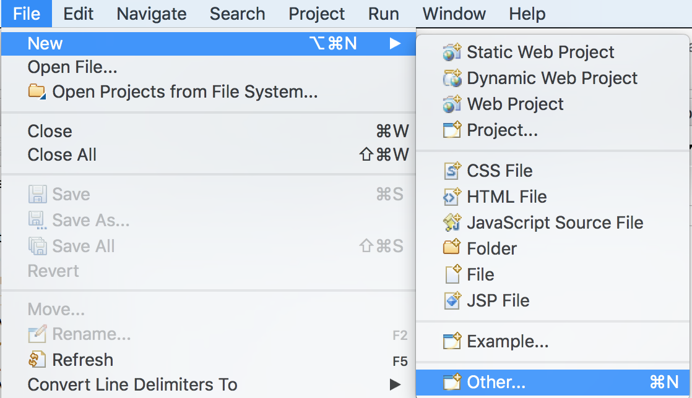

# Java Batch lab

Java Batch is a new specification in Java EE 7 for offline data processing. In this lab we will demonstrate how to use JavaBatch via a set of job steps to populate and process data in a database.

Please refer to the following table for file and resource location references on different operating systems.

Location Ref. |   OS    |     Absolute Path
 --------------| ------- | --------------------------
 *{LAB_HOME}*  | Windows |  `C:\\WLP_<VERSION>` or your choice
 *{LAB_HOME}*  | Linux   |  `~/WLP_<VERSION>` or your choice
 *{LAB_HOME}*  | Mac OS |  `~/WLP_<VERSION>` or your choice  

## Prerequisites

The following preparation must be completed prior to beginning this lab:

1. Complete the Getting Started lab to set up the lab environment, including JRE, Liberty runtime, and eclipse with WDT. You should be familiar with how to use WDT to code a web application, creating a new server, start/stopping servers.

## Overview

The requirements for this lab are:

1.  Create the Derby database
1.  Create an empty table in a database
1.  Populate the database with input from a text file.
1.  Calculate statistics from rows in the database. We will only be counting the number of rows, but the sample is detailed enough to enable you to perform much more complex processing on your own.

The artifacts for a batch job include:

1.  **Steps** that compose a job
1.  **Components** of a step, including
    1.  **Batchlet:** Used for code that does not involve record processing
    1.  **Chunk:** Used to process records
1.  Flow control including:
    1.  **Splits and flows** to enable groups of steps to run concurrently. A **split** is composed of multiple flows, each of which can run independently. A **flow** is composed of a number of steps.
    1.  **Partitions:** Concurrent processing within a step.
1.  **Listeners** with callback for various phases of batch processing.

For this lab, we will be constructing three steps. We will use partitions for concurrent processing within a step. And we will be using listeners as needed to complete the implementation of our job. This lab will not cover splits and flows, which are natural extensions to the basic lab.

From the requirements for this lab, we will construct the following batch artifacts:

1.  A step containing a batchlet to create an empty table in a database

1.  A step containing a chunk to populate the database table with input from a text file. The artifacts include:
    1.  An **ItemReader** to read input from text file
    1.  An **ItemProcessor** to convert text into an Employee record
    1.  An **ItemWriter** to populate the table with Employee records

3.  A step containing a chunk to perform processing on the database tables. The artifacts include:

    1.  An **ItemReader** to read input from the database
    1.  An **ItemProcessor** to process the input.
    1.  An **ItemWriter** to write the output.
    1.  Two partition instances of the chunk, each processing half of the database concurrently.
    1.  A **PartitionCollector**, one instance for each chunk, to collect statistics from each chunk
    1.  A **PartitionAnalyzer** that receives data from each chunk on the main job processing thread
    1.  A **PartitionReducer** that produces the final output with data received by PartitionAnalyzer

## We will go through this lab in the following sequence:

1.  Create the Derby database required for the lab

2.  Import batch artifacts into WDT

3.  Walkthrough the code to learn how the jobs steps are put together

4.  Run the batch job

5.  Use command line utility to submit jobs

### Create the Derby Database

  A Derby database is required for this lab. If you completed the JDBC lab, you will already have the Derby database created. If you did not run the JDBC lab, then you need to follow the steps below to Install Derby.

1.  Install Derby Database

  1.  **For Windows or Mac**:

        extract `{LAB_HOME}\derby\db-derby-10.14.1.0-lib.zip` to `{LAB_HOME}` directory.

    1.  **For Linux** :

        extract `{LAB_HOME}/derby/db-derby-10.14.1.0-lib.tar.gz` to `{LAB_HOME}` directory

### Import the Batch Artifacts

1.  Start Eclipse by running `{LAB_HOME}\wdt\eclipse\eclipse.exe` and select the workspace at `{LAB_HOME}\workspace`.

    

1.  Create a Java EE Batch Project called **EmployeeBatch.**

    a.  Click **File > New > Other**

    

1.  Click **Java EE Batch Project**, then click **Next.**

    

1.  For Project name, enter **EmployeeBatch.** Ensure **Add project to a Dynamic Web project** is checked, and the name is **EmployeeBatchWar.** Click **Finish.**

    

1.  Import sample artifacts

    1.  From **Enterprise Explorer**, navigate to **EmployeeBatch > src.** Right click **src** and select **New > package**

        

    1.  For Name, enter **com.ibm.ws.jbatch.sample.employee.** Click **Finish.**

        

    1.  Right click **com.ibm.ws.jbatch.sample.employee** package and select **import**

        

    1.  Select **General > File System,** then click **Next**

        

    1.  Browse to `{LAB_HOME}/labs/development/8_JavaBatch` directory, select all the .java files for this lab, then click **Finish.** The java files include

        1.  Employee.java
        1.  InitializationBatchlet.java
        1.  JDBCDataHolder.java
        1.  JDBCReader.java
        1.  JDBCReaderChunkListener.java
        1.  JDBCWriter.java
        1.  ReadTextStepListener.java
        1.  StatAnalyzer.java
        1.  StatCollector.java
        1.  StatReducer.java
        1.  StatWriter.java
        1.  TextProcessor.java
        1.  TextReader.java

         

    1.  Double check that all files are imported within the package

        

    1.  Right click **EmployeeBatch** project, and navigate to **New > Other**

        

    1.  Select **Batch Job** then click **Next**

        

    1.  For Job Name, enter **employee-job.** Click **Finish**

        

    1.  The location of the job definition is **EmployeeBatch > src > META-INF > batch-jobs > employee-job.xml.**

        

    1.  Click **Source** view. Copy and paste the contents of `{LAB_HOME}/labs/development/8_JavaBatch/employee-job.xml` to the window. Alternately you could import this file to the project.

        

## Code Walk Through
-----------------

### Step 1: Job Initialization

The first step of our job is creating an empty table in the database.

1.  Bring up `employee-job.xml` in Eclipse, and review the first step. Note that it is a batchlet implemented by InitializationBatchlet
   ~~~~
   <step id="JobInitialization" next="ReadText">
      <batchlet ref="com.ibm.ws.jbatch.sample.employee.InitializationBatchlet" />
   </step>
   ~~~~

1.  Bring up `InitializationBatchlet.java` in Eclipse. A batchlet may be used to implement any arbitrary function, such as environment set up, or clean up. For our sample, the **process** method is used to create an empty table in the database.

### Step 2: Populate Database

The second step of our job is to populate the database table with input from a text file.

1.  Bring up **employee-job.xml** in Eclipse, and review the second step, ***ReadText***.

    1.  This is a chunk with

        1.  Reader: TextReader
            - The property **input.text.file.name** is associated with job parameter input.text.file.name. The job parameter and its value is specified when starting the job later in this lab.
        1.  Processor: TextProcessor
        1.  Writer: JDBCWriter

    1.  A listener called ReadTextStepListener is used. The listener implements the *javax.batch*.api.listener.StepListener interface. The afterStep() method is implemented, which counts and prints the number of records inserted into the Employee database table.
      ~~~~
      <step id="ReadText" next="CalcStats">
      		<listeners>
      			<listener ref="com.ibm.ws.jbatch.sample.employee.ReadTextStepListener" />
      		</listeners>
      		<chunk>
      			<reader ref="com.ibm.ws.jbatch.sample.employee.TextReader">
      				<properties>
                 <property name="input.text.file.name" value="#{jobParameters['input.text.file.name']}" />
      				</properties>
      			</reader>
      			<processor ref="com.ibm.ws.jbatch.sample.employee.TextProcessor" />
      			<writer ref="com.ibm.ws.jbatch.sample.employee.JDBCWriter" />
      		</chunk>
      		</step>
      ~~~~

1. Bring up TextReader, the class used to read a record from a text file and note:

    1. It gets the input file name from the batch property input.text.file.name. This is associated with job parameter input.text.file.name in employee-job.xml
    ~~~~
    @Inject

    @BatchProperty(name = "input.text.file.name")

    String inputFileName;
    ~~~~
1.  The variable lastRecord is used to track the position of the last record read. This variable is also the checkpoint information. If the step fails, the batch container can ask the reader to restart from the last known checkpoint.
    ~~~~
    private Long lastRecord = new Long(0);
    ~~~~
1.  The method **readItem** just reads the next line from the input file, and increments the **lastRecord** variable.

1.  The method **open** is called with variable **checkPoint** set to null on first call. In this case, the reader will read the file from the beginning. If the **checkPoint** is not null, then it is the position of the last record read. The code will skip all previously records to start reading at the correct place indicated by the checkpoint.
~~~~
public void open(Serializable checkPoint) throws java.io.IOException {

         input = new BufferedReader(new FileReader(inputFileName));
         lastRecord = (Long)checkPoint;
         if ( lastRecord == null) {
           // No previous checkpoint. Read from beginning
           lastRecord = new Long(0);
         }   
         // skip up to last record
         for (long i=0; i < lastRecord.longValue(); i++){
           input.readLine();
         }
}
~~~~

1.  The **checkpointInfo** method returns the value of **lastRecord** variable as the checkpoint.

1.  Bring up **TextProcessor,** the class used to process each item read by TextReader. Note the **processItem** method is used to convert one input string into an **Employee** record.

1.  Bring up **JDBCWriter,** the class used to populate the database table with **Employee** records.

    1.  The **open** method is used to initialize the data source connection.

    1.  The **writeItems** method is used to write a List of Employee objects into the database. The batch container reads items in chunks, by default 10 at time. Each item read is passed to an ItemProcessor, in our case the TextProcessor. After collecting the results of processing the entire chucnk, they are then sent to the ItemWriter, in this case our JDBCWriter, to write one chunk worth of records.

    1.  Note that a transaction is committed at the end of chunk processing. If an error occurs, the transaction is rolled back, and the container may restart from the last checkpoint.

1.  Bring up **ReadTextStepListener** and note that the **afterStep** method, called at the completion of the step, is used to print out the total number of records in the database table for sanity check.

### Step 3: Read from Database and Calculate Statistics

The third step of our job is to count the number of rows in the database using two partitions. This sample may be easily extended to cover more complex scenarios.

1.  Bring up `employee-job.xml` and examine the last step, ***calcStats***.

    1.  It is a chunk with

        1.  JDBCReader to read from the database. The properties **firstID** and **lastID** needed by the reader are mapped to the partition plan.

        1.  No processor. The JDBCReader is already reading Employee records. Therefore, no processor is required.

        1.  StatWriter to write the output.

    1.  It contains two partitions. Each partition runs on a different thread, and uses one instance of reader/processor/writer.

        1.  Partition 0 is used to process employees whose IDs range from 1230000 to 1230049.

        1.  Partition 1 is used to process employees whose IDs range from 1230050 to 1230099.

    1.  It uses **StatCollector** to collect statistics for each chunk. A collector runs in the same thread as the chunk.

    1.  It uses **StatAnalyzer** to receive data from each chunk. An analyzer runs on the same thread as the parent step.

    1.  It uses **StatReducer** to output the final statistics. A reducer runs on the same thread as the parent step.

    1. It uses **chunk listener JDBCReaderChunkListener** to receive callbacks during chunk processing and perform additional operations.
    ~~~~
    <step id="CalcStats" >
		<listeners>
			<listener ref="com.ibm.ws.jbatch.sample.employee.JDBCReaderChunkListener" />
		</listeners>
		<chunk>
			<reader ref="com.ibm.ws.jbatch.sample.employee.JDBCReader">
				<properties>
					<property name="firstID" value="#{partitionPlan['firstID']}" />
					<property name="lastID" value="#{partitionPlan['lastID']}" />
				</properties>
			</reader>
			<writer ref="com.ibm.ws.jbatch.sample.employee.StatWriter" />
		</chunk>
		<partition>
			<plan partitions="2">
				<properties partition="0">
					<property name="firstID" value="1230000" />
					<property name="lastID" value="1230049" />
				</properties>
				<properties partition="1">
					<property name="firstID" value="1230050" />
				</properties>
			</plan>
			<collector ref="com.ibm.ws.jbatch.sample.employee.StatCollector" />
			<analyzer ref="com.ibm.ws.jbatch.sample.employee.StatAnalyzer" />
			<reducer ref="com.ibm.ws.jbatch.sample.employee.StatReducer" />
		</partition>
</step>
~~~~

1.  Bring up JDBCReader.java and note

    1.  the properties **firstID** and **lastID.** When using partitions, each partition contains a different instance of the reader/processor/writer. Therefore, the properties **fisrtID** and **lastID** are used to control which part of the database is to be read by the partition instance.

    1.  the **open** method is called with checkpoint information. If the variable **checkpt** is null, there was no previous checkpoint. All the relevant data is stored in the JDBCDataHolder. Some of the data, such as firstID and lastID, are transient, and need to be repopulated.

    1.  The **readItem** method merely gets the next record from the JDBC ResultSet. The result set is stored in the step context JDBCDataHolder. The result set is initialized during chunk start by the JDBCReaderChunkListener.

    1.  The **readItem** method also increments the number of records read by one.

1. Bring up JDBCWriter.java. Note that this is a dummy class to satisfy the requirement of having an ItemWriter. The actual operations of the step does not require a writer.

1. Bring up `JDBCReaderChunkListener.java`

    1.  In the **beforeChunk** method, it resets the number of records read to 0, and produces a new ResultSet for the next batch of records. This is required because the batch container commits the transaction after processing each chunk, by default after 10 records. After the transaction commits, the ResultSet is no longer valid. There are two solutions for this issue:

        1.  Use a **ChunkListener** to re-issue an updated query at the beginning of chunk processing, the solution in the sample.

        1.  Use a **non-transactional data source**. This is also a suitable solution for scenarios involving reading records from the database to produce statistics.

1.  Bring up **StatCollector.** A collector runs on the chunk’s thread, and is called at the end of chunk processing to produce data for the chunk to be passed to the analyzer. The **StatCollector** merely produces the number of records read for the current chunk.

1.  Bring up **StatAnalyzer.** An analyzer runs in the threads of the parent step to consolidate information coming from the chunks at the end of chunk processing. For **StatAnalyzer** it just adds the number of additional records read by the chunk to the number of records it keeps track on the step context’s transient data. Note that the parent thread and the children threads for each partition do not share the same step context.

1.  Bring up **StatReducer** and note that it prints the final tally in the **afterPartitionedStepCompletion** method.

## Running the Lab

Now that we understand how the sample is put together, we are now ready to run it.

1.  From Eclipse WDT, create a new server called **batchServer**.

    Ensure you select the “Existing installation path for Liberty, when creating the server.

    

1.  Copy the file `{LAB_HOME}/labs/development/8_JavaBatch/employee.txt` to `{LAB_HOME}/wlp/usr/servers/batchServer` directory. This is the input text file to be used to populate the database. It contains information for 100 employees.

1.  Copy / paste `{LAB_HOME}/labs/development/8_JavaBatch/server.xml` to `{LAB_HOME}/wlp/usr/servers/batchServer/server.xml`. When prompted to overwrite the file, select **‘YES”** or **‘OK”**.

    

1.  Open the server.xml file located in `{LAB_HOME}/wlp/usr/servers/batchServer` and observer the following:

    1.  The feature **batchManager-1.0** is used for running and managing batch jobs.

    1.  The **batchDB** data source is required by the batch container to store job related information, including checkpoints.

    1.  The **employeeDB** data source is used to access the employee table

    1.  Change the **derby driver** location in the fileset tag. Then **Save**

      ~~~~
      <dataSource id="batchDB" jndiName="jdbc/batch">
          <jdbcDriver>
              <library>
                  <fileset dir="${LAB_HOME}/db-derby-10.14.1.0-lib/lib" includes="derby.jar"/>
              </library>
          </jdbcDriver>
          <properties.derby.embedded createDatabase="create" databaseName="${server.config.dir}/resources/BATCHDB">
          </properties.derby.embedded>
      </dataSource>
      <dataSource id="employeDB" jndiName="jdbc/employeeDS">
          <jdbcDriver>
              <library>
                  <fileset dir="${LAB_HOME}/db-derby-10.14.1.0-lib/lib" includes="derby.jar"/>
              </library>
          </jdbcDriver>
          <properties.derby.embedded createDatabase="create" databaseName="${server.config.dir}/resources/EMPLOYEEDB">
          </properties.derby.embedded>
      </dataSource>
      ~~~~

1.  Add EmployeeBatchWar web application to the server

    1.  Right click batchServer and select **Add and Remove**

        

    1. Add EmployeeBatchWar and click **Finish.**

        

1.  Start batchServer

    

1.  Right click **employee-job.xml** and select **Run As > Java EE Batch Job**

    

1.  For User ID, enter **admin**. For password, enter **adminpwd.** Add a new job parameter with

    Parameter Name: **input.text.file.name**

    Value: **{LAB_HOME}\wlp\\usr\servers\batchServer\employee.txt**

    

1.  Click OK for the pop-up about job submission.

    

1.  The Java EE Job Logs window should show job completed successfully.

    

1.  The console window should show the output from the three steps:

    

1.  (Optional) Take a look at the contents of `{LAB_HOME}/wlp/usr/servers/batchServer/logs/jobLogs` directory.

### Command Line Utility

Change directory to `{LAB_HOME}/wlp/bin` and try the following commands:

1.  Submit a job.

  **Note** the option ***--trustSslCertificates*** bypasses certificate verification, and should only be used if you trust the host/port you’re connecting to.
    ~~~~
    batchManager submit --user=admin --password=adminpwd --batchManager=localhost:9443 --jobXMLName=employee-job --moduleName=EmployeeBatchWAR.war --trustSslCertificates --jobParameter=input.text.file.name={LAB_HOME}/wlp/usr/servers/batchServer/employee.txt
    ~~~~
2.  List jobs and their status
    ~~~~
    batchManager listJobs --user=admin --password=adminpwd --batchManager=localhost:9443 --trustSslCertificates
    ~~~~
3.  Get more information about batchManager
    ~~~~
    batchManager –help
    ~~~~
## Clean up after lab

1.  Stop the server **batchServer.**

# Notices

This information was developed for products and services offered in the U.S.A.

IBM may not offer the products, services, or features discussed in this document in other countries. Consult your local IBM representative for information on the products and services currently available in your area. Any reference to an IBM product, program, or service is not intended to state or imply that only that IBM product, program, or service may be used. Any functionally equivalent product, program, or service that does not infringe any IBM intellectual property right may be used instead. However, it is the user's responsibility to evaluate and verify the operation of any non-IBM product, program, or service.

IBM may have patents or pending patent applications covering subject matter described in this document. The furnishing of this document does not grant you any license to these patents. You can send license inquiries, in writing, to:

IBM Director of Licensing\
IBM Corporation\
North Castle Drive\
Armonk, NY 10504-1785\
U.S.A.

For license inquiries regarding double-byte (DBCS) information, contact the IBM Intellectual Property Department in your country or send inquiries, in writing, to:

IBM World Trade Asia Corporation\
Licensing\
2-31 Roppongi 3-chome, Minato-ku\
Tokyo 106-0032, Japan

**The following paragraph does not apply to the United Kingdom or any other country where such provisions are inconsistent with local law:** INTERNATIONAL BUSINESS MACHINES CORPORATION PROVIDES THIS PUBLICATION "AS IS" WITHOUT WARRANTY OF ANY KIND, EITHER EXPRESS OR IMPLIED, INCLUDING, BUT NOT LIMITED TO, THE IMPLIED WARRANTIES OF NON-INFRINGEMENT, MERCHANTABILITY OR FITNESS FOR A PARTICULAR PURPOSE. Some states do not allow disclaimer of express or implied warranties in certain transactions, therefore, this statement may not apply to you.

This information could include technical inaccuracies or typographical errors. Changes are periodically made to the information herein; these changes will be incorporated in new editions of the publication. IBM may make improvements and/or changes in the product(s) and/or the program(s) described in this publication at any time without notice.

Any references in this information to non-IBM Web sites are provided for convenience only and do not in any manner serve as an endorsement of those Web sites. The materials at those Web sites are not part of the materials for this IBM product and use of those Web sites is at your own risk.

IBM may use or distribute any of the information you supply in any way it believes appropriate without incurring any obligation to you.

Any performance data contained herein was determined in a controlled environment. Therefore, the results obtained in other operating environments may vary significantly. Some measurements may have been made on development-level systems and there is no guarantee that these measurements will be the same on generally available systems. Furthermore, some measurements may have been estimated through extrapolation. Actual results may vary. Users of this document should verify the applicable data for their specific environment.

Information concerning non-IBM products was obtained from the suppliers of those products, their published announcements or other publicly available sources. IBM has not tested those products and cannot confirm the accuracy of performance, compatibility or any other claims related to non-IBM products. Questions on the capabilities of non-IBM products should be addressed to the suppliers of those products.

All statements regarding IBM's future direction and intent are subject to change or withdrawal without notice, and represent goals and objectives only.

This information contains examples of data and reports used in daily business operations. To illustrate them as completely as possible, the examples include the names of individuals, companies, brands, and products. All of these names are fictitious and any similarity to the names and addresses used by an actual business enterprise is entirely coincidental. All references to fictitious companies or individuals are used for illustration purposes only.

COPYRIGHT LICENSE:

This information contains sample application programs in source language, which illustrate programming techniques on various operating platforms. You may copy, modify, and distribute these sample programs in any form without payment to IBM, for the purposes of developing, using, marketing or distributing application programs conforming to the application programming interface for the operating platform for which the sample programs are written. These examples have not been thoroughly tested under all conditions. IBM, therefore, cannot guarantee or imply reliability, serviceability, or function of these programs.

Trademarks and copyrights
=========================

The following terms are trademarks of International Business Machines Corporation in the United States, other countries, or both:

  IBM          AIX        CICS             ClearCase      ClearQuest   Cloudscape   
  ------------ ---------- ---------------- -------------- ------------ ------------ --
  Cube Views   DB2        developerWorks   DRDA           IMS          IMS/ESA      
  Informix     Lotus      Lotus Workflow   MQSeries       OmniFind                  
  Rational     Redbooks   Red Brick        RequisitePro   System i                  
  *System z*   *Tivoli*   *WebSphere*      *Workplace*    *System p*                

Adobe, the Adobe logo, PostScript, and the PostScript logo are either registered trademarks or trademarks of Adobe Systems Incorporated in the United States, and/or other countries.

IT Infrastructure Library is a registered trademark of the Central Computer and Telecommunications Agency which is now part of the Office of Government Commerce.

Intel, Intel logo, Intel Inside, Intel Inside logo, Intel Centrino, Intel Centrino logo, Celeron, Intel Xeon, Intel SpeedStep, Itanium, and Pentium are trademarks or registered trademarks of Intel Corporation or its subsidiaries in the United States and other countries.

Linux is a registered trademark of Linus Torvalds in the United States, other countries, or both.

Microsoft, Windows, Windows NT, and the Windows logo are trademarks of Microsoft Corporation in the United States, other countries, or both.

ITIL is a registered trademark, and a registered community trademark of The Minister for the Cabinet Office, and is registered in the U.S. Patent and Trademark Office.

UNIX is a registered trademark of The Open Group in the United States and other countries.

Java and all Java-based trademarks and logos are trademarks or registered trademarks of Oracle and/or its affiliates.

Cell Broadband Engine is a trademark of Sony Computer Entertainment, Inc. in the United States, other countries, or both and is used under license therefrom.

Linear Tape-Open, LTO, the LTO Logo, Ultrium, and the Ultrium logo are trademarks of HP, IBM Corp. and Quantum in the U.S. and other countries.

© Copyright IBM Corporation 2018.

The information contained in these materials is provided for informational purposes only, and is provided AS IS without warranty of any kind, express or implied. IBM shall not be responsible for any damages arising out of the use of, or otherwise related to, these materials. Nothing contained in these materials is intended to, nor shall have the effect of, creating any warranties or representations from IBM or its suppliers or licensors, or altering the terms and conditions of the applicable license agreement governing the use of IBM software. References in these materials to IBM products, programs, or services do not imply that they will be available in all countries in which IBM operates. This information is based on current IBM product plans and strategy, which are subject to change by IBM without notice. Product release dates and/or capabilities referenced in these materials may change at any time at IBM’s sole discretion based on market opportunities or other factors, and are not intended to be a commitment to future product or feature availability in any way.

IBM, the IBM logo and ibm.com are trademarks of International Business Machines Corp., registered in many jurisdictions worldwide. Other product and service names might be trademarks of IBM or other companies. A current list of IBM trademarks is available on the Web at “Copyright and trademark information” at www.ibm.com/legal/copytrade.shtml.

