# Discover Liberty

In this lab we will perform the initial set up required for all the labs and explore Liberty. The instructions assume a Windows environment, but Linux and Mac differences are presented. Where applicable, substitute with Linux or Mac equivalent, such as path names.

Please refer to the following table for file and resource location references on different operating systems.

Location Ref. |   OS    |     Absolute Path
 --------------| ------- | --------------------------
 *{LAB_HOME}*  | Windows |  `C:\\WLP_<VERSION>` or your choice
 *{LAB_HOME}*  | Linux   |  `~/WLP_<VERSION>` or your choice
 *{LAB_HOME}*  | Mac OSX |  `~/WLP_<VERSION>` or your choice                  

## Exploring the Liberty Server

1.  Start the server in eclipse.

    1.  From the **Servers** view, select your **labServer** instance and click the **Start the server** button . Alternatively, you can also right-click the server name and choose the **Start** option from the context menu.

    1.  Switch to the **Console** view if necessary. Look at the messages to see how fast your server starts!

        

1.  Modify the lab server configuration.

    1.  In the **Servers** view, double-click on your **labServer** server to open the server Overview (or right-click and select **Open** from the context menu).

    1.  First, expand the **Publishing** section and notice that the server is set to automatically detect and publish changes. Keep this default setting.

      

    1.  In this exercise, you will be deploying a simple servlet application, so try enabling the servlet feature on this server. On the **Overview** page, locate the **Liberty Server Settings** section, and click the **Open server configuration** link to open the server.xml editor.

      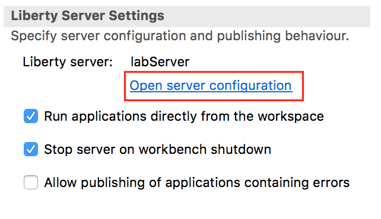

    1.  Start by providing a meaningful description for your server, such as “Liberty server for labs”.

      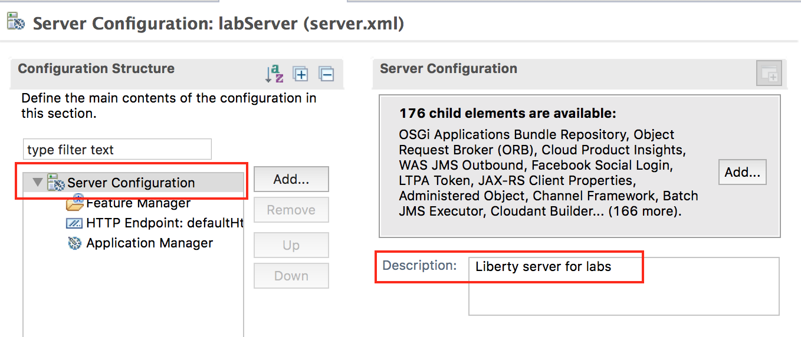

    1.  To add a feature, such as servlet-3.1, go back in the **Configuration Structure** area, and determine if the **Feature Manager** has already been added to the configuration.

        1.  The Feature Manager will already exist in the configuration if the Liberty Server configuration already has features defined, such as ***jsp-2.3***. Review the Feature Manager settings. In this lab, the Feature Manager has already been added to the configuration. Click on “Feature Manager” to view the list of features already configured.

          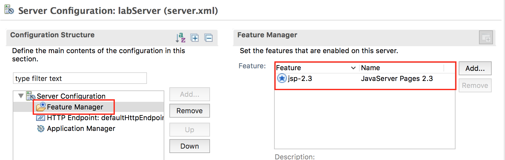

    1.  Click the Add button

    1.  In the pop-up, type **servlet** to filter to servlet related features. Then select **servlet-3.1.** Click **OK**

        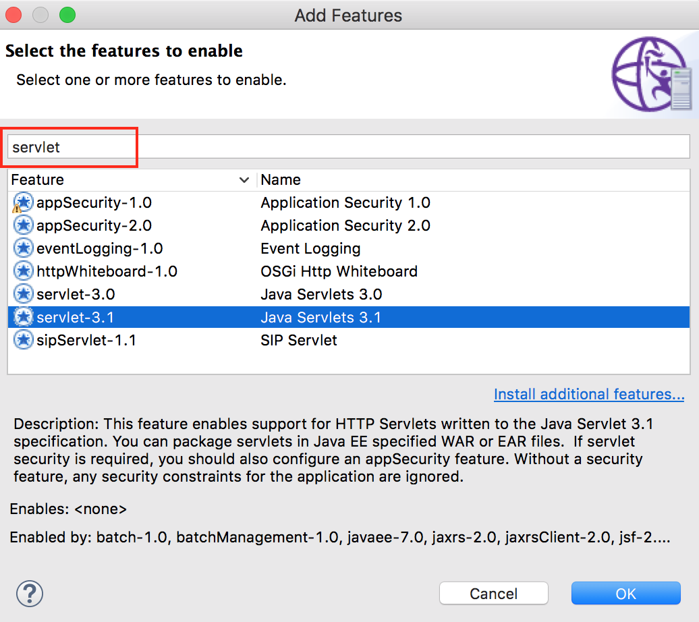

    1.  In the **server.xml** editor, switch to the **Source** tab at the bottom to see the XML source for this configuration file. You will see that a new **featureManager** element has been added, and that it contains the **servlet-3.1** feature.

        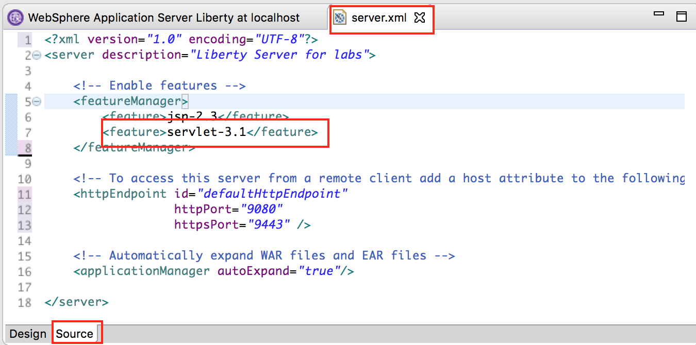

    1.  Now you have a server that is configured to use the **servlet-3.1** feature. Click the **Save** button () to save your changes (or use CTRL+S) Switch to the **Console** panel at the bottom of the workbench and review the latest messages. These messages are showing that your Liberty server automatically detected the configuration update, processed the feature that you enabled, and is now listening for incoming requests.

        1.  You will notice that the server configuration was automatically updated and the feature update was completed very quickly. In this example, it was less than one second.\
            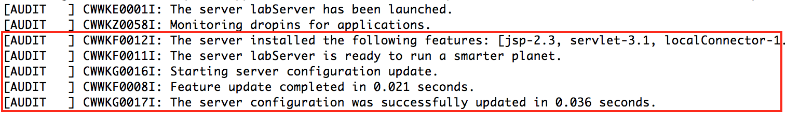{width="5.659840332458443in" height="0.8897233158355206in"}

    1.  Now you are ready to start working with a sample application that uses the Servlet feature.

## Import a sample application into Eclipse  

1.  A simple servlet WAR file has been provided for this exercise; import it into your workbench.

    1.  In Eclipse, go to **File > Import**. Expand the **Web** section, then select **WAR file**. Click **Next**.

      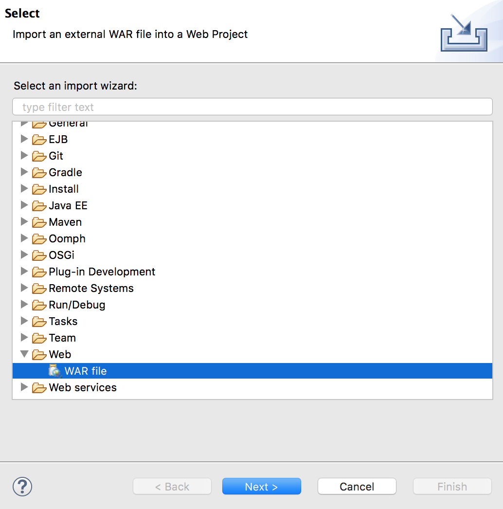

    1.  In the **WAR file** field, select **Browse**. Navigate to `{LAB_HOME}\labs\gettingStarted\1_discover\Sample1.war` and click **Open**.

    1.  Ensure the **Target runtime** is set to **WebSphere Application Server Liberty**.

    1.  **Unselect “Add project to an EAR”**

    1.  Click **Finish**

      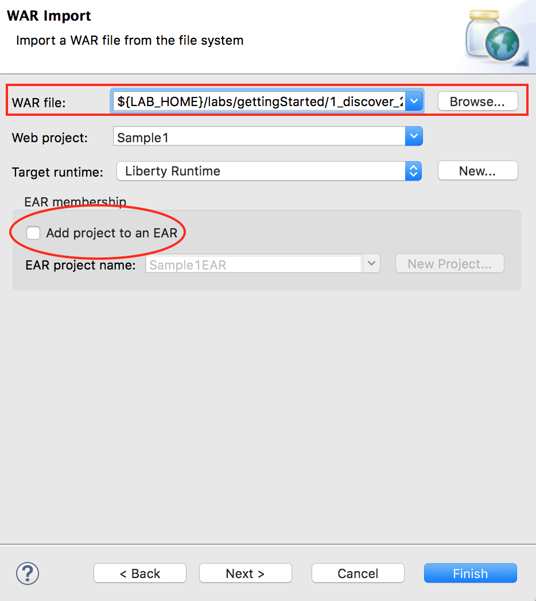

    1.  If prompted to open the web perspective, click **Open Perspective**.

    1.  Now you have a **Sample1** web project in your workspace. You can expand it in the **Enterprise Explorer** view to see the different components of the project.

        

## Deploying a sample application to Liberty

1.  Start the sample application.

    1.  In the **Enterprise Explorer** pane, navigate to the SimpleServlet.java as shown below.

     **Sample1 -> Java resources -> src -> wasdev.sample -> SimpleServlet.java**

    1.  Right-click on **SimpleServlet.java**. **Note:** If right click on SimpleServlet.class file you will get a Run As > Run Configuration, select the java file.

    1.  From the context menu, select **Run As > Run on Server**.

        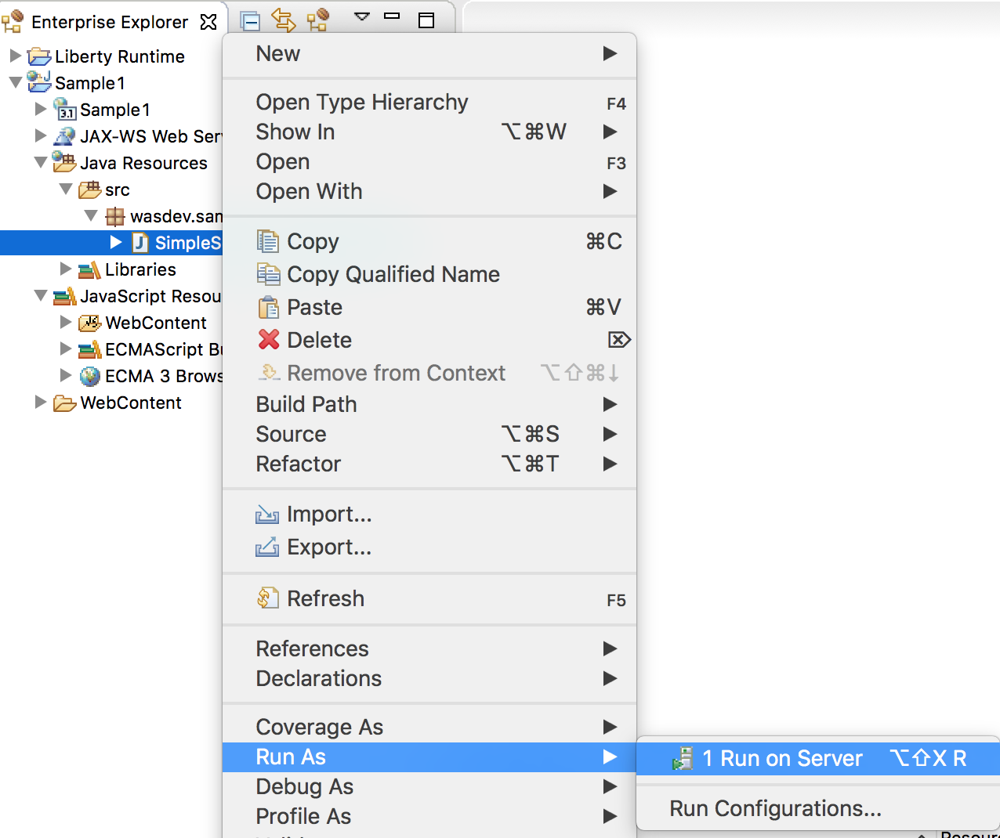

    1.  In the **Run On Server** dialog, verify that **Choose an existing server** is chosen.

1.  Under **localhost**, select the **Liberty Server** that you defined earlier. The server should be listed in **Started** state.

1. Click **Finish**.

    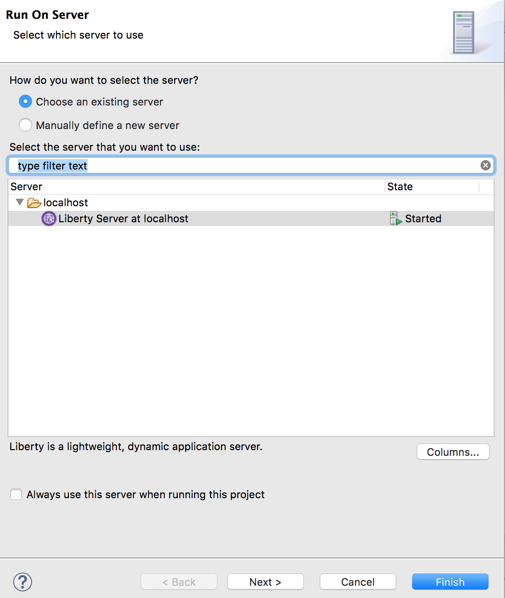

    1.  After a moment, your application will be installed and started. See the **Console** pane for the corresponding messages.

      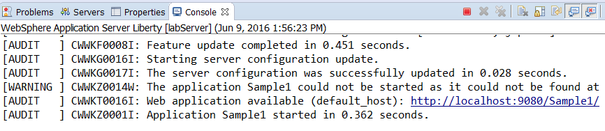

    1.  In the main panel of the workbench, a browser also opened, pointing to <http://localhost:9080/Sample1/SimpleServlet>

    1.  If you receive a 404 the first time, try to refresh the browser once the application is completely deployed and started.

    1.  At this point, you should see the rendered HTML content generated by the simple servlet.

        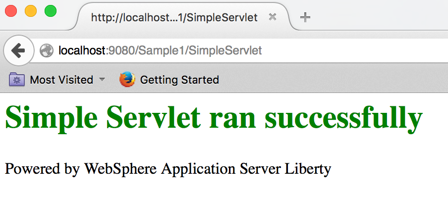

### Modify the application

1.  Open the servlet java source code.

    1.  In the **Enterprise Explorer** panel, expand the **Sample1** project, then go to **Sample1 > Servlets**. Double-click the **wasdev.sample.SimpleServlet** entry to open the Java editor for the servlet.

      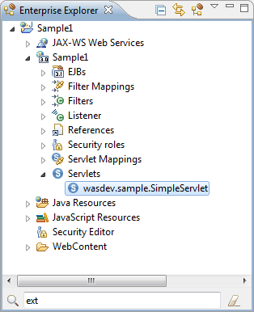

    1.  This is how the SimpleServlet.java source looks in the editor:

        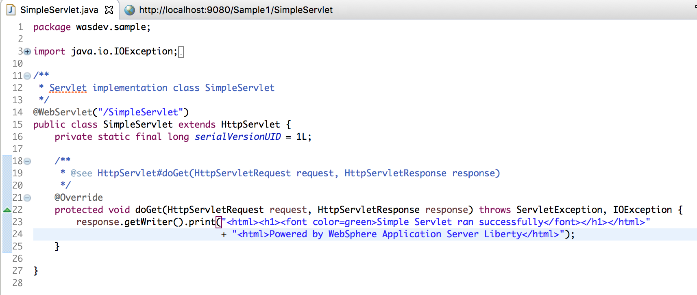

    1.  This is a very simple servlet with a **doGet()** method that sends out an HTML snippet string as a response. Your **doGet()** method will look similar to this (some of the HTML tags might be a little different – that is ok).
        ~~~~
        /**
        * @see HttpServlet\#doGet(HttpServletRequest request, HttpServletResponse response)
        */

        protected void doGet(HttpServletRequest request, HttpServletResponse response) **throws** ServletException, IOException {

        response.getWriter().print(

        "<html><h1>Simple Servlet ran successfully</h1></html>"

        + <html><Powered by WebSphere Application Server Liberty</html>");

        }
        ~~~~

1.  Modify the application and publish the change.

    1.  In the **doGet()** method, Locate the `<h1>` heading element of the HTML string, and notice that it contains a font tag to set the color to green. Modify this string by changing the text green to **purple**, so your font tag will look read ``.

       ~~~
        response.getWriter().print(
          "<html><h1>Simple Servlet ran successfully</html>"  
          + "<html>Powered by WebSphere Application Server Liberty</html>");
      ~~~
    1.  Save your changes to the Java source file by either clicking the **Save** button () or using **CTRL+S**.

    1.  Recall that your server configuration is setup to automatically detect and publish application changes immediately. By saving the changes to your Java source file, you automatically triggered an application update on the server.

    1.  To see this, go to the **Console** view at the bottom of the workbench. The application update started almost immediately after you saved the change to the application, and the update completed in seconds.\
        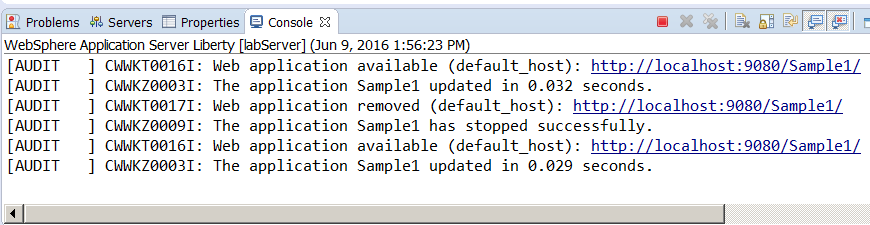{\

1.  Access the updated application.

    1.  Refresh the browser in your workbench to see the application change. The title should now be rendered in purple text.

        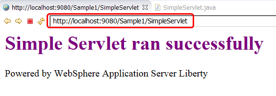

    1.  Optionally continue to play around with application modifications and see how quickly those changes are available in the deployed application. Maybe put in some additional text to display on the page, or add extra HTML tags to see formatting changes (you could add a title tag to set the text displayed in the browser title bar, for example, `<head><title>Liberty Server</title></head>`.

    1.  The key is that this ***edit / publish / debug cycle is very simple and fast!***

## Modify the server HTTP(s) ports

1.  Open the server configuration editor.

    1.  In the **Servers** view, double-click on the labServer **Server Configuration** server to open the configuration server.xml editor.

        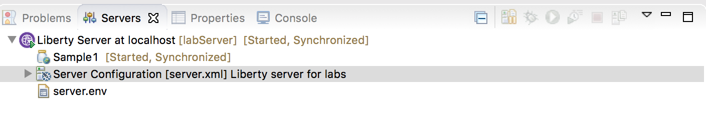

    1.  Ensure you are in the Design mode by selecting the **Design** tab on the Server Configuration editor.

    1.  Select the **Web Application: Sample1** item in the **Server Configuration** and look at its configuration details. From here, you can set basic application parameters, including the context root for the application.

        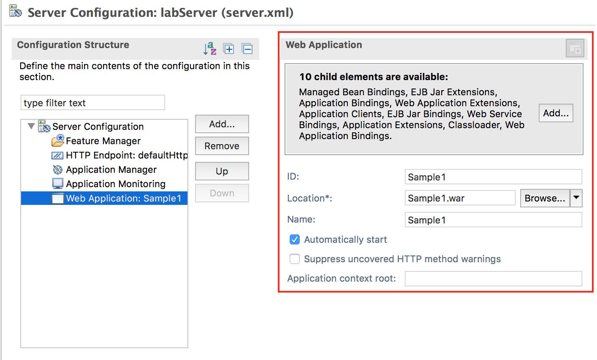

    1.  Select the **Application Monitoring** item in the **Server Configuration** and look at its configuration details. You can see that the monitor polls for changes every **500ms** using an **mbean** trigger. You did not add any JMX features to your server to support mbean notification – so how is that working?
        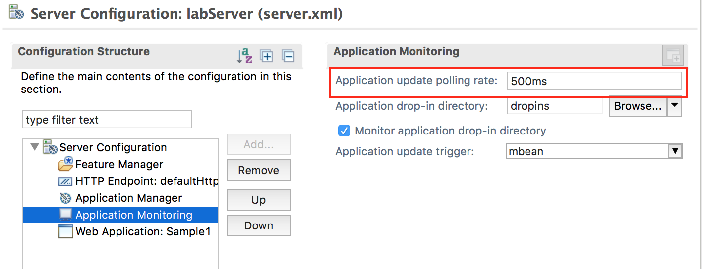

    1.  Select the **Feature Manager** item to see the features that are configured on your server. You added the **servlet-3.1** feature because you knew that you were going to be running a servlet application. But the development tools automatically added the **localConnector-1.0.** feature to your server to support notifications and application updates. In fact, you would not have needed to add the servlet feature to your server at the beginning at all. The tools would have automatically enabled that feature, based on the content of the application.

        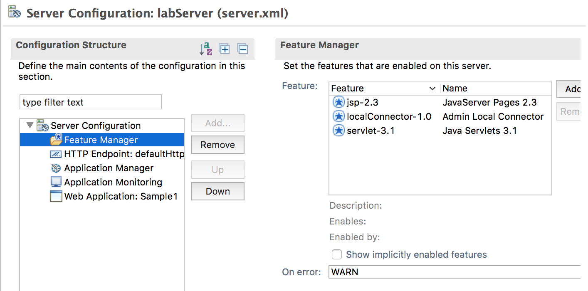

1.  Change the HTTP port.

    1.  Using the default HTTP port (9080) is an easy way to quickly bring up an application, but it is common to want to use a different port. This is an easy thing to change.

    1.  In the **Configuration Structure** area, select **Server Configuration**, then select **HTTP Endpoint**

        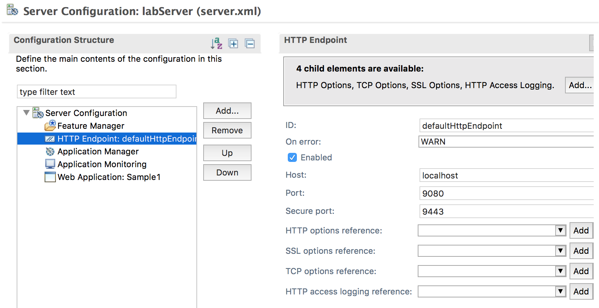

    1.  In the **HTTP Endpoint Details** area, Change the HTTP Port to 9580.

        1. Update the **Port** field to **9580**.

            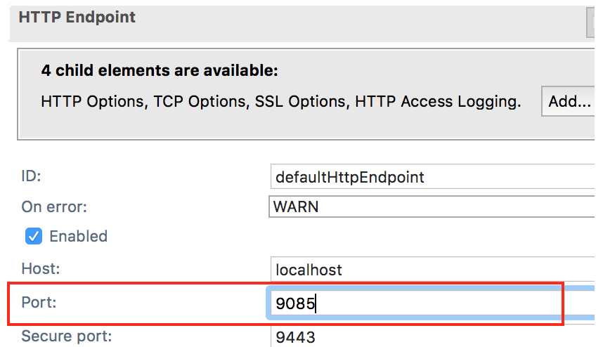

    1.  **Save** your changes to the server configuration (CTRL+S).

    1.  You can review your full server configuration in the **server.xml** source file. Back in the server configuration editor, switch to the Source tab at the bottom to view the full XML source for your server configuration.

    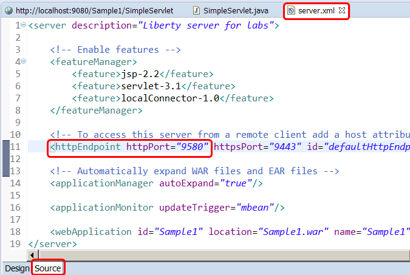

1.  After you saved your configuration changes, the configuration of your running server was automatically updated. The **Console** pane will show that the Sample1 servlet is now available on port 9580.\
    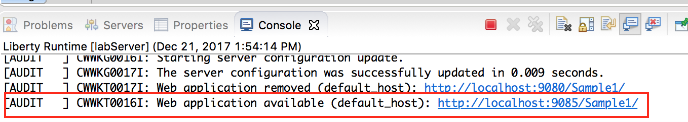

1.  Now, you can access your sample application using the new port. In the browser in your workbench, change the port from **9080** to **9580** and refresh the application.

    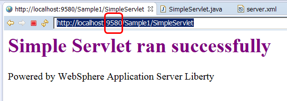

## Add INFO logging output to console

By default, the Liberty Server has the console log level set to AUDIT. In this section, you will change the level of log messages written to the console from AUDIT to INFO.

You will perform this activity in the server.xml file using the UI. It is also possible to set default logging options in the bootstrap.properties file. If the logging options are set in the bootstrap.properties file, the logging options will take effect very early in server startup, so it may be useful for debugging server initialization problems.

1.  Open the server configuration editor.

    1.  In the **Servers** view, double-click on the labServer **Server Configuration** server to open the configuration server.xml editor.

        

    1.  Ensure you are in the Design mode by selecting the **Design** tab on the Server Configuration editor.

1.  Add the Logging configuration option to the server

    1.  Under the **Configuration Structure** section, Click on **Server Configuration.** And, then click the **Add button**.

        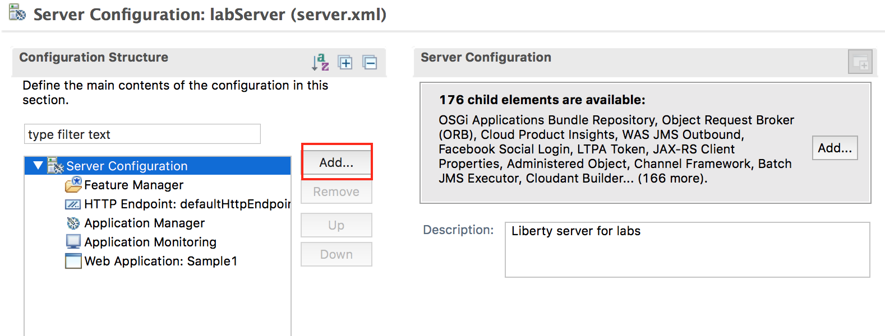

    1.  On the **Add Element** dialog, select **Logging**, And, then click the **OK** button**. **

        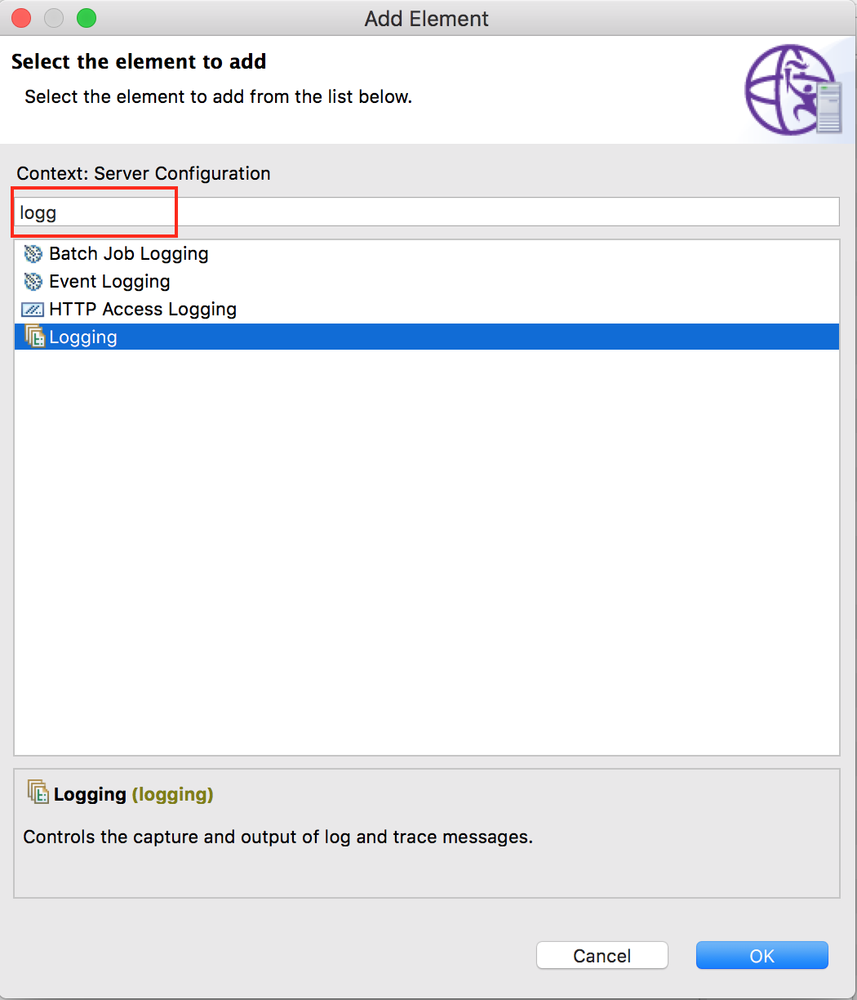

1.  The logging page displays the properties for the logging configuration, such as the name of the log files, the maximum size of log files, and the maximum number of log files to retain.

 Additional configuration information is displayed regarding tracing. Notice that the **Console Log Level** is set to **AUDIT** by default.

    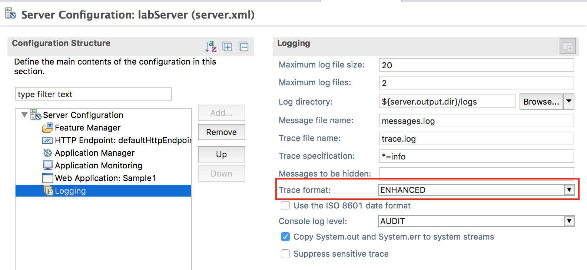

1. Change the Console log level to **INFO** using the pull down menu.

    

   1.  Switch to the **Source** view for the server.xml file to see the configuration changes added to server.xml.

    `<logging consoleLogLevel=*"INFO"*/>`

   1.  **Save** the configuration file.

    The changes you made are dynamic and take effect immediately.

    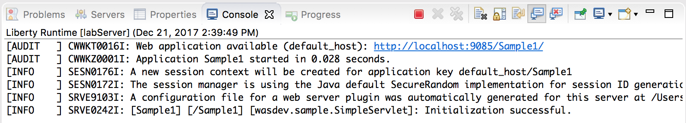

## Update trace specification

By default, the Liberty Server trace specification is set to `*=info=enabled`. This is the same for Traditional WAS.

Updating the trace specification for debugging is easily performed using the server configuration editor. You can specify the trace specification in the UI, or copy & paste the trace specification directly into the server.xml file. In this section, you will specify a trace specification using the configuration editor. And, then, you will look at the result in the server.xml source file

1.  Open the server configuration editor, if it is not already opened.

    1.  In the **Servers** view, double-click on the labServer **Server Configuration** server to open the configuration server.xml editor.

        

    1.  Ensure you are in the Design mode by selecting the **Design** tab on the Server Configuration editor.

1.  Update the Trace Specification under the logging configuration.

    1.  Click on **Logging** under the Server Configuration section. This displays the logging and trace details.

    1.  Update the **Trace Specification** field with the following trace string:

        `webcontainer=all=enabled:*=info=enabled`

        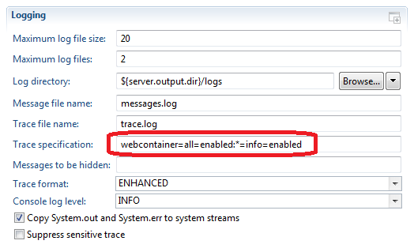

    1.  Switch to the **Source** tab on the configuration editor and view the logging configuration. :

        `<logging traceSpecification="webcontainer=all=enabled:*=info=enabled"*/>`

    1.  **Save** the configuration changes.

    1.  Check the console view

        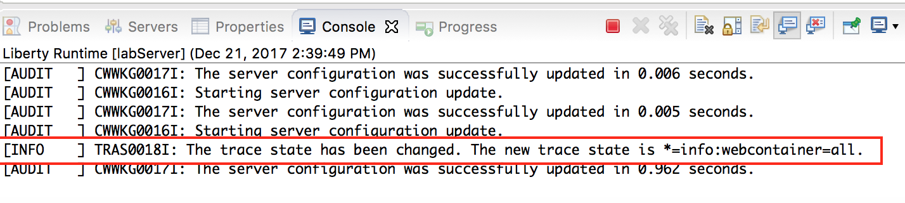

1.  Verify that the trace.log file contains trace data.

    1.  From a Windows Explorer, navigate to the server logs directory.

        `{LAB_HOME}\wlp\usr\servers\labServer\logs`

        The trace.log file has been created and contains content.

        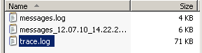

    1.  You can view the **trace.log** file using **Notepad**.

    1.  You can also view the trace file in Eclipse. In the Enterprise Explorer view, expand the WebSphere Application Server Liberty project, and its subdirectories, and you will find the trace.log file on the logs directory. You may need to right-click on a higher directory and select **refresh** to see any newly-created directories and files.

        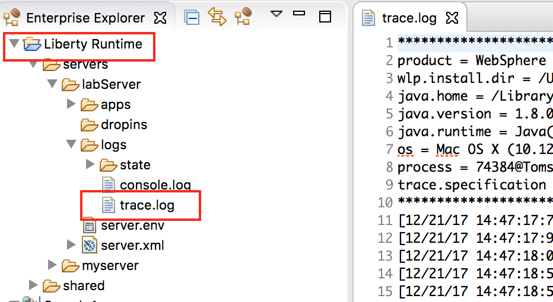

1.  **Very importantly**, reset the trace specification back to the default value.

    1.  Switch to the **Source** tab on the configuration editor and update the logging configuration to:

        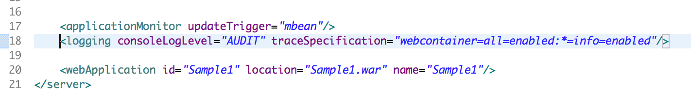

    1.  **Save** the configuration.

## Customizing Liberty JVM Options

The generic JVM arguments are used to configure and adjust how the JVM executes.

The WebSphere Liberty is pre-configured with minimal settings defined. The following steps will direct you how to define custom generic JVM arguments such as heap settings for a Liberty server.

1.  In the eclipse Servers view, right-click on the localhost server. And, then select **New Server Environment File** **jvm.options** from the context menu.

    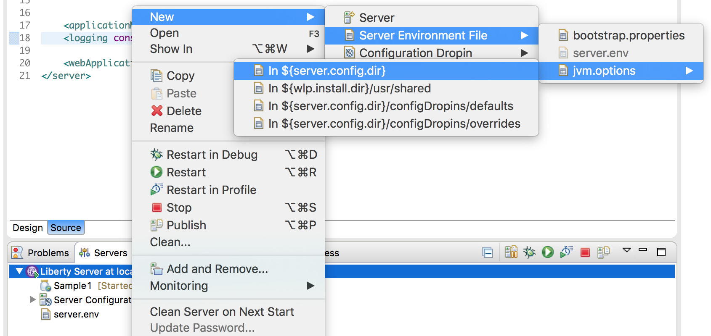

    This will create a jvm.options file in the server’s configuration directory with the most commonly-used options available in comments:

    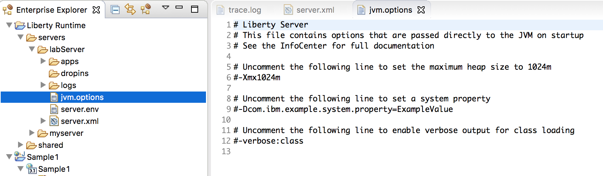

1.  If necessary, double click to open the file in the eclipse text editor

1.  Enter the following two lines in the **jvm.options** file to set the minimum and maximum heap size for the labServer server. The following options will set the min / max JVM heap size to 25 MB and 500 MB respectively.

     > -Xms25m
     >
     > -Xmx500m

1.  Save the file. Ctrl + S

 **TIPs:**

    - The default maximum heap size values of the JVM heap size is:
     > **–Xmx1024m**

    - VerboseGC can be enabled by specifying -verbose:gc in the jvm.options file.

    - Verbose GC output will be logged to the following location by default:

     `<wlp.install.dir>/usr/servers/<serverName>/logs/console.log`

    - Depending on your preferences, you might configure a single JVM or all Liberty JVMs with your options file. To apply these settings to all Liberty Servers, save jvm.options at:

     > ${wlp.install.dir}/etc/jvm.options

    **TIP:** For this lab, the ***${wlp.install.dir}*** is ***{LAB_HOME}\wlp***

    - The changes will take effect for all JVMs that do not have a locally defined jvm.options file.

Restart the server to enable changes.

This concludes the customization portion of the lab. In the next sections, you will be introduced to the Liberty configuration files for customizing the server initialization and environment settings.

## Introducing Liberty Environment Variable Configuration

You can customize the Liberty environment using certain specific variables to support the placement of product binaries and shared resources.

The Liberty environment variables are specified using **server.env** file.

You can use **server.env** file at the installation and server levels to specify environment variables such as JAVA_HOME, WLP_USER_DIR and WLP_OUTPUT_DIR.

**NOTE:** You will not modify the default environment configuration in this lab.

Review the information in this section to become familiar with the environment variables that are available for customizing the Liberty environment.

The following Liberty specific variables can be used to customize the Liberty environment:

     ${wlp.install.dir}

This configuration variable has an inferred location. The installation directory is always set to the parent of the directory containing the launch script or the parent of the / lib directory containing the target jar files.

> **TIP:** For this lab, the ***${wlp.install.dir}*** is **{LAB_HOME}\wlp**

**WLP_USER_DIR**

  This environment variable can be used to specify an alternate location for the **${wlp.install.dir}/usr**. This variable can only be an absolute path. If this is specified, the runtime environment looks for shared resources and server definition in the specified directory.

  The **${server.config.dir}** is equivalent to **${wlp.user.dir}/servers/serverName** and can be set to a different location when running a server (to use configuration files from a location outside **wlp.user.dir**).

> **TIP:** For this lab, the ***${server.config.dir}*** is **{LAB_HOME}\wlp\usr\servers\labServer**

**WLP_OUTPUT_DIR**

This environment variable can be used to specify an alternate location for server generated output such as logs, the workarea directory and generated files. This variable can only be an absolute path.

If this environment variable is specified, **${server.output.dir}** is set to the equivalent of **WLP_OUTPUT_DIR/serverName**. If not specified, the **${server.output.dir}** is the same as **${server.config.dir}**.

> **TIP:** For this lab, the **${server.output.dir}** is ***{LAB_HOME}\wlp\usr\servers\labServer***, which is the same as **${server.config.dir}**.

## Introducing Liberty bootstrap.properties
----------------------------------------

In this section of the lab, you will gain an understanding of how and when bootstrap properties are required during environment initialization.

**NOTE:** You will not modify any of the default environment initialization. This information is provided in the lab for your reference.

Bootstrap properties are used to initialize the runtime environment for a particular server. Generally, they are attributes that affect the configuration and initialization of the runtime.

Bootstrap properties are set in a text file named **bootstrap.properties**. This file should be located in the server directory alongside the configuration root file server.xml.

By default, the server directory is **usr/servers/*server_name***.

The **bootstrap.properties** file contains two types of properties:

-   A small, predefined set of initialization properties.

-   Any custom properties you choose to define which you can then use as variables in other configuration files (that is, server.xml and included files).

You can create the bootstrap.properties through any file creation mechanism, or by using the same method shown above for creation of the jvm.options file in eclipse. You can edit the bootstrap.properties file using a text editor, or using the editor that is part of the Liberty developer tools.

Changes to the bootstrap.properties file are applied when the server is restarted.

**TIP:**

As an example, the logging service can be controlled through the server configuration (server.xml) file. Occasionally you need to set logging properties so they can take effect before the server configuration files are processed.

In this case you set them in the bootstrap.properties file instead of the server configuration.

You do not usually need to do this to get logging from your own code, which is loaded after server configuration processing, but you might need to do this to analyze problems in early server start or configuration processing.

## Running Liberty as a Windows Service

A Liberty server can be registered as a Microsoft Windows Service program when running on Windows. After registering as a Windows Service, Liberty can then be started and stopped manually as a Service, or the Windows "Services" program can be used to change the Liberty service to start automatically when the Windows Server starts.

The commands to Register/Start/Stop/Unregister Liberty as Service use the same **server.bat** file that is used when starting the Liberty server normally. You should get a Windows prompt to make changes to your computer. Accept these changes.

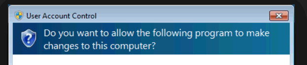

1.  Register the labServer as a Windows service by running these commands:

~~~~
cd {LAB_HOME}\wlp\bin
server registerWinService labServer
~~~~

1.  Start the labServer Windows service. This can be done with the following command:

~~~
server startWinService labServer
~~~

Alternatively, the server can be started through the Windows Services interface. Start the Windows "Services" program and find the entry that corresponds to the server name 'labServer'. Using the Windows Services program the service can be modified to start in Automatic mode, to start under a specified Account ID (and password), and to start with specified Liberty Server command line parameters.

1.  Stop the labServer Windows service. This can be done with the following command:
~~~
server stopWinService labServer
~~~
Alternatively, the server can be stopped through the Windows Services interface.

1.  Unregister the labServer Windows service. This can be done with the following command:
~~~
server unregisterWinService labServer
~~~
The Liberty Service can also be administered via the Windows Registry, typically using the Windows **regedit** program. The entries for the Service will be located in the Registry:
~~~
HKEY\_LOCAL\_MACHINE->SOFTWARE->Wow6432Node->Apache Software Foundation->Procrun 2.0-><labServer>
~~~
and
~~~
HKEY\_LOCAL\_MACHINE->SYSTEM->CurrentControlSet->services-><labServer>
~~~
This completes the lab exercises.

Notices

This information was developed for products and services offered in the U.S.A.

IBM may not offer the products, services, or features discussed in this document in other countries. Consult your local IBM representative for information on the products and services currently available in your area. Any reference to an IBM product, program, or service is not intended to state or imply that only that IBM product, program, or service may be used. Any functionally equivalent product, program, or service that does not infringe any IBM intellectual property right may be used instead. However, it is the user's responsibility to evaluate and verify the operation of any non-IBM product, program, or service.

IBM may have patents or pending patent applications covering subject matter described in this document. The furnishing of this document does not grant you any license to these patents. You can send license inquiries, in writing, to:

IBM Director of Licensing
IBM Corporation
North Castle Drive
Armonk, NY 10504-1785
U.S.A.

For license inquiries regarding double-byte (DBCS) information, contact the IBM Intellectual Property Department in your country or send inquiries, in writing, to:

IBM World Trade Asia Corporation
Licensing
2-31 Roppongi 3-chome, Minato-ku
Tokyo 106-0032, Japan

**The following paragraph does not apply to the United Kingdom or any other country where such provisions are inconsistent with local law:** INTERNATIONAL BUSINESS MACHINES CORPORATION PROVIDES THIS PUBLICATION "AS IS" WITHOUT WARRANTY OF ANY KIND, EITHER EXPRESS OR IMPLIED, INCLUDING, BUT NOT LIMITED TO, THE IMPLIED WARRANTIES OF NON-INFRINGEMENT, MERCHANTABILITY OR FITNESS FOR A PARTICULAR PURPOSE. Some states do not allow disclaimer of express or implied warranties in certain transactions, therefore, this statement may not apply to you.

This information could include technical inaccuracies or typographical errors. Changes are periodically made to the information herein; these changes will be incorporated in new editions of the publication. IBM may make improvements and/or changes in the product(s) and/or the program(s) described in this publication at any time without notice.

Any references in this information to non-IBM Web sites are provided for convenience only and do not in any manner serve as an endorsement of those Web sites. The materials at those Web sites are not part of the materials for this IBM product and use of those Web sites is at your own risk.

IBM may use or distribute any of the information you supply in any way it believes appropriate without incurring any obligation to you.

Any performance data contained herein was determined in a controlled environment. Therefore, the results obtained in other operating environments may vary significantly. Some measurements may have been made on development-level systems and there is no guarantee that these measurements will be the same on generally available systems. Furthermore, some measurements may have been estimated through extrapolation. Actual results may vary. Users of this document should verify the applicable data for their specific environment.

Information concerning non-IBM products was obtained from the suppliers of those products, their published announcements or other publicly available sources. IBM has not tested those products and cannot confirm the accuracy of performance, compatibility or any other claims related to non-IBM products. Questions on the capabilities of non-IBM products should be addressed to the suppliers of those products.

All statements regarding IBM's future direction and intent are subject to change or withdrawal without notice, and represent goals and objectives only.

This information contains examples of data and reports used in daily business operations. To illustrate them as completely as possible, the examples include the names of individuals, companies, brands, and products. All of these names are fictitious and any similarity to the names and addresses used by an actual business enterprise is entirely coincidental. All references to fictitious companies or individuals are used for illustration purposes only.

COPYRIGHT LICENSE:

This information contains sample application programs in source language, which illustrate programming techniques on various operating platforms. You may copy, modify, and distribute these sample programs in any form without payment to IBM, for the purposes of developing, using, marketing or distributing application programs conforming to the application programming interface for the operating platform for which the sample programs are written. These examples have not been thoroughly tested under all conditions. IBM, therefore, cannot guarantee or imply reliability, serviceability, or function of these programs.

Trademarks and copyrights
=========================

The following terms are trademarks of International Business Machines Corporation in the United States, other countries, or both:

  IBM          AIX        CICS             ClearCase      ClearQuest   Cloudscape   
  ------------ ---------- ---------------- -------------- ------------ ------------ --
  Cube Views   DB2        developerWorks   DRDA           IMS          IMS/ESA      
  Informix     Lotus      Lotus Workflow   MQSeries       OmniFind                  
  Rational     Redbooks   Red Brick        RequisitePro   System i                  
  *System z*   *Tivoli*   *WebSphere*      *Workplace*    *System p*                

Adobe, the Adobe logo, PostScript, and the PostScript logo are either registered trademarks or trademarks of Adobe Systems Incorporated in the United States, and/or other countries.

IT Infrastructure Library is a registered trademark of the Central Computer and Telecommunications Agency which is now part of the Office of Government Commerce.

Intel, Intel logo, Intel Inside, Intel Inside logo, Intel Centrino, Intel Centrino logo, Celeron, Intel Xeon, Intel SpeedStep, Itanium, and Pentium are trademarks or registered trademarks of Intel Corporation or its subsidiaries in the United States and other countries.

Linux is a registered trademark of Linus Torvalds in the United States, other countries, or both.

Microsoft, Windows, Windows NT, and the Windows logo are trademarks of Microsoft Corporation in the United States, other countries, or both.

ITIL is a registered trademark, and a registered community trademark of The Minister for the Cabinet Office, and is registered in the U.S. Patent and Trademark Office.

UNIX is a registered trademark of The Open Group in the United States and other countries.

Java and all Java-based trademarks and logos are trademarks or registered trademarks of Oracle and/or its affiliates.

Cell Broadband Engine is a trademark of Sony Computer Entertainment, Inc. in the United States, other countries, or both and is used under license therefrom.

Linear Tape-Open, LTO, the LTO Logo, Ultrium, and the Ultrium logo are trademarks of HP, IBM Corp. and Quantum in the U.S. and other countries.

© Copyright IBM Corporation 2017.

The information contained in these materials is provided for informational purposes only, and is provided AS IS without warranty of any kind, express or implied. IBM shall not be responsible for any damages arising out of the use of, or otherwise related to, these materials. Nothing contained in these materials is intended to, nor shall have the effect of, creating any warranties or representations from IBM or its suppliers or licensors, or altering the terms and conditions of the applicable license agreement governing the use of IBM software. References in these materials to IBM products, programs, or services do not imply that they will be available in all countries in which IBM operates. This information is based on current IBM product plans and strategy, which are subject to change by IBM without notice. Product release dates and/or capabilities referenced in these materials may change at any time at IBM’s sole discretion based on market opportunities or other factors, and are not intended to be a commitment to future product or feature availability in any way.

IBM, the IBM logo and ibm.com are trademarks of International Business Machines Corp., registered in many jurisdictions worldwide. Other product and service names might be trademarks of IBM or other companies. A current list of IBM trademarks is available on the Web at “Copyright and trademark information” at www.ibm.com/legal/copytrade.shtml.

